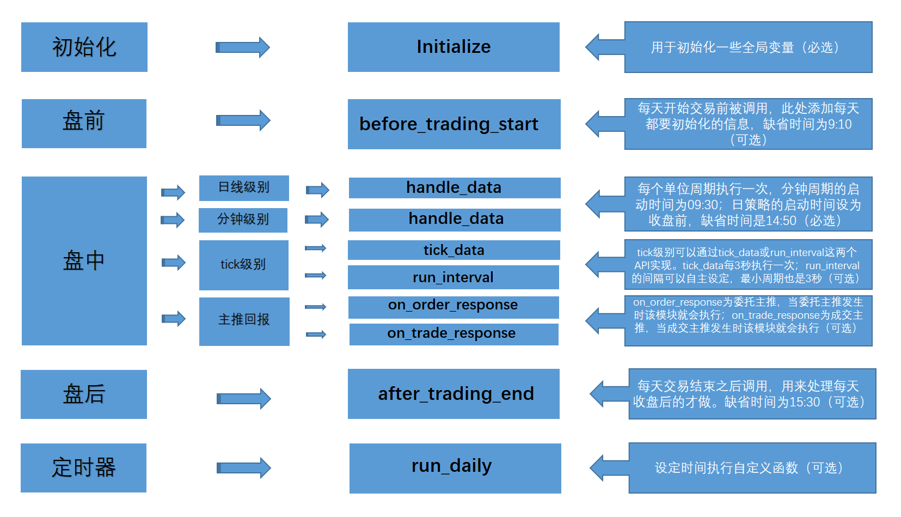

<a id="策略引擎简介"></a>

## 策略引擎简介

<a id="业务流程框架"></a>

### 业务流程框架

ptrade量化引擎以事件触发为基础，通过初始化事件(initialize)、盘前事件(before\_trading\_start)、盘中事件(handle\_data)、盘后事件(after\_trading\_end)来完成每个交易日的策略任务。

initialize和handle\_data是一个允许运行策略的最基础结构，也就是必选项，before\_trading\_start和after\_trading\_end是可以按需运行的。

handle\_data仅满足日线和分钟级别的盘中处理，tick级别的盘中处理则需要通过tick\_data或者run\_interval来实现。

ptrade还支持委托主推事件(on\_order\_response)、交易主推事件(on\_trade\_response)，可以通过委托和成交的信息来处理策略逻辑，是tick级的一个补充。

除了以上的一些事件以外，ptrade也支持通过定时任务来运行策略逻辑，可以通过run\_daily接口实现。



<a id="initialize"></a>

#### initialize(必选)

```python
initialize(context)
```

##### 使用场景

该函数仅在回测、交易模块可用

##### 接口说明

该函数用于初始化一些全局变量，是策略运行的唯二必须定义函数之一。

注意事项：

1.  该函数只会在回测和交易启动的时候运行一次。

##### 可调用接口

<table><tbody><tr><td><a href="http://180.169.107.9:7766/hub/help/api?weworkcfmcode#set_universe">set_universe(回测/交易)</a></td><td><a href="http://180.169.107.9:7766/hub/help/api?weworkcfmcode#set_benchmark">set_benchmark(回测/交易)</a></td><td><a href="http://180.169.107.9:7766/hub/help/api?weworkcfmcode#set_commission">set_commission(回测)</a></td><td><a href="http://180.169.107.9:7766/hub/help/api?weworkcfmcode#set_fixed_slippage">set_fixed_slippage(回测)</a></td><td><a href="http://180.169.107.9:7766/hub/help/api?weworkcfmcode#set_slippage">set_slippage(回测)</a></td></tr><tr><td><a href="http://180.169.107.9:7766/hub/help/api?weworkcfmcode#set_volume_ratio">set_volume_ratio(回测)</a></td><td><a href="http://180.169.107.9:7766/hub/help/api?weworkcfmcode#set_limit_mode">set_limit_mode(回测)</a></td><td><a href="http://180.169.107.9:7766/hub/help/api?weworkcfmcode#set_yesterday_position">set_yesterday_position(回测)</a></td><td><a href="http://180.169.107.9:7766/hub/help/api?weworkcfmcode#set_parameters">set_parameters(回测/交易)</a></td><td><a href="http://180.169.107.9:7766/hub/help/api?weworkcfmcode#run_daily">run_daily(回测/交易)</a></td></tr><tr><td><a href="http://180.169.107.9:7766/hub/help/api?weworkcfmcode#run_interval">run_interval(交易)</a></td><td><a href="http://180.169.107.9:7766/hub/help/api?weworkcfmcode#convert_position_from_csv">convert_position_from_csv(回测)</a></td><td><a href="http://180.169.107.9:7766/hub/help/api?weworkcfmcode#get_user_name">get_user_name(回测/交易)</a></td><td><a href="http://180.169.107.9:7766/hub/help/api?weworkcfmcode#get_research_path">get_research_path(回测/交易)</a></td><td><a href="http://180.169.107.9:7766/hub/help/api?weworkcfmcode#get_trade_name">get_trade_name(交易)</a></td></tr><tr><td><a href="http://180.169.107.9:7766/hub/help/api?weworkcfmcode#set_future_commission">set_future_commission(回测(期货))</a></td><td><a href="http://180.169.107.9:7766/hub/help/api?weworkcfmcode#set_margin_rate">set_margin_rate(回测(期货))</a></td><td><a href="http://180.169.107.9:7766/hub/help/api?weworkcfmcode#log">log(回测/交易)</a></td><td><a href="http://180.169.107.9:7766/hub/help/api?weworkcfmcode#is_trade">is_trade(回测/交易)</a></td><td><a href="http://180.169.107.9:7766/hub/help/api?weworkcfmcode#permission_test">permission_test(交易)</a></td></tr><tr><td><a href="http://180.169.107.9:7766/hub/help/api?weworkcfmcode#create_dir">create_dir(研究/回测/交易)</a></td><td><a href="http://180.169.107.9:7766/hub/help/api?weworkcfmcode#get_frequency">get_frequency(回测/交易)</a></td><td><a href="http://180.169.107.9:7766/hub/help/api?weworkcfmcode#get_business_type">get_business_type(回测/交易)</a></td><td><a href="http://180.169.107.9:7766/hub/help/api?weworkcfmcode#set_email_info">set_email_info(交易)</a></td></tr></tbody></table>

##### 参数

context: [Context对象](http://180.169.107.9:7766/hub/help/api?weworkcfmcode#Context)，存放有当前的账户及持仓信息；

##### 返回

None

##### 示例

```python
def initialize(context):
    #g为全局对象
    g.security = '600570.SS'
    set_universe(g.security)

def handle_data(context, data):
    order('600570.SS',100)
```

<a id="before_trading_start"></a>

#### before\_trading\_start(可选)

```python
before_trading_start(context, data)
```

##### 使用场景

该函数仅在回测、交易模块可用

##### 接口说明

该函数在每天开始交易前被调用一次，用于添加每天都要初始化的信息，如无盘前初始化需求，该函数可以在策略中不做定义。

注意事项：

1.  在回测中，该函数在每个回测交易日8:30分执行。
2.  在交易中，该函数在开启交易时立即执行，从隔日开始每天9:10分(默认)执行。
3.  当在9:10前开启交易时，受行情未更新原因在该函数内调用实时行情接口会导致数据有误。 可通过在该函数内sleep至9:10分或调用实时行情接口改为run\_daily执行等方式进行避免。

##### 可调用接口

<table><tbody><tr><td><a href="http://180.169.107.9:7766/hub/help/api?weworkcfmcode#set_parameters">set_parameters(回测/交易)</a></td><td><a href="http://180.169.107.9:7766/hub/help/api?weworkcfmcode#get_trading_day">get_trading_day(回测/交易)</a></td><td><a href="http://180.169.107.9:7766/hub/help/api?weworkcfmcode#get_all_trades_days">get_all_trades_days(研究/回测/交易)</a></td><td><a href="http://180.169.107.9:7766/hub/help/api?weworkcfmcode#get_trade_days">get_trade_days(研究/回测/交易)</a></td><td><a href="http://180.169.107.9:7766/hub/help/api?weworkcfmcode#get_trading_day_by_date">get_trading_day_by_date(研究/回测/交易)</a></td></tr><tr><td><a href="http://180.169.107.9:7766/hub/help/api?weworkcfmcode#get_market_list">get_market_list(研究/回测/交易)</a></td><td><a href="http://180.169.107.9:7766/hub/help/api?weworkcfmcode#get_market_detail">get_market_detail(研究/回测/交易)</a></td><td><a href="http://180.169.107.9:7766/hub/help/api?weworkcfmcode#get_history">get_history(研究/回测/交易)</a></td><td><a href="http://180.169.107.9:7766/hub/help/api?weworkcfmcode#get_price">get_price(研究/回测/交易)</a></td><td><a href="http://180.169.107.9:7766/hub/help/api?weworkcfmcode#get_individual_entrust">get_individual_entrust(交易)</a></td></tr><tr><td><a href="http://180.169.107.9:7766/hub/help/api?weworkcfmcode#get_individual_transaction">get_individual_transaction(交易)</a></td><td><a href="http://180.169.107.9:7766/hub/help/api?weworkcfmcode#get_tick_direction">get_tick_direction(交易)</a></td><td><a href="http://180.169.107.9:7766/hub/help/api?weworkcfmcode#get_sort_msg">get_sort_msg(交易)</a></td><td><a href="http://180.169.107.9:7766/hub/help/api?weworkcfmcode#get_underlying_code">get_underlying_code(交易)</a></td><td><a href="http://180.169.107.9:7766/hub/help/api?weworkcfmcode#get_etf_info">get_etf_info(交易)</a></td></tr><tr><td><a href="http://180.169.107.9:7766/hub/help/api?weworkcfmcode#get_etf_stock_info">get_etf_stock_info(交易)</a></td><td><a href="http://180.169.107.9:7766/hub/help/api?weworkcfmcode#get_gear_price">get_gear_price(交易)</a></td><td><a href="http://180.169.107.9:7766/hub/help/api?weworkcfmcode#get_snapshot">get_snapshot(交易)</a></td><td><a href="http://180.169.107.9:7766/hub/help/api?weworkcfmcode#get_cb_info">get_cb_info(研究/交易)</a></td><td><a href="http://180.169.107.9:7766/hub/help/api?weworkcfmcode#get_trend_data">get_trend_data(研究/回测/交易)</a></td></tr><tr><td><a href="http://180.169.107.9:7766/hub/help/api?weworkcfmcode#get_stock_name">get_stock_name(研究/回测/交易)</a></td><td><a href="http://180.169.107.9:7766/hub/help/api?weworkcfmcode#get_stock_info">get_stock_info(研究/回测/交易)</a></td><td><a href="http://180.169.107.9:7766/hub/help/api?weworkcfmcode#get_stock_status">get_stock_status(研究/回测/交易)</a></td><td><a href="http://180.169.107.9:7766/hub/help/api?weworkcfmcode#get_stock_exrights">get_stock_exrights(研究/回测/交易)</a></td><td><a href="http://180.169.107.9:7766/hub/help/api?weworkcfmcode#get_stock_blocks">get_stock_blocks(研究/回测/交易)</a></td></tr><tr><td><a href="http://180.169.107.9:7766/hub/help/api?weworkcfmcode#get_index_stocks">get_index_stocks(研究/回测/交易)</a></td><td><a href="http://180.169.107.9:7766/hub/help/api?weworkcfmcode#get_etf_stock_list">get_etf_stock_list(交易)</a></td><td><a href="http://180.169.107.9:7766/hub/help/api?weworkcfmcode#get_industry_stocks">get_industry_stocks(研究/回测/交易)</a></td><td><a href="http://180.169.107.9:7766/hub/help/api?weworkcfmcode#get_fundamentals">get_fundamentals(研究/回测/交易)</a></td><td><a href="http://180.169.107.9:7766/hub/help/api?weworkcfmcode#get_Ashares">get_Ashares(研究/回测/交易)</a></td></tr><tr><td><a href="http://180.169.107.9:7766/hub/help/api?weworkcfmcode#get_etf_list">get_etf_list(交易)</a></td><td><a href="http://180.169.107.9:7766/hub/help/api?weworkcfmcode#get_ipo_stocks">get_ipo_stocks(交易)</a></td><td><a href="http://180.169.107.9:7766/hub/help/api?weworkcfmcode#get_position">get_position(回测/交易)</a></td><td><a href="http://180.169.107.9:7766/hub/help/api?weworkcfmcode#get_positions">get_positions(回测/交易)</a></td><td><a href="http://180.169.107.9:7766/hub/help/api?weworkcfmcode#get_all_positions">get_all_positions(交易)</a></td></tr><tr><td><a href="http://180.169.107.9:7766/hub/help/api?weworkcfmcode#get_trades_file">get_trades_file(回测)</a></td><td><a href="http://180.169.107.9:7766/hub/help/api?weworkcfmcode#get_deliver">get_deliver(交易)</a></td><td><a href="http://180.169.107.9:7766/hub/help/api?weworkcfmcode#get_fundjour">get_fundjour(交易)</a></td><td><a href="http://180.169.107.9:7766/hub/help/api?weworkcfmcode#get_lucky_info">get_lucky_info(交易)</a></td><td><a href="http://180.169.107.9:7766/hub/help/api?weworkcfmcode#order">order(回测/交易)</a></td></tr><tr><td><a href="http://180.169.107.9:7766/hub/help/api?weworkcfmcode#order_target">order_target(回测/交易)</a></td><td><a href="http://180.169.107.9:7766/hub/help/api?weworkcfmcode#order_value">order_value(回测/交易)</a></td><td><a href="http://180.169.107.9:7766/hub/help/api?weworkcfmcode#order_target_value">order_target_value(回测/交易)</a></td><td><a href="http://180.169.107.9:7766/hub/help/api?weworkcfmcode#order_market">order_market(交易)</a></td><td><a href="http://180.169.107.9:7766/hub/help/api?weworkcfmcode#ipo_stocks_order">ipo_stocks_order(交易)</a></td></tr><tr><td><a href="http://180.169.107.9:7766/hub/help/api?weworkcfmcode#etf_basket_order">etf_basket_order(交易)</a></td><td><a href="http://180.169.107.9:7766/hub/help/api?weworkcfmcode#etf_purchase_redemption">etf_purchase_redemption(交易)</a></td><td><a href="http://180.169.107.9:7766/hub/help/api?weworkcfmcode#cancel_order">cancel_order(回测/交易)</a></td><td><a href="http://180.169.107.9:7766/hub/help/api?weworkcfmcode#cancel_order_ex">cancel_order_ex(交易)</a></td><td><a href="http://180.169.107.9:7766/hub/help/api?weworkcfmcode#debt_to_stock_order">debt_to_stock_order(交易)</a></td></tr><tr><td><a href="http://180.169.107.9:7766/hub/help/api?weworkcfmcode#get_open_orders">get_open_orders(回测/交易)</a></td><td><a href="http://180.169.107.9:7766/hub/help/api?weworkcfmcode#get_order">get_order(回测/交易)</a></td><td><a href="http://180.169.107.9:7766/hub/help/api?weworkcfmcode#get_orders">get_orders(回测/交易)</a></td><td><a href="http://180.169.107.9:7766/hub/help/api?weworkcfmcode#get_all_orders">get_all_orders(交易)</a></td><td><a href="http://180.169.107.9:7766/hub/help/api?weworkcfmcode#get_trades">get_trades(回测/交易)</a></td></tr><tr><td><a href="http://180.169.107.9:7766/hub/help/api?weworkcfmcode#margin_trade">margin_trade(回测/交易)</a></td><td><a href="http://180.169.107.9:7766/hub/help/api?weworkcfmcode#margincash_open">margincash_open(交易)</a></td><td><a href="http://180.169.107.9:7766/hub/help/api?weworkcfmcode#margincash_close">margincash_close(交易)</a></td><td><a href="http://180.169.107.9:7766/hub/help/api?weworkcfmcode#margincash_direct_refund">margincash_direct_refund(交易)</a></td><td><a href="http://180.169.107.9:7766/hub/help/api?weworkcfmcode#marginsec_open">marginsec_open(交易)</a></td></tr><tr><td><a href="http://180.169.107.9:7766/hub/help/api?weworkcfmcode#marginsec_close">marginsec_close(交易)</a></td><td><a href="http://180.169.107.9:7766/hub/help/api?weworkcfmcode#marginsec_direct_refund">marginsec_direct_refund(交易)</a></td><td><a href="http://180.169.107.9:7766/hub/help/api?weworkcfmcode#get_margincash_stocks">get_margincash_stocks(交易)</a></td><td><a href="http://180.169.107.9:7766/hub/help/api?weworkcfmcode#get_marginsec_stocks">get_marginsec_stocks(交易)</a></td><td><a href="http://180.169.107.9:7766/hub/help/api?weworkcfmcode#get_margin_contract">get_margin_contract(交易)</a></td></tr><tr><td><a href="http://180.169.107.9:7766/hub/help/api?weworkcfmcode#get_margin_contractreal">get_margin_contractreal(交易)</a></td><td><a href="http://180.169.107.9:7766/hub/help/api?weworkcfmcode#get_margin_asset">get_margin_asset(交易)</a></td><td><a href="http://180.169.107.9:7766/hub/help/api?weworkcfmcode#get_assure_security_list">get_assure_security_list(交易)</a></td><td><a href="http://180.169.107.9:7766/hub/help/api?weworkcfmcode#get_margincash_open_amount">get_margincash_open_amount(交易)</a></td><td><a href="http://180.169.107.9:7766/hub/help/api?weworkcfmcode#get_margincash_close_amount">get_margincash_close_amount(交易)</a></td></tr><tr><td><a href="http://180.169.107.9:7766/hub/help/api?weworkcfmcode#get_marginsec_open_amount">get_marginsec_open_amount(交易)</a></td><td><a href="http://180.169.107.9:7766/hub/help/api?weworkcfmcode#get_marginsec_close_amount">get_marginsec_close_amount(交易)</a></td><td><a href="http://180.169.107.9:7766/hub/help/api?weworkcfmcode#get_margin_entrans_amount">get_margin_entrans_amount(交易)</a></td><td><a href="http://180.169.107.9:7766/hub/help/api?weworkcfmcode#get_enslo_security_info">get_enslo_security_info(交易)</a></td><td><a href="http://180.169.107.9:7766/hub/help/api?weworkcfmcode#buy_open">buy_open(回测/交易(期货))</a></td></tr><tr><td><a href="http://180.169.107.9:7766/hub/help/api?weworkcfmcode#sell_close">sell_close(回测/交易(期货))</a></td><td><a href="http://180.169.107.9:7766/hub/help/api?weworkcfmcode#sell_open">sell_open(回测/交易(期货))</a></td><td><a href="http://180.169.107.9:7766/hub/help/api?weworkcfmcode#buy_close">buy_close(回测/交易(期货))</a></td><td><a href="http://180.169.107.9:7766/hub/help/api?weworkcfmcode#get_margin_rate">get_margin_rate(回测(期货))</a></td><td><a href="http://180.169.107.9:7766/hub/help/api?weworkcfmcode#get_instruments">get_instruments(回测/交易(期货))</a></td></tr><tr><td><a href="http://180.169.107.9:7766/hub/help/api?weworkcfmcode#get_dominant_contract">get_dominant_contract(研究/回测/交易(期货))</a></td><td><a href="http://180.169.107.9:7766/hub/help/api?weworkcfmcode#get_opt_objects">get_opt_objects(研究/回测/交易(期权))</a></td><td><a href="http://180.169.107.9:7766/hub/help/api?weworkcfmcode#get_opt_last_dates">get_opt_last_dates(研究/回测/交易(期权))</a></td><td><a href="http://180.169.107.9:7766/hub/help/api?weworkcfmcode#get_opt_contracts">get_opt_contracts(研究/回测/交易(期权))</a></td><td><a href="http://180.169.107.9:7766/hub/help/api?weworkcfmcode#get_contract_info">get_contract_info(研究/回测/交易(期权))</a></td></tr><tr><td><a href="http://180.169.107.9:7766/hub/help/api?weworkcfmcode#get_covered_lock_amount">get_covered_lock_amount(交易(期权))</a></td><td><a href="http://180.169.107.9:7766/hub/help/api?weworkcfmcode#get_covered_unlock_amount">get_covered_unlock_amount(交易(期权))</a></td><td><a href="http://180.169.107.9:7766/hub/help/api?weworkcfmcode#option_buy_open">option_buy_open(回测/交易(期权))</a></td><td><a href="http://180.169.107.9:7766/hub/help/api?weworkcfmcode#option_sell_close">option_sell_close(回测/交易(期权))</a></td><td><a href="http://180.169.107.9:7766/hub/help/api?weworkcfmcode#option_sell_open">option_sell_open(回测/交易(期权))</a></td></tr><tr><td><a href="http://180.169.107.9:7766/hub/help/api?weworkcfmcode#option_buy_close">option_buy_close(回测/交易(期权))</a></td><td><a href="http://180.169.107.9:7766/hub/help/api?weworkcfmcode#open_prepared">open_prepared(交易(期权))</a></td><td><a href="http://180.169.107.9:7766/hub/help/api?weworkcfmcode#close_prepared">close_prepared(交易(期权))</a></td><td><a href="http://180.169.107.9:7766/hub/help/api?weworkcfmcode#option_exercise">option_exercise(交易(期权))</a></td><td><a href="http://180.169.107.9:7766/hub/help/api?weworkcfmcode#option_covered_lock">option_covered_lock(交易(期权))</a></td></tr><tr><td><a href="http://180.169.107.9:7766/hub/help/api?weworkcfmcode#option_covered_unlock">option_covered_unlock(交易(期权))</a></td><td><a href="http://180.169.107.9:7766/hub/help/api?weworkcfmcode#get_hks_list">get_hks_list(交易(港股通))</a></td><td><a href="http://180.169.107.9:7766/hub/help/api?weworkcfmcode#get_hks_price_gap">get_hks_price_gap(交易(港股通))</a></td><td><a href="http://180.169.107.9:7766/hub/help/api?weworkcfmcode#get_hks_unit_amount">get_hks_unit_amount(交易(港股通))</a></td><td><a href="http://180.169.107.9:7766/hub/help/api?weworkcfmcode#hks_order">hks_order(交易(港股通))</a></td></tr><tr><td><a href="http://180.169.107.9:7766/hub/help/api?weworkcfmcode#hks_odd_lot_order">hks_odd_lot_order(交易(港股通))</a></td><td><a href="http://180.169.107.9:7766/hub/help/api?weworkcfmcode#get_MACD">get_MACD(回测/交易)</a></td><td><a href="http://180.169.107.9:7766/hub/help/api?weworkcfmcode#get_KDJ">get_KDJ(回测/交易)</a></td><td><a href="http://180.169.107.9:7766/hub/help/api?weworkcfmcode#get_RSI">get_RSI(回测/交易)</a></td><td><a href="http://180.169.107.9:7766/hub/help/api?weworkcfmcode#get_CCI">get_CCI(回测/交易)</a></td></tr><tr><td><a href="http://180.169.107.9:7766/hub/help/api?weworkcfmcode#log">log(回测/交易)</a></td><td><a href="http://180.169.107.9:7766/hub/help/api?weworkcfmcode#check_limit">check_limit(回测/交易)</a></td><td><a href="http://180.169.107.9:7766/hub/help/api?weworkcfmcode#send_email">send_email(交易)</a></td><td><a href="http://180.169.107.9:7766/hub/help/api?weworkcfmcode#send_qywx">send_qywx(交易)</a></td><td><a href="http://180.169.107.9:7766/hub/help/api?weworkcfmcode#permission_test">permission_test(交易)</a></td></tr><tr><td><a href="http://180.169.107.9:7766/hub/help/api?weworkcfmcode#create_dir">create_dir(研究/回测/交易)</a></td><td><a href="http://180.169.107.9:7766/hub/help/api?weworkcfmcode#filter_stock_by_status">filter_stock_by_status(研究/回测/交易)</a></td><td><a href="http://180.169.107.9:7766/hub/help/api?weworkcfmcode#get_cb_list">get_cb_list(交易)</a></td><td><a href="http://180.169.107.9:7766/hub/help/api?weworkcfmcode#get_reits_list">get_reits_list(研究/回测/交易)</a></td><td><a href="http://180.169.107.9:7766/hub/help/api?weworkcfmcode#get_crdt_fund">get_crdt_fund(交易)</a></td></tr><tr><td><a href="http://180.169.107.9:7766/hub/help/api?weworkcfmcode#fund_transfer">fund_transfer(交易)</a></td><td><a href="http://180.169.107.9:7766/hub/help/api?weworkcfmcode#market_fund_transfer">market_fund_transfer(交易)</a></td></tr></tbody></table>

##### 参数

context: [Context对象](http://180.169.107.9:7766/hub/help/api?weworkcfmcode#Context)，存放有当前的账户及持仓信息；

data：保留字段暂无数据；

##### 返回

None

##### 示例

```python
def initialize(context):
    #g为全局变量
    g.security = '600570.SS'
    set_universe(g.security)

def before_trading_start(context, data):
    log.info(g.security)

def handle_data(context, data):
    order('600570.SS',100)
```

<a id="handle_data"></a>

#### handle\_data(必选)

```python
handle_data(context, data)
```

##### 使用场景

该函数仅在回测、交易模块可用

##### 接口说明

该函数在交易时间内按指定的周期频率运行，是用于处理策略交易的主要模块，根据策略保存时的周期参数分为每分钟运行和每天运行，是策略运行的唯二必须定义函数之一。

注意事项：

1.  该函数每个单位周期执行一次
2.  如果是日线级别策略，每天执行一次。股票回测场景下，在15:00执行；股票交易场景下，执行时间为券商实际配置时间。
3.  如果是分钟级别策略，每分钟执行一次，股票回测场景下，执行时间为9:31 -- 15:00，股票交易场景下，执行时间为9:30 -- 14:59。
4.  回测与交易中，handle\_data函数不会在非交易日触发(如回测或交易起始日期为2015年12月21日，则策略在2016年1月1日-3日时， handle\_data不会运行，4日继续运行)。

##### 可调用接口

<table><tbody><tr><td><a href="http://180.169.107.9:7766/hub/help/api?weworkcfmcode#set_parameters">set_parameters(回测/交易)</a></td><td><a href="http://180.169.107.9:7766/hub/help/api?weworkcfmcode#get_trading_day">get_trading_day(回测/交易)</a></td><td><a href="http://180.169.107.9:7766/hub/help/api?weworkcfmcode#get_all_trades_days">get_all_trades_days(研究/回测/交易)</a></td><td><a href="http://180.169.107.9:7766/hub/help/api?weworkcfmcode#get_trade_days">get_trade_days(研究/回测/交易)</a></td><td><a href="http://180.169.107.9:7766/hub/help/api?weworkcfmcode#get_trading_day_by_date">get_trading_day_by_date(研究/回测/交易)</a></td></tr><tr><td><a href="http://180.169.107.9:7766/hub/help/api?weworkcfmcode#get_history">get_history(研究/回测/交易)</a></td><td><a href="http://180.169.107.9:7766/hub/help/api?weworkcfmcode#get_price">get_price(研究/回测/交易)</a></td><td><a href="http://180.169.107.9:7766/hub/help/api?weworkcfmcode#get_individual_entrust">get_individual_entrust(交易)</a></td><td><a href="http://180.169.107.9:7766/hub/help/api?weworkcfmcode#get_individual_transaction">get_individual_transaction(交易)</a></td><td><a href="http://180.169.107.9:7766/hub/help/api?weworkcfmcode#get_tick_direction">get_tick_direction(交易)</a></td></tr><tr><td><a href="http://180.169.107.9:7766/hub/help/api?weworkcfmcode#get_sort_msg">get_sort_msg(交易)</a></td><td><a href="http://180.169.107.9:7766/hub/help/api?weworkcfmcode#get_underlying_code">get_underlying_code(交易)</a></td><td><a href="http://180.169.107.9:7766/hub/help/api?weworkcfmcode#get_etf_info">get_etf_info(交易)</a></td><td><a href="http://180.169.107.9:7766/hub/help/api?weworkcfmcode#get_etf_stock_info">get_etf_stock_info(交易)</a></td><td><a href="http://180.169.107.9:7766/hub/help/api?weworkcfmcode#get_gear_price">get_gear_price(交易)</a></td></tr><tr><td><a href="http://180.169.107.9:7766/hub/help/api?weworkcfmcode#get_snapshot">get_snapshot(交易)</a></td><td><a href="http://180.169.107.9:7766/hub/help/api?weworkcfmcode#get_cb_info">get_cb_info(研究/交易)</a></td><td><a href="http://180.169.107.9:7766/hub/help/api?weworkcfmcode#get_trend_data">get_trend_data(研究/回测/交易)</a></td><td><a href="http://180.169.107.9:7766/hub/help/api?weworkcfmcode#get_stock_name">get_stock_name(研究/回测/交易)</a></td><td><a href="http://180.169.107.9:7766/hub/help/api?weworkcfmcode#get_stock_info">get_stock_info(研究/回测/交易)</a></td></tr><tr><td><a href="http://180.169.107.9:7766/hub/help/api?weworkcfmcode#get_stock_status">get_stock_status(研究/回测/交易)</a></td><td><a href="http://180.169.107.9:7766/hub/help/api?weworkcfmcode#get_stock_exrights">get_stock_exrights(研究/回测/交易)</a></td><td><a href="http://180.169.107.9:7766/hub/help/api?weworkcfmcode#get_stock_blocks">get_stock_blocks(研究/回测/交易)</a></td><td><a href="http://180.169.107.9:7766/hub/help/api?weworkcfmcode#get_index_stocks">get_index_stocks(研究/回测/交易)</a></td><td><a href="http://180.169.107.9:7766/hub/help/api?weworkcfmcode#get_etf_stock_list">get_etf_stock_list(交易)</a></td></tr><tr><td><a href="http://180.169.107.9:7766/hub/help/api?weworkcfmcode#get_industry_stocks">get_industry_stocks(研究/回测/交易)</a></td><td><a href="http://180.169.107.9:7766/hub/help/api?weworkcfmcode#get_fundamentals">get_fundamentals(研究/回测/交易)</a></td><td><a href="http://180.169.107.9:7766/hub/help/api?weworkcfmcode#get_Ashares">get_Ashares(研究/回测/交易)</a></td><td><a href="http://180.169.107.9:7766/hub/help/api?weworkcfmcode#get_etf_list">get_etf_list(交易)</a></td><td><a href="http://180.169.107.9:7766/hub/help/api?weworkcfmcode#get_ipo_stocks">get_ipo_stocks(交易)</a></td></tr><tr><td><a href="http://180.169.107.9:7766/hub/help/api?weworkcfmcode#get_cb_list">get_cb_list(交易)</a></td><td><a href="http://180.169.107.9:7766/hub/help/api?weworkcfmcode#get_reits_list">get_reits_list(研究/回测/交易)</a></td><td><a href="http://180.169.107.9:7766/hub/help/api?weworkcfmcode#get_position">get_position(回测/交易)</a></td><td><a href="http://180.169.107.9:7766/hub/help/api?weworkcfmcode#get_positions">get_positions(回测/交易)</a></td><td><a href="http://180.169.107.9:7766/hub/help/api?weworkcfmcode#get_all_positions">get_all_positions(交易)</a></td></tr><tr><td><a href="http://180.169.107.9:7766/hub/help/api?weworkcfmcode#order">order(回测/交易)</a></td><td><a href="http://180.169.107.9:7766/hub/help/api?weworkcfmcode#order_target">order_target(回测/交易)</a></td><td><a href="http://180.169.107.9:7766/hub/help/api?weworkcfmcode#order_value">order_value(回测/交易)</a></td><td><a href="http://180.169.107.9:7766/hub/help/api?weworkcfmcode#order_target_value">order_target_value(回测/交易)</a></td><td><a href="http://180.169.107.9:7766/hub/help/api?weworkcfmcode#order_market">order_market(交易)</a></td></tr><tr><td><a href="http://180.169.107.9:7766/hub/help/api?weworkcfmcode#ipo_stocks_order">ipo_stocks_order(交易)</a></td><td><a href="http://180.169.107.9:7766/hub/help/api?weworkcfmcode#after_trading_order">after_trading_order(交易)</a></td><td><a href="http://180.169.107.9:7766/hub/help/api?weworkcfmcode#after_trading_cancel_order">after_trading_cancel_order(交易)</a></td><td><a href="http://180.169.107.9:7766/hub/help/api?weworkcfmcode#etf_basket_order">etf_basket_order(交易)</a></td><td><a href="http://180.169.107.9:7766/hub/help/api?weworkcfmcode#etf_purchase_redemption">etf_purchase_redemption(交易)</a></td></tr><tr><td><a href="http://180.169.107.9:7766/hub/help/api?weworkcfmcode#cancel_order">cancel_order(回测/交易)</a></td><td><a href="http://180.169.107.9:7766/hub/help/api?weworkcfmcode#cancel_order_ex">cancel_order_ex(交易)</a></td><td><a href="http://180.169.107.9:7766/hub/help/api?weworkcfmcode#debt_to_stock_order">debt_to_stock_order(交易)</a></td><td><a href="http://180.169.107.9:7766/hub/help/api?weworkcfmcode#get_open_orders">get_open_orders(回测/交易)</a></td><td><a href="http://180.169.107.9:7766/hub/help/api?weworkcfmcode#get_order">get_order(回测/交易)</a></td></tr><tr><td><a href="http://180.169.107.9:7766/hub/help/api?weworkcfmcode#get_orders">get_orders(回测/交易)</a></td><td><a href="http://180.169.107.9:7766/hub/help/api?weworkcfmcode#get_all_orders">get_all_orders(交易)</a></td><td><a href="http://180.169.107.9:7766/hub/help/api?weworkcfmcode#get_trades">get_trades(回测/交易)</a></td><td><a href="http://180.169.107.9:7766/hub/help/api?weworkcfmcode#margin_trade">margin_trade(回测/交易)</a></td><td><a href="http://180.169.107.9:7766/hub/help/api?weworkcfmcode#margincash_open">margincash_open(交易)</a></td></tr><tr><td><a href="http://180.169.107.9:7766/hub/help/api?weworkcfmcode#margincash_close">margincash_close(交易)</a></td><td><a href="http://180.169.107.9:7766/hub/help/api?weworkcfmcode#margincash_direct_refund">margincash_direct_refund(交易)</a></td><td><a href="http://180.169.107.9:7766/hub/help/api?weworkcfmcode#marginsec_open">marginsec_open(交易)</a></td><td><a href="http://180.169.107.9:7766/hub/help/api?weworkcfmcode#marginsec_close">marginsec_close(交易)</a></td><td><a href="http://180.169.107.9:7766/hub/help/api?weworkcfmcode#marginsec_direct_refund">marginsec_direct_refund(交易)</a></td></tr><tr><td><a href="http://180.169.107.9:7766/hub/help/api?weworkcfmcode#get_margin_contract">get_margin_contract(交易)</a></td><td><a href="http://180.169.107.9:7766/hub/help/api?weworkcfmcode#get_margin_contractreal">get_margin_contractreal(交易)</a></td><td><a href="http://180.169.107.9:7766/hub/help/api?weworkcfmcode#get_margin_asset">get_margin_asset(交易)</a></td><td><a href="http://180.169.107.9:7766/hub/help/api?weworkcfmcode#get_assure_security_list">get_assure_security_list(交易)</a></td><td><a href="http://180.169.107.9:7766/hub/help/api?weworkcfmcode#get_margincash_open_amount">get_margincash_open_amount(交易)</a></td></tr><tr><td><a href="http://180.169.107.9:7766/hub/help/api?weworkcfmcode#get_margincash_close_amount">get_margincash_close_amount(交易)</a></td><td><a href="http://180.169.107.9:7766/hub/help/api?weworkcfmcode#get_marginsec_open_amount">get_marginsec_open_amount(交易)</a></td><td><a href="http://180.169.107.9:7766/hub/help/api?weworkcfmcode#get_marginsec_close_amount">get_marginsec_close_amount(交易)</a></td><td><a href="http://180.169.107.9:7766/hub/help/api?weworkcfmcode#get_margin_entrans_amount">get_margin_entrans_amount(交易)</a></td><td><a href="http://180.169.107.9:7766/hub/help/api?weworkcfmcode#get_enslo_security_info">get_enslo_security_info(交易)</a></td></tr><tr><td><a href="http://180.169.107.9:7766/hub/help/api?weworkcfmcode#buy_open">buy_open(回测/交易(期货))</a></td><td><a href="http://180.169.107.9:7766/hub/help/api?weworkcfmcode#sell_close">sell_close(回测/交易(期货))</a></td><td><a href="http://180.169.107.9:7766/hub/help/api?weworkcfmcode#sell_open">sell_open(回测/交易(期货))</a></td><td><a href="http://180.169.107.9:7766/hub/help/api?weworkcfmcode#buy_close">buy_close(回测/交易(期货))</a></td><td><a href="http://180.169.107.9:7766/hub/help/api?weworkcfmcode#get_covered_lock_amount">get_covered_lock_amount(交易(期权))</a></td></tr><tr><td><a href="http://180.169.107.9:7766/hub/help/api?weworkcfmcode#get_covered_unlock_amount">get_covered_unlock_amount(交易(期权))</a></td><td><a href="http://180.169.107.9:7766/hub/help/api?weworkcfmcode#option_buy_open">option_buy_open(回测/交易(期权))</a></td><td><a href="http://180.169.107.9:7766/hub/help/api?weworkcfmcode#option_sell_close">option_sell_close(回测/交易(期权))</a></td><td><a href="http://180.169.107.9:7766/hub/help/api?weworkcfmcode#option_sell_open">option_sell_open(回测/交易(期权))</a></td><td><a href="http://180.169.107.9:7766/hub/help/api?weworkcfmcode#option_buy_close">option_buy_close(回测/交易(期权))</a></td></tr><tr><td><a href="http://180.169.107.9:7766/hub/help/api?weworkcfmcode#open_prepared">open_prepared(交易(期权))</a></td><td><a href="http://180.169.107.9:7766/hub/help/api?weworkcfmcode#close_prepared">close_prepared(交易(期权))</a></td><td><a href="http://180.169.107.9:7766/hub/help/api?weworkcfmcode#option_exercise">option_exercise(交易(期权))</a></td><td><a href="http://180.169.107.9:7766/hub/help/api?weworkcfmcode#option_covered_lock">option_covered_lock(交易(期权))</a></td><td><a href="http://180.169.107.9:7766/hub/help/api?weworkcfmcode#option_covered_unlock">option_covered_unlock(交易(期权))</a></td></tr><tr><td><a href="http://180.169.107.9:7766/hub/help/api?weworkcfmcode#get_hks_list">get_hks_list(交易(港股通))</a></td><td><a href="http://180.169.107.9:7766/hub/help/api?weworkcfmcode#get_hks_price_gap">get_hks_price_gap(交易(港股通))</a></td><td><a href="http://180.169.107.9:7766/hub/help/api?weworkcfmcode#get_hks_unit_amount">get_hks_unit_amount(交易(港股通))</a></td><td><a href="http://180.169.107.9:7766/hub/help/api?weworkcfmcode#hks_order">hks_order(交易(港股通))</a></td><td><a href="http://180.169.107.9:7766/hub/help/api?weworkcfmcode#hks_odd_lot_order">hks_odd_lot_order(交易(港股通))</a></td></tr><tr><td><a href="http://180.169.107.9:7766/hub/help/api?weworkcfmcode#get_MACD">get_MACD(回测/交易)</a></td><td><a href="http://180.169.107.9:7766/hub/help/api?weworkcfmcode#get_KDJ">get_KDJ(回测/交易)</a></td><td><a href="http://180.169.107.9:7766/hub/help/api?weworkcfmcode#get_RSI">get_RSI(回测/交易)</a></td><td><a href="http://180.169.107.9:7766/hub/help/api?weworkcfmcode#get_CCI">get_CCI(回测/交易)</a></td><td><a href="http://180.169.107.9:7766/hub/help/api?weworkcfmcode#log">log(回测/交易)</a></td></tr><tr><td><a href="http://180.169.107.9:7766/hub/help/api?weworkcfmcode#check_limit">check_limit(回测/交易)</a></td><td><a href="http://180.169.107.9:7766/hub/help/api?weworkcfmcode#send_email">send_email(交易)</a></td><td><a href="http://180.169.107.9:7766/hub/help/api?weworkcfmcode#send_qywx">send_qywx(交易)</a></td><td><a href="http://180.169.107.9:7766/hub/help/api?weworkcfmcode#create_dir">create_dir(研究/回测/交易)</a></td><td><a href="http://180.169.107.9:7766/hub/help/api?weworkcfmcode#get_current_kline_count">get_current_kline_count(研究/回测/交易)</a></td></tr><tr><td><a href="http://180.169.107.9:7766/hub/help/api?weworkcfmcode#get_dominant_contract">get_dominant_contract(研究/回测/交易(期货))</a></td><td><a href="http://180.169.107.9:7766/hub/help/api?weworkcfmcode#get_crdt_fund">get_crdt_fund(交易)</a></td><td><a href="http://180.169.107.9:7766/hub/help/api?weworkcfmcode#fund_transfer">fund_transfer(交易)</a></td><td><a href="http://180.169.107.9:7766/hub/help/api?weworkcfmcode#market_fund_transfer">market_fund_transfer(交易)</a></td></tr></tbody></table>

##### 参数

context: [Context对象](http://180.169.107.9:7766/hub/help/api?weworkcfmcode#Context)，存放有当前的账户及持仓信息；

data：是一个类对象，实现了类似字典的通过key获取value的方法，可以通过股票代码获取代码对应的BarData对象，对象中包含当前周期(日线策略是当天，分钟策略是当前分钟)的数据；

注意：为了加速，data中的数据只包含股票池中所订阅标的的信息，可使用data\[security\]的方式来获取当前周期对应的标的信息；

##### 返回

None

##### 示例

```python
def initialize(context):
    #g为全局变量
    g.security = '600570.SS'
    set_universe(g.security)

def handle_data(context, data):
    # 通过data对象获取股票当前周期最新价
    current_price = data[g.security].price
    # 用当前最新价委托下单
    order('600570.SS', 100, limit_price=current_price)
```

<a id="after_trading_end"></a>

#### after\_trading\_end(可选)

```python
after_trading_end(context, data)
```

##### 使用场景

该函数仅在回测、交易模块可用

##### 接口说明

该函数会在每天交易结束之后调用，用于处理每天收盘后的操作，如无盘后处理需求，该函数可以在策略中不做定义。

注意事项：

1.  该函数只会执行一次
2.  该函数执行时间为由券商配置决定，一般为15:30。

##### 可调用接口

<table><tbody><tr><td><a href="http://180.169.107.9:7766/hub/help/api?weworkcfmcode#set_parameters">set_parameters(回测/交易)</a></td><td><a href="http://180.169.107.9:7766/hub/help/api?weworkcfmcode#get_trading_day">get_trading_day(回测/交易)</a></td><td><a href="http://180.169.107.9:7766/hub/help/api?weworkcfmcode#get_all_trades_days">get_all_trades_days(研究/回测/交易)</a></td><td><a href="http://180.169.107.9:7766/hub/help/api?weworkcfmcode#get_trade_days">get_trade_days(研究/回测/交易)</a></td><td><a href="http://180.169.107.9:7766/hub/help/api?weworkcfmcode#get_trading_day_by_date">get_trading_day_by_date(研究/回测/交易)</a></td></tr><tr><td><a href="http://180.169.107.9:7766/hub/help/api?weworkcfmcode#get_market_list">get_market_list(研究/回测/交易)</a></td><td><a href="http://180.169.107.9:7766/hub/help/api?weworkcfmcode#get_market_detail">get_market_detail(研究/回测/交易)</a></td><td><a href="http://180.169.107.9:7766/hub/help/api?weworkcfmcode#get_history">get_history(研究/回测/交易)</a></td><td><a href="http://180.169.107.9:7766/hub/help/api?weworkcfmcode#get_price">get_price(研究/回测/交易)</a></td><td><a href="http://180.169.107.9:7766/hub/help/api?weworkcfmcode#get_individual_entrust">get_individual_entrust(交易)</a></td></tr><tr><td><a href="http://180.169.107.9:7766/hub/help/api?weworkcfmcode#get_individual_transaction">get_individual_transaction(交易)</a></td><td><a href="http://180.169.107.9:7766/hub/help/api?weworkcfmcode#get_tick_direction">get_tick_direction(交易)</a></td><td><a href="http://180.169.107.9:7766/hub/help/api?weworkcfmcode#get_sort_msg">get_sort_msg(交易)</a></td><td><a href="http://180.169.107.9:7766/hub/help/api?weworkcfmcode#get_underlying_code">get_underlying_code(交易)</a></td><td><a href="http://180.169.107.9:7766/hub/help/api?weworkcfmcode#get_etf_info">get_etf_info(交易)</a></td></tr><tr><td><a href="http://180.169.107.9:7766/hub/help/api?weworkcfmcode#get_etf_stock_info">get_etf_stock_info(交易)</a></td><td><a href="http://180.169.107.9:7766/hub/help/api?weworkcfmcode#get_gear_price">get_gear_price(交易)</a></td><td><a href="http://180.169.107.9:7766/hub/help/api?weworkcfmcode#get_snapshot">get_snapshot(交易)</a></td><td><a href="http://180.169.107.9:7766/hub/help/api?weworkcfmcode#get_cb_info">get_cb_info(研究/交易)</a></td><td><a href="http://180.169.107.9:7766/hub/help/api?weworkcfmcode#get_trend_data">get_trend_data(研究/回测/交易)</a></td></tr><tr><td><a href="http://180.169.107.9:7766/hub/help/api?weworkcfmcode#get_stock_name">get_stock_name(研究/回测/交易)</a></td><td><a href="http://180.169.107.9:7766/hub/help/api?weworkcfmcode#get_stock_info">get_stock_info(研究/回测/交易)</a></td><td><a href="http://180.169.107.9:7766/hub/help/api?weworkcfmcode#get_stock_status">get_stock_status(研究/回测/交易)</a></td><td><a href="http://180.169.107.9:7766/hub/help/api?weworkcfmcode#get_stock_exrights">get_stock_exrights(研究/回测/交易)</a></td><td><a href="http://180.169.107.9:7766/hub/help/api?weworkcfmcode#get_stock_blocks">get_stock_blocks(研究/回测/交易)</a></td></tr><tr><td><a href="http://180.169.107.9:7766/hub/help/api?weworkcfmcode#get_index_stocks">get_index_stocks(研究/回测/交易)</a></td><td><a href="http://180.169.107.9:7766/hub/help/api?weworkcfmcode#get_etf_stock_list">get_etf_stock_list(交易)</a></td><td><a href="http://180.169.107.9:7766/hub/help/api?weworkcfmcode#get_industry_stocks">get_industry_stocks(研究/回测/交易)</a></td><td><a href="http://180.169.107.9:7766/hub/help/api?weworkcfmcode#get_fundamentals">get_fundamentals(研究/回测/交易)</a></td><td><a href="http://180.169.107.9:7766/hub/help/api?weworkcfmcode#get_Ashares">get_Ashares(研究/回测/交易)</a></td></tr><tr><td><a href="http://180.169.107.9:7766/hub/help/api?weworkcfmcode#get_etf_list">get_etf_list(交易)</a></td><td><a href="http://180.169.107.9:7766/hub/help/api?weworkcfmcode#get_ipo_stocks">get_ipo_stocks(交易)</a></td><td><a href="http://180.169.107.9:7766/hub/help/api?weworkcfmcode#get_position">get_position(回测/交易)</a></td><td><a href="http://180.169.107.9:7766/hub/help/api?weworkcfmcode#get_positions">get_positions(回测/交易)</a></td><td><a href="http://180.169.107.9:7766/hub/help/api?weworkcfmcode#get_all_positions">get_all_positions(交易)</a></td></tr><tr><td><a href="http://180.169.107.9:7766/hub/help/api?weworkcfmcode#get_trades_file">get_trades_file(回测)</a></td><td><a href="http://180.169.107.9:7766/hub/help/api?weworkcfmcode#get_deliver">get_deliver(交易)</a></td><td><a href="http://180.169.107.9:7766/hub/help/api?weworkcfmcode#get_fundjour">get_fundjour(交易)</a></td><td><a href="http://180.169.107.9:7766/hub/help/api?weworkcfmcode#get_lucky_info">get_lucky_info(交易)</a></td><td><a href="http://180.169.107.9:7766/hub/help/api?weworkcfmcode#order">order(回测/交易)</a></td></tr><tr><td><a href="http://180.169.107.9:7766/hub/help/api?weworkcfmcode#order_target">order_target(回测/交易)</a></td><td><a href="http://180.169.107.9:7766/hub/help/api?weworkcfmcode#order_value">order_value(回测/交易)</a></td><td><a href="http://180.169.107.9:7766/hub/help/api?weworkcfmcode#order_target_value">order_target_value(回测/交易)</a></td><td><a href="http://180.169.107.9:7766/hub/help/api?weworkcfmcode#order_market">order_market(交易)</a></td><td><a href="http://180.169.107.9:7766/hub/help/api?weworkcfmcode#ipo_stocks_order">ipo_stocks_order(交易)</a></td></tr><tr><td><a href="http://180.169.107.9:7766/hub/help/api?weworkcfmcode#etf_basket_order">etf_basket_order(交易)</a></td><td><a href="http://180.169.107.9:7766/hub/help/api?weworkcfmcode#etf_purchase_redemption">etf_purchase_redemption(交易)</a></td><td><a href="http://180.169.107.9:7766/hub/help/api?weworkcfmcode#cancel_order">cancel_order(回测/交易)</a></td><td><a href="http://180.169.107.9:7766/hub/help/api?weworkcfmcode#cancel_order_ex">cancel_order_ex(交易)</a></td><td><a href="http://180.169.107.9:7766/hub/help/api?weworkcfmcode#debt_to_stock_order">debt_to_stock_order(交易)</a></td></tr><tr><td><a href="http://180.169.107.9:7766/hub/help/api?weworkcfmcode#get_open_orders">get_open_orders(回测/交易)</a></td><td><a href="http://180.169.107.9:7766/hub/help/api?weworkcfmcode#get_order">get_order(回测/交易)</a></td><td><a href="http://180.169.107.9:7766/hub/help/api?weworkcfmcode#get_orders">get_orders(回测/交易)</a></td><td><a href="http://180.169.107.9:7766/hub/help/api?weworkcfmcode#get_all_orders">get_all_orders(交易)</a></td><td><a href="http://180.169.107.9:7766/hub/help/api?weworkcfmcode#get_trades">get_trades(回测/交易)</a></td></tr><tr><td><a href="http://180.169.107.9:7766/hub/help/api?weworkcfmcode#margin_trade">margin_trade(回测/交易)</a></td><td><a href="http://180.169.107.9:7766/hub/help/api?weworkcfmcode#margincash_open">margincash_open(交易)</a></td><td><a href="http://180.169.107.9:7766/hub/help/api?weworkcfmcode#margincash_close">margincash_close(交易)</a></td><td><a href="http://180.169.107.9:7766/hub/help/api?weworkcfmcode#margincash_direct_refund">margincash_direct_refund(交易)</a></td><td><a href="http://180.169.107.9:7766/hub/help/api?weworkcfmcode#marginsec_open">marginsec_open(交易)</a></td></tr><tr><td><a href="http://180.169.107.9:7766/hub/help/api?weworkcfmcode#marginsec_close">marginsec_close(交易)</a></td><td><a href="http://180.169.107.9:7766/hub/help/api?weworkcfmcode#marginsec_direct_refund">marginsec_direct_refund(交易)</a></td><td><a href="http://180.169.107.9:7766/hub/help/api?weworkcfmcode#get_margincash_stocks">get_margincash_stocks(交易)</a></td><td><a href="http://180.169.107.9:7766/hub/help/api?weworkcfmcode#get_marginsec_stocks">get_marginsec_stocks(交易)</a></td><td><a href="http://180.169.107.9:7766/hub/help/api?weworkcfmcode#get_margin_contract">get_margin_contract(交易)</a></td></tr><tr><td><a href="http://180.169.107.9:7766/hub/help/api?weworkcfmcode#get_margin_contractreal">get_margin_contractreal(交易)</a></td><td><a href="http://180.169.107.9:7766/hub/help/api?weworkcfmcode#get_margin_asset">get_margin_asset(交易)</a></td><td><a href="http://180.169.107.9:7766/hub/help/api?weworkcfmcode#get_assure_security_list">get_assure_security_list(交易)</a></td><td><a href="http://180.169.107.9:7766/hub/help/api?weworkcfmcode#get_margincash_open_amount">get_margincash_open_amount(交易)</a></td><td><a href="http://180.169.107.9:7766/hub/help/api?weworkcfmcode#get_margincash_close_amount">get_margincash_close_amount(交易)</a></td></tr><tr><td><a href="http://180.169.107.9:7766/hub/help/api?weworkcfmcode#get_marginsec_open_amount">get_marginsec_open_amount(交易)</a></td><td><a href="http://180.169.107.9:7766/hub/help/api?weworkcfmcode#get_marginsec_close_amount">get_marginsec_close_amount(交易)</a></td><td><a href="http://180.169.107.9:7766/hub/help/api?weworkcfmcode#get_margin_entrans_amount">get_margin_entrans_amount(交易)</a></td><td><a href="http://180.169.107.9:7766/hub/help/api?weworkcfmcode#get_enslo_security_info">get_enslo_security_info(交易)</a></td><td><a href="http://180.169.107.9:7766/hub/help/api?weworkcfmcode#buy_open">buy_open(回测/交易(期货))</a></td></tr><tr><td><a href="http://180.169.107.9:7766/hub/help/api?weworkcfmcode#sell_close">sell_close(回测/交易(期货))</a></td><td><a href="http://180.169.107.9:7766/hub/help/api?weworkcfmcode#sell_open">sell_open(回测/交易(期货))</a></td><td><a href="http://180.169.107.9:7766/hub/help/api?weworkcfmcode#buy_close">buy_close(回测/交易(期货))</a></td><td><a href="http://180.169.107.9:7766/hub/help/api?weworkcfmcode#get_margin_rate">get_margin_rate(回测(期货))</a></td><td><a href="http://180.169.107.9:7766/hub/help/api?weworkcfmcode#get_instruments">get_instruments(回测/交易(期货))</a></td></tr><tr><td><a href="http://180.169.107.9:7766/hub/help/api?weworkcfmcode#get_dominant_contract">get_dominant_contract(研究/回测/交易(期货))</a></td><td><a href="http://180.169.107.9:7766/hub/help/api?weworkcfmcode#get_opt_objects">get_opt_objects(研究/回测/交易(期权))</a></td><td><a href="http://180.169.107.9:7766/hub/help/api?weworkcfmcode#get_opt_last_dates">get_opt_last_dates(研究/回测/交易(期权))</a></td><td><a href="http://180.169.107.9:7766/hub/help/api?weworkcfmcode#get_opt_contracts">get_opt_contracts(研究/回测/交易(期权))</a></td><td><a href="http://180.169.107.9:7766/hub/help/api?weworkcfmcode#get_contract_info">get_contract_info(研究/回测/交易(期权))</a></td></tr><tr><td><a href="http://180.169.107.9:7766/hub/help/api?weworkcfmcode#get_covered_lock_amount">get_covered_lock_amount(交易(期权))</a></td><td><a href="http://180.169.107.9:7766/hub/help/api?weworkcfmcode#get_covered_unlock_amount">get_covered_unlock_amount(交易(期权))</a></td><td><a href="http://180.169.107.9:7766/hub/help/api?weworkcfmcode#option_buy_open">option_buy_open(回测/交易(期权))</a></td><td><a href="http://180.169.107.9:7766/hub/help/api?weworkcfmcode#option_sell_close">option_sell_close(回测/交易(期权))</a></td><td><a href="http://180.169.107.9:7766/hub/help/api?weworkcfmcode#option_sell_open">option_sell_open(回测/交易(期权))</a></td></tr><tr><td><a href="http://180.169.107.9:7766/hub/help/api?weworkcfmcode#option_buy_close">option_buy_close(回测/交易(期权))</a></td><td><a href="http://180.169.107.9:7766/hub/help/api?weworkcfmcode#open_prepared">open_prepared(交易(期权))</a></td><td><a href="http://180.169.107.9:7766/hub/help/api?weworkcfmcode#close_prepared">close_prepared(交易(期权))</a></td><td><a href="http://180.169.107.9:7766/hub/help/api?weworkcfmcode#option_exercise">option_exercise(交易(期权))</a></td><td><a href="http://180.169.107.9:7766/hub/help/api?weworkcfmcode#option_covered_lock">option_covered_lock(交易(期权))</a></td></tr><tr><td><a href="http://180.169.107.9:7766/hub/help/api?weworkcfmcode#option_covered_unlock">option_covered_unlock(交易(期权))</a></td><td><a href="http://180.169.107.9:7766/hub/help/api?weworkcfmcode#get_hks_list">get_hks_list(交易(港股通))</a></td><td><a href="http://180.169.107.9:7766/hub/help/api?weworkcfmcode#get_hks_price_gap">get_hks_price_gap(交易(港股通))</a></td><td><a href="http://180.169.107.9:7766/hub/help/api?weworkcfmcode#get_hks_unit_amount">get_hks_unit_amount(交易(港股通))</a></td><td><a href="http://180.169.107.9:7766/hub/help/api?weworkcfmcode#hks_order">hks_order(交易(港股通))</a></td></tr><tr><td><a href="http://180.169.107.9:7766/hub/help/api?weworkcfmcode#hks_odd_lot_order">hks_odd_lot_order(交易(港股通))</a></td><td><a href="http://180.169.107.9:7766/hub/help/api?weworkcfmcode#get_MACD">get_MACD(回测/交易)</a></td><td><a href="http://180.169.107.9:7766/hub/help/api?weworkcfmcode#get_KDJ">get_KDJ(回测/交易)</a></td><td><a href="http://180.169.107.9:7766/hub/help/api?weworkcfmcode#get_RSI">get_RSI(回测/交易)</a></td><td><a href="http://180.169.107.9:7766/hub/help/api?weworkcfmcode#get_CCI">get_CCI(回测/交易)</a></td></tr><tr><td><a href="http://180.169.107.9:7766/hub/help/api?weworkcfmcode#log">log(回测/交易)</a></td><td><a href="http://180.169.107.9:7766/hub/help/api?weworkcfmcode#check_limit">check_limit(回测/交易)</a></td><td><a href="http://180.169.107.9:7766/hub/help/api?weworkcfmcode#send_email">send_email(交易)</a></td><td><a href="http://180.169.107.9:7766/hub/help/api?weworkcfmcode#send_qywx">send_qywx(交易)</a></td><td><a href="http://180.169.107.9:7766/hub/help/api?weworkcfmcode#permission_test">permission_test(交易)</a></td></tr><tr><td><a href="http://180.169.107.9:7766/hub/help/api?weworkcfmcode#create_dir">create_dir(研究/回测/交易)</a></td><td><a href="http://180.169.107.9:7766/hub/help/api?weworkcfmcode#filter_stock_by_status">filter_stock_by_status(研究/回测/交易)</a></td><td><a href="http://180.169.107.9:7766/hub/help/api?weworkcfmcode#get_cb_list">get_cb_list(交易)</a></td><td><a href="http://180.169.107.9:7766/hub/help/api?weworkcfmcode#get_reits_list">get_reits_list(研究/回测/交易)</a></td><td><a href="http://180.169.107.9:7766/hub/help/api?weworkcfmcode#after_trading_order">after_trading_order(交易)</a></td></tr><tr><td><a href="http://180.169.107.9:7766/hub/help/api?weworkcfmcode#after_trading_cancel_order">after_trading_cancel_order(交易)</a></td><td><a href="http://180.169.107.9:7766/hub/help/api?weworkcfmcode#get_crdt_fund">get_crdt_fund(交易)</a></td><td><a href="http://180.169.107.9:7766/hub/help/api?weworkcfmcode#fund_transfer">fund_transfer(交易)</a></td><td><a href="http://180.169.107.9:7766/hub/help/api?weworkcfmcode#market_fund_transfer">market_fund_transfer(交易)</a></td></tr></tbody></table>

##### 参数

context: [Context对象](http://180.169.107.9:7766/hub/help/api?weworkcfmcode#Context)，存放有当前的账户及持仓信息；

data：保留字段暂无数据；

##### 返回

None

##### 示例

```python
def initialize(context):
    #g为全局变量
    g.security = '600570.SS'
    set_universe(g.security)

def handle_data(context, data):
    order('600570.SS',100)

def after_trading_end(context, data):
    log.info(g.security)
```

<a id="tick_data"></a>

#### tick\_data(可选)

```python
tick_data(context, data)
```

##### 使用场景

该函数仅交易模块可用

##### 接口说明

该函数可以用于处理tick级别策略的交易逻辑，每隔3秒执行一次，如无tick处理需求，该函数可以在策略中不做定义。

注意事项：

1.  该函数执行时间为9:30 -- 14:59。
2.  该函数中的data和[handle\_data](http://180.169.107.9:7766/hub/help/api?weworkcfmcode#handle_data)函数中的data是不一样的，请勿混肴。
3.  参数data中包含的逐笔委托，逐笔成交数据需开通level2行情才能获取到数据，否则对应数据返回None。
4.  参数data中的tick数据取自[get\_snapshot()](http://180.169.107.9:7766/hub/help/api?weworkcfmcode#get_snapshot)并转换为DataFrame格式， 如要更快速的获取快照强烈建议直接使用[get\_snapshot()](http://180.169.107.9:7766/hub/help/api?weworkcfmcode#get_snapshot)获取。
5.  当调用[set\_parameters()](http://180.169.107.9:7766/hub/help/api?weworkcfmcode#set_parameters)并设置tick\_data\_no\_l2="1"时， 参数data中将不包含逐笔委托、逐笔成交字段，当券商有l2行情时配置该参数可提升data取速；
6.  当策略执行时间超过3s时，将会丢弃中间堵塞的tick\_data。
7.  在收盘后，将会清空队列中未执行的tick\_data。
8.  参数data中包含的逐笔委托，逐笔成交数据正常返回DataFrame格式，异常时返回None。

##### 可调用接口

<table><tbody><tr><td><a href="http://180.169.107.9:7766/hub/help/api?weworkcfmcode#set_parameters">set_parameters(回测/交易)</a></td><td><a href="http://180.169.107.9:7766/hub/help/api?weworkcfmcode#get_trading_day">get_trading_day(回测/交易)</a></td><td><a href="http://180.169.107.9:7766/hub/help/api?weworkcfmcode#get_all_trades_days">get_all_trades_days(研究/回测/交易)</a></td><td><a href="http://180.169.107.9:7766/hub/help/api?weworkcfmcode#get_trade_days">get_trade_days(研究/回测/交易)</a></td><td><a href="http://180.169.107.9:7766/hub/help/api?weworkcfmcode#get_trading_day_by_date">get_trading_day_by_date(研究/回测/交易)</a></td></tr><tr><td><a href="http://180.169.107.9:7766/hub/help/api?weworkcfmcode#get_history">get_history(研究/回测/交易)</a></td><td><a href="http://180.169.107.9:7766/hub/help/api?weworkcfmcode#get_price">get_price(研究/回测/交易)</a></td><td><a href="http://180.169.107.9:7766/hub/help/api?weworkcfmcode#get_individual_entrust">get_individual_entrust(交易)</a></td><td><a href="http://180.169.107.9:7766/hub/help/api?weworkcfmcode#get_individual_transaction">get_individual_transaction(交易)</a></td><td><a href="http://180.169.107.9:7766/hub/help/api?weworkcfmcode#get_tick_direction">get_tick_direction(交易)</a></td></tr><tr><td><a href="http://180.169.107.9:7766/hub/help/api?weworkcfmcode#get_sort_msg">get_sort_msg(交易)</a></td><td><a href="http://180.169.107.9:7766/hub/help/api?weworkcfmcode#get_underlying_code">get_underlying_code(交易)</a></td><td><a href="http://180.169.107.9:7766/hub/help/api?weworkcfmcode#get_etf_info">get_etf_info(交易)</a></td><td><a href="http://180.169.107.9:7766/hub/help/api?weworkcfmcode#get_etf_stock_info">get_etf_stock_info(交易)</a></td><td><a href="http://180.169.107.9:7766/hub/help/api?weworkcfmcode#get_gear_price">get_gear_price(交易)</a></td></tr><tr><td><a href="http://180.169.107.9:7766/hub/help/api?weworkcfmcode#get_snapshot">get_snapshot(交易)</a></td><td><a href="http://180.169.107.9:7766/hub/help/api?weworkcfmcode#get_cb_info">get_cb_info(研究/交易)</a></td><td><a href="http://180.169.107.9:7766/hub/help/api?weworkcfmcode#get_trend_data">get_trend_data(研究/回测/交易)</a></td><td><a href="http://180.169.107.9:7766/hub/help/api?weworkcfmcode#get_stock_name">get_stock_name(研究/回测/交易)</a></td><td><a href="http://180.169.107.9:7766/hub/help/api?weworkcfmcode#get_stock_info">get_stock_info(研究/回测/交易)</a></td></tr><tr><td><a href="http://180.169.107.9:7766/hub/help/api?weworkcfmcode#get_stock_status">get_stock_status(研究/回测/交易)</a></td><td><a href="http://180.169.107.9:7766/hub/help/api?weworkcfmcode#get_stock_exrights">get_stock_exrights(研究/回测/交易)</a></td><td><a href="http://180.169.107.9:7766/hub/help/api?weworkcfmcode#get_stock_blocks">get_stock_blocks(研究/回测/交易)</a></td><td><a href="http://180.169.107.9:7766/hub/help/api?weworkcfmcode#get_index_stocks">get_index_stocks(研究/回测/交易)</a></td><td><a href="http://180.169.107.9:7766/hub/help/api?weworkcfmcode#get_etf_stock_list">get_etf_stock_list(交易)</a></td></tr><tr><td><a href="http://180.169.107.9:7766/hub/help/api?weworkcfmcode#get_industry_stocks">get_industry_stocks(研究/回测/交易)</a></td><td><a href="http://180.169.107.9:7766/hub/help/api?weworkcfmcode#get_fundamentals">get_fundamentals(研究/回测/交易)</a></td><td><a href="http://180.169.107.9:7766/hub/help/api?weworkcfmcode#get_Ashares">get_Ashares(研究/回测/交易)</a></td><td><a href="http://180.169.107.9:7766/hub/help/api?weworkcfmcode#get_etf_list">get_etf_list(交易)</a></td><td><a href="http://180.169.107.9:7766/hub/help/api?weworkcfmcode#get_ipo_stocks">get_ipo_stocks(交易)</a></td></tr><tr><td><a href="http://180.169.107.9:7766/hub/help/api?weworkcfmcode#get_cb_list">get_cb_list(交易)</a></td><td><a href="http://180.169.107.9:7766/hub/help/api?weworkcfmcode#get_reits_list">get_reits_list(研究/回测/交易)</a></td><td><a href="http://180.169.107.9:7766/hub/help/api?weworkcfmcode#get_position">get_position(回测/交易)</a></td><td><a href="http://180.169.107.9:7766/hub/help/api?weworkcfmcode#get_positions">get_positions(回测/交易)</a></td><td><a href="http://180.169.107.9:7766/hub/help/api?weworkcfmcode#get_all_positions">get_all_positions(交易)</a></td></tr><tr><td><a href="http://180.169.107.9:7766/hub/help/api?weworkcfmcode#order">order(回测/交易)</a></td><td><a href="http://180.169.107.9:7766/hub/help/api?weworkcfmcode#order_target">order_target(回测/交易)</a></td><td><a href="http://180.169.107.9:7766/hub/help/api?weworkcfmcode#order_value">order_value(回测/交易)</a></td><td><a href="http://180.169.107.9:7766/hub/help/api?weworkcfmcode#order_target_value">order_target_value(回测/交易)</a></td><td><a href="http://180.169.107.9:7766/hub/help/api?weworkcfmcode#order_market">order_market(交易)</a></td></tr><tr><td><a href="http://180.169.107.9:7766/hub/help/api?weworkcfmcode#ipo_stocks_order">ipo_stocks_order(交易)</a></td><td><a href="http://180.169.107.9:7766/hub/help/api?weworkcfmcode#after_trading_order">after_trading_order(交易)</a></td><td><a href="http://180.169.107.9:7766/hub/help/api?weworkcfmcode#after_trading_cancel_order">after_trading_cancel_order(交易)</a></td><td><a href="http://180.169.107.9:7766/hub/help/api?weworkcfmcode#etf_basket_order">etf_basket_order(交易)</a></td><td><a href="http://180.169.107.9:7766/hub/help/api?weworkcfmcode#etf_purchase_redemption">etf_purchase_redemption(交易)</a></td></tr><tr><td><a href="http://180.169.107.9:7766/hub/help/api?weworkcfmcode#cancel_order">cancel_order(回测/交易)</a></td><td><a href="http://180.169.107.9:7766/hub/help/api?weworkcfmcode#cancel_order_ex">cancel_order_ex(交易)</a></td><td><a href="http://180.169.107.9:7766/hub/help/api?weworkcfmcode#debt_to_stock_order">debt_to_stock_order(交易)</a></td><td><a href="http://180.169.107.9:7766/hub/help/api?weworkcfmcode#get_open_orders">get_open_orders(回测/交易)</a></td><td><a href="http://180.169.107.9:7766/hub/help/api?weworkcfmcode#get_order">get_order(回测/交易)</a></td></tr><tr><td><a href="http://180.169.107.9:7766/hub/help/api?weworkcfmcode#get_orders">get_orders(回测/交易)</a></td><td><a href="http://180.169.107.9:7766/hub/help/api?weworkcfmcode#get_all_orders">get_all_orders(交易)</a></td><td><a href="http://180.169.107.9:7766/hub/help/api?weworkcfmcode#get_trades">get_trades(回测/交易)</a></td><td><a href="http://180.169.107.9:7766/hub/help/api?weworkcfmcode#margin_trade">margin_trade(回测/交易)</a></td><td><a href="http://180.169.107.9:7766/hub/help/api?weworkcfmcode#margincash_open">margincash_open(交易)</a></td></tr><tr><td><a href="http://180.169.107.9:7766/hub/help/api?weworkcfmcode#margincash_close">margincash_close(交易)</a></td><td><a href="http://180.169.107.9:7766/hub/help/api?weworkcfmcode#margincash_direct_refund">margincash_direct_refund(交易)</a></td><td><a href="http://180.169.107.9:7766/hub/help/api?weworkcfmcode#marginsec_open">marginsec_open(交易)</a></td><td><a href="http://180.169.107.9:7766/hub/help/api?weworkcfmcode#marginsec_close">marginsec_close(交易)</a></td><td><a href="http://180.169.107.9:7766/hub/help/api?weworkcfmcode#marginsec_direct_refund">marginsec_direct_refund(交易)</a></td></tr><tr><td><a href="http://180.169.107.9:7766/hub/help/api?weworkcfmcode#get_margin_contract">get_margin_contract(交易)</a></td><td><a href="http://180.169.107.9:7766/hub/help/api?weworkcfmcode#get_margin_contractreal">get_margin_contractreal(交易)</a></td><td><a href="http://180.169.107.9:7766/hub/help/api?weworkcfmcode#get_margin_asset">get_margin_asset(交易)</a></td><td><a href="http://180.169.107.9:7766/hub/help/api?weworkcfmcode#get_assure_security_list">get_assure_security_list(交易)</a></td><td><a href="http://180.169.107.9:7766/hub/help/api?weworkcfmcode#get_margincash_open_amount">get_margincash_open_amount(交易)</a></td></tr><tr><td><a href="http://180.169.107.9:7766/hub/help/api?weworkcfmcode#get_margincash_close_amount">get_margincash_close_amount(交易)</a></td><td><a href="http://180.169.107.9:7766/hub/help/api?weworkcfmcode#get_marginsec_open_amount">get_marginsec_open_amount(交易)</a></td><td><a href="http://180.169.107.9:7766/hub/help/api?weworkcfmcode#get_marginsec_close_amount">get_marginsec_close_amount(交易)</a></td><td><a href="http://180.169.107.9:7766/hub/help/api?weworkcfmcode#get_margin_entrans_amount">get_margin_entrans_amount(交易)</a></td><td><a href="http://180.169.107.9:7766/hub/help/api?weworkcfmcode#get_enslo_security_info">get_enslo_security_info(交易)</a></td></tr><tr><td><a href="http://180.169.107.9:7766/hub/help/api?weworkcfmcode#buy_open">buy_open(回测/交易(期货))</a></td><td><a href="http://180.169.107.9:7766/hub/help/api?weworkcfmcode#sell_close">sell_close(回测/交易(期货))</a></td><td><a href="http://180.169.107.9:7766/hub/help/api?weworkcfmcode#sell_open">sell_open(回测/交易(期货))</a></td><td><a href="http://180.169.107.9:7766/hub/help/api?weworkcfmcode#buy_close">buy_close(回测/交易(期货))</a></td><td><a href="http://180.169.107.9:7766/hub/help/api?weworkcfmcode#get_covered_lock_amount">get_covered_lock_amount(交易(期权))</a></td></tr><tr><td><a href="http://180.169.107.9:7766/hub/help/api?weworkcfmcode#get_covered_unlock_amount">get_covered_unlock_amount(交易(期权))</a></td><td><a href="http://180.169.107.9:7766/hub/help/api?weworkcfmcode#option_buy_open">option_buy_open(回测/交易(期权))</a></td><td><a href="http://180.169.107.9:7766/hub/help/api?weworkcfmcode#option_sell_close">option_sell_close(回测/交易(期权))</a></td><td><a href="http://180.169.107.9:7766/hub/help/api?weworkcfmcode#option_sell_open">option_sell_open(回测/交易(期权))</a></td><td><a href="http://180.169.107.9:7766/hub/help/api?weworkcfmcode#option_buy_close">option_buy_close(回测/交易(期权))</a></td></tr><tr><td><a href="http://180.169.107.9:7766/hub/help/api?weworkcfmcode#open_prepared">open_prepared(交易(期权))</a></td><td><a href="http://180.169.107.9:7766/hub/help/api?weworkcfmcode#close_prepared">close_prepared(交易(期权))</a></td><td><a href="http://180.169.107.9:7766/hub/help/api?weworkcfmcode#option_exercise">option_exercise(交易(期权))</a></td><td><a href="http://180.169.107.9:7766/hub/help/api?weworkcfmcode#option_covered_lock">option_covered_lock(交易(期权))</a></td><td><a href="http://180.169.107.9:7766/hub/help/api?weworkcfmcode#option_covered_unlock">option_covered_unlock(交易(期权))</a></td></tr><tr><td><a href="http://180.169.107.9:7766/hub/help/api?weworkcfmcode#get_hks_list">get_hks_list(交易(港股通))</a></td><td><a href="http://180.169.107.9:7766/hub/help/api?weworkcfmcode#get_hks_price_gap">get_hks_price_gap(交易(港股通))</a></td><td><a href="http://180.169.107.9:7766/hub/help/api?weworkcfmcode#get_hks_unit_amount">get_hks_unit_amount(交易(港股通))</a></td><td><a href="http://180.169.107.9:7766/hub/help/api?weworkcfmcode#hks_order">hks_order(交易(港股通))</a></td><td><a href="http://180.169.107.9:7766/hub/help/api?weworkcfmcode#hks_odd_lot_order">hks_odd_lot_order(交易(港股通))</a></td></tr><tr><td><a href="http://180.169.107.9:7766/hub/help/api?weworkcfmcode#get_MACD">get_MACD(回测/交易)</a></td><td><a href="http://180.169.107.9:7766/hub/help/api?weworkcfmcode#get_KDJ">get_KDJ(回测/交易)</a></td><td><a href="http://180.169.107.9:7766/hub/help/api?weworkcfmcode#get_RSI">get_RSI(回测/交易)</a></td><td><a href="http://180.169.107.9:7766/hub/help/api?weworkcfmcode#get_CCI">get_CCI(回测/交易)</a></td><td><a href="http://180.169.107.9:7766/hub/help/api?weworkcfmcode#log">log(回测/交易)</a></td></tr><tr><td><a href="http://180.169.107.9:7766/hub/help/api?weworkcfmcode#check_limit">check_limit(回测/交易)</a></td><td><a href="http://180.169.107.9:7766/hub/help/api?weworkcfmcode#send_email">send_email(交易)</a></td><td><a href="http://180.169.107.9:7766/hub/help/api?weworkcfmcode#send_qywx">send_qywx(交易)</a></td><td><a href="http://180.169.107.9:7766/hub/help/api?weworkcfmcode#create_dir">create_dir(研究/回测/交易)</a></td><td><a href="http://180.169.107.9:7766/hub/help/api?weworkcfmcode#order_tick">order_tick(交易)</a></td></tr><tr><td><a href="http://180.169.107.9:7766/hub/help/api?weworkcfmcode#get_dominant_contract">get_dominant_contract(研究/回测/交易(期货))</a></td><td><a href="http://180.169.107.9:7766/hub/help/api?weworkcfmcode#get_crdt_fund">get_crdt_fund(交易)</a></td><td><a href="http://180.169.107.9:7766/hub/help/api?weworkcfmcode#fund_transfer">fund_transfer(交易)</a></td><td><a href="http://180.169.107.9:7766/hub/help/api?weworkcfmcode#market_fund_transfer">market_fund_transfer(交易)</a></td></tr></tbody></table>

##### 参数

context: [Context对象](http://180.169.107.9:7766/hub/help/api?weworkcfmcode#Context)，存放有当前的账户及持仓信息；

data: 一个字典(dict)，key为对应的标的代码(如：'600570.SS')，value为一个字典(dict)，包含order(逐笔委托)、tick(当前tick数据)、transaction(逐笔成交)三项

结构如下：

```
{'股票代码':
    {
        'order(最近一条逐笔委托)':DataFrame/None,
        'tick(当前tick数据)':DataFrame,
        'transaction(最近一条逐笔成交)':DataFrame/None,
    }
}
```

每项具体介绍：

```
order - 逐笔委托对应DataFrame包含字段：
    business_time：时间戳毫秒级
    hq_px：价格
    business_amount：委托量
    order_no：委托编号
    business_direction：成交方向
    trans_kind：委托类型
tick - tick数据对应DataFrame包含字段：
    amount：持仓量(期货字段,股票返回0)；
    bid_grp：买档位，dict类型，内容如：{1:[42.71,200,0],2:[42.74,200,0],3:[42.75,700,...，以档位为Key，以list为Value，每个Value包含：委托价格、委托数量和委托笔数；
    business_amount：成交数量；
    business_amount_in：内盘成交量；
    business_amount_out：外盘成交量；
    business_balance：成交金额；
    business_count：成交笔数；
    circulation_amount：流通股本；
    current_amount：最近成交量(现手)；
    down_px：跌停价格；
    end_trade_date：最后交易日；
    entrust_diff：委差；
    entrust_rate：委比；
    high_px：最高价；
    hsTimeStamp：时间戳，格式为YYYYMMDDHHMISS，如20170711141612，表示2017年7月11日14时16分12秒的tick数据信息；
    last_px：最新成交价；
    low_px：最低价；
    offer_grp：卖档位，dict类型，内容如：{1:[42.71,200,0],2:[42.74,200,0],3:[42.75,700,...，以档位为Key，以list为Value，每个Value包含：委托价格、委托数量和委托笔数；
    open_px：今开盘价；
    pb_rate：市净率；
    pe_rate：动态市盈率；
    preclose_px：昨收价；
    prev_settlement：昨结算(期货字段,股票返回0.0)；
    px_change_rate: 涨跌幅；
    settlement：结算价(期货字段,股票返回0.0)；
    start_trade_date：首个交易日；
    tick_size：最小报价单位；
    total_bid_turnover: 委买金额；
    total_bidqty: 委买量；
    total_offer_turnover: 委卖金额；
    total_offerqty: 委卖量；
    trade_mins：交易时间，距离开盘已过交易时间，如100则表示每日240分钟交易时间中的第100分钟；
    trade_status：交易状态；
    turnover_ratio：换手率；
    up_px：涨停价格；
    vol_ratio：量比；
    wavg_px：加权平均价；
transaction - 逐笔成交对应DataFrame包含字段：
    business_time：时间戳毫秒级；
    hq_px：价格；
    business_amount：成交量；
    trade_index：成交编号；
    business_direction：成交方向；
    buy_no: 叫买方编号；
    sell_no: 叫卖方编号；
    trans_flag: 成交标记；
    trans_identify_am: 盘后逐笔成交序号标识；
    channel_num: 成交通道信息；
```

返回

None

##### 示例

```python
import ast
def initialize(context):
    g.security = '600570.SS'
    set_universe(g.security)

def tick_data(context,data):
    # 获取买一价
    security = g.security
    current_price = ast.literal_eval(data[security]['tick']['bid_grp'][0])[1][0]
    log.info(current_price)
    # 获取买二价
    # current_price = ast.literal_eval(data[security]['tick']['bid_grp'][0])[2][0]
    # 获取买三量
    # current_amount = ast.literal_eval(data[security]['tick']['bid_grp'][0])[3][1]
    # 获取tick最高价
    # current_high_price = data[security]['tick']['high_px'][0]
    # 获取最近一笔逐笔成交的成交量
    # transaction = data[security]["transaction"]
    # business_amount = list(transaction["business_amount"])
    # if len(business_amount) > 0:
    #     log.info("最近一笔逐笔成交的成交量：%s" % business_amount[0])
    # 获取最近一笔逐笔委托的委托类型
    # order = data[security]["order"]
    # trans_kind = list(order["trans_kind"])
    # if len(trans_kind) > 0:
    #     log.info("最近一笔逐笔委托的委托类型：%s" % trans_kind[0])
    if current_price > 38.19:
        # 按买一档价格下单
        order_tick(security, 100, 1)

def handle_data(context, data):
    pass
```

<a id="on_order_response"></a>

#### on\_order\_response(可选)-委托主推

```python
on_order_response(context, order_list)
```

##### 使用场景

该函数仅在交易模块可用，对接jz\_ufx不支持该函数

##### 接口说明

该函数会在委托主推回调时响应，比引擎、get\_order()和get\_orders()函数更新Order状态的速度更快，适合对速度要求比较高的策略。

注意事项：

1.  目前可接收股票、可转债、ETF、LOF、期货代码的主推数据。
2.  当接到策略外交易产生的主推时(需券商配置默认不推送)，由于没有对应的Order对象，主推信息中order\_id字段赋值为""。
3.  当主推先于委托应答返回时，由于无法根据entrust\_no匹配对应的Order对象，主推信息中order\_id字段赋值为""。
4.  当在主推里调用委托接口时，需要进行判断处理避免无限迭代循环问题。
5.  当券商配置接收策略外交易产生的主推且策略调用[set\_parameters()](http://180.169.107.9:7766/hub/help/api?weworkcfmcode#set_parameters)并设置receive\_other\_response="1"时， 策略中将接收非本交易产生的主推。
6.  当策略调用[set\_parameters()](http://180.169.107.9:7766/hub/help/api?weworkcfmcode#set_parameters)并设置receive\_cancel\_response="1"， 策略接收到撤单成交主推时，主推信息中的order\_id为买入或卖出委托Order对象的order\_id，entrust\_no为撤单委托的委托编号。
7.  撤单委托主推信息中成交数量均处理为正数。

##### 可调用委托接口

<table><tbody><tr><td><a href="http://180.169.107.9:7766/hub/help/api?weworkcfmcode#set_parameters">set_parameters(回测/交易)</a></td><td><a href="http://180.169.107.9:7766/hub/help/api?weworkcfmcode#get_history">get_history(研究/回测/交易)</a></td><td><a href="http://180.169.107.9:7766/hub/help/api?weworkcfmcode#get_price">get_price(研究/回测/交易)</a></td><td><a href="http://180.169.107.9:7766/hub/help/api?weworkcfmcode#get_individual_entrust">get_individual_entrust(交易)</a></td><td><a href="http://180.169.107.9:7766/hub/help/api?weworkcfmcode#get_individual_transaction">get_individual_transaction(交易)</a></td></tr><tr><td><a href="http://180.169.107.9:7766/hub/help/api?weworkcfmcode#get_tick_direction">get_tick_direction(交易)</a></td><td><a href="http://180.169.107.9:7766/hub/help/api?weworkcfmcode#get_sort_msg">get_sort_msg(交易)</a></td><td><a href="http://180.169.107.9:7766/hub/help/api?weworkcfmcode#get_underlying_code">get_underlying_code(交易)</a></td><td><a href="http://180.169.107.9:7766/hub/help/api?weworkcfmcode#get_etf_info">get_etf_info(交易)</a></td><td><a href="http://180.169.107.9:7766/hub/help/api?weworkcfmcode#get_etf_stock_info">get_etf_stock_info(交易)</a></td></tr><tr><td><a href="http://180.169.107.9:7766/hub/help/api?weworkcfmcode#get_gear_price">get_gear_price(交易)</a></td><td><a href="http://180.169.107.9:7766/hub/help/api?weworkcfmcode#get_snapshot">get_snapshot(交易)</a></td><td><a href="http://180.169.107.9:7766/hub/help/api?weworkcfmcode#get_cb_info">get_cb_info(研究/交易)</a></td><td><a href="http://180.169.107.9:7766/hub/help/api?weworkcfmcode#get_trend_data">get_trend_data(研究/回测/交易)</a></td><td><a href="http://180.169.107.9:7766/hub/help/api?weworkcfmcode#get_stock_name">get_stock_name(研究/回测/交易)</a></td></tr><tr><td><a href="http://180.169.107.9:7766/hub/help/api?weworkcfmcode#get_stock_info">get_stock_info(研究/回测/交易)</a></td><td><a href="http://180.169.107.9:7766/hub/help/api?weworkcfmcode#get_stock_status">get_stock_status(研究/回测/交易)</a></td><td><a href="http://180.169.107.9:7766/hub/help/api?weworkcfmcode#get_stock_exrights">get_stock_exrights(研究/回测/交易)</a></td><td><a href="http://180.169.107.9:7766/hub/help/api?weworkcfmcode#get_stock_blocks">get_stock_blocks(研究/回测/交易)</a></td><td><a href="http://180.169.107.9:7766/hub/help/api?weworkcfmcode#get_index_stocks">get_index_stocks(研究/回测/交易)</a></td></tr><tr><td><a href="http://180.169.107.9:7766/hub/help/api?weworkcfmcode#get_etf_stock_list">get_etf_stock_list(交易)</a></td><td><a href="http://180.169.107.9:7766/hub/help/api?weworkcfmcode#get_industry_stocks">get_industry_stocks(研究/回测/交易)</a></td><td><a href="http://180.169.107.9:7766/hub/help/api?weworkcfmcode#get_fundamentals">get_fundamentals(研究/回测/交易)</a></td><td><a href="http://180.169.107.9:7766/hub/help/api?weworkcfmcode#get_Ashares">get_Ashares(研究/回测/交易)</a></td><td><a href="http://180.169.107.9:7766/hub/help/api?weworkcfmcode#get_etf_list">get_etf_list(交易)</a></td></tr><tr><td><a href="http://180.169.107.9:7766/hub/help/api?weworkcfmcode#get_ipo_stocks">get_ipo_stocks(交易)</a></td><td><a href="http://180.169.107.9:7766/hub/help/api?weworkcfmcode#get_cb_list">get_cb_list(交易)</a></td><td><a href="http://180.169.107.9:7766/hub/help/api?weworkcfmcode#get_reits_list">get_reits_list(研究/回测/交易)</a></td><td><a href="http://180.169.107.9:7766/hub/help/api?weworkcfmcode#get_position">get_position(回测/交易)</a></td><td><a href="http://180.169.107.9:7766/hub/help/api?weworkcfmcode#get_positions">get_positions(回测/交易)</a></td></tr><tr><td><a href="http://180.169.107.9:7766/hub/help/api?weworkcfmcode#get_all_positions">get_all_positions(交易)</a></td><td><a href="http://180.169.107.9:7766/hub/help/api?weworkcfmcode#order">order(回测/交易)</a></td><td><a href="http://180.169.107.9:7766/hub/help/api?weworkcfmcode#order_target">order_target(回测/交易)</a></td><td><a href="http://180.169.107.9:7766/hub/help/api?weworkcfmcode#order_value">order_value(回测/交易)</a></td><td><a href="http://180.169.107.9:7766/hub/help/api?weworkcfmcode#order_target_value">order_target_value(回测/交易)</a></td></tr><tr><td><a href="http://180.169.107.9:7766/hub/help/api?weworkcfmcode#order_market">order_market(交易)</a></td><td><a href="http://180.169.107.9:7766/hub/help/api?weworkcfmcode#ipo_stocks_order">ipo_stocks_order(交易)</a></td><td><a href="http://180.169.107.9:7766/hub/help/api?weworkcfmcode#after_trading_order">after_trading_order(交易)</a></td><td><a href="http://180.169.107.9:7766/hub/help/api?weworkcfmcode#after_trading_cancel_order">after_trading_cancel_order(交易)</a></td><td><a href="http://180.169.107.9:7766/hub/help/api?weworkcfmcode#etf_basket_order">etf_basket_order(交易)</a></td></tr><tr><td><a href="http://180.169.107.9:7766/hub/help/api?weworkcfmcode#etf_purchase_redemption">etf_purchase_redemption(交易)</a></td><td><a href="http://180.169.107.9:7766/hub/help/api?weworkcfmcode#cancel_order">cancel_order(回测/交易)</a></td><td><a href="http://180.169.107.9:7766/hub/help/api?weworkcfmcode#cancel_order_ex">cancel_order_ex(交易)</a></td><td><a href="http://180.169.107.9:7766/hub/help/api?weworkcfmcode#debt_to_stock_order">debt_to_stock_order(交易)</a></td><td><a href="http://180.169.107.9:7766/hub/help/api?weworkcfmcode#get_open_orders">get_open_orders(回测/交易)</a></td></tr><tr><td><a href="http://180.169.107.9:7766/hub/help/api?weworkcfmcode#get_order">get_order(回测/交易)</a></td><td><a href="http://180.169.107.9:7766/hub/help/api?weworkcfmcode#get_orders">get_orders(回测/交易)</a></td><td><a href="http://180.169.107.9:7766/hub/help/api?weworkcfmcode#get_all_orders">get_all_orders(交易)</a></td><td><a href="http://180.169.107.9:7766/hub/help/api?weworkcfmcode#get_trades">get_trades(回测/交易)</a></td><td><a href="http://180.169.107.9:7766/hub/help/api?weworkcfmcode#margin_trade">margin_trade(回测/交易)</a></td></tr><tr><td><a href="http://180.169.107.9:7766/hub/help/api?weworkcfmcode#margincash_open">margincash_open(交易)</a></td><td><a href="http://180.169.107.9:7766/hub/help/api?weworkcfmcode#margincash_close">margincash_close(交易)</a></td><td><a href="http://180.169.107.9:7766/hub/help/api?weworkcfmcode#margincash_direct_refund">margincash_direct_refund(交易)</a></td><td><a href="http://180.169.107.9:7766/hub/help/api?weworkcfmcode#marginsec_open">marginsec_open(交易)</a></td><td><a href="http://180.169.107.9:7766/hub/help/api?weworkcfmcode#marginsec_close">marginsec_close(交易)</a></td></tr><tr><td><a href="http://180.169.107.9:7766/hub/help/api?weworkcfmcode#marginsec_direct_refund">marginsec_direct_refund(交易)</a></td><td><a href="http://180.169.107.9:7766/hub/help/api?weworkcfmcode#get_margin_contract">get_margin_contract(交易)</a></td><td><a href="http://180.169.107.9:7766/hub/help/api?weworkcfmcode#get_margin_contractreal">get_margin_contractreal(交易)</a></td><td><a href="http://180.169.107.9:7766/hub/help/api?weworkcfmcode#get_margin_asset">get_margin_asset(交易)</a></td><td><a href="http://180.169.107.9:7766/hub/help/api?weworkcfmcode#get_assure_security_list">get_assure_security_list(交易)</a></td></tr><tr><td><a href="http://180.169.107.9:7766/hub/help/api?weworkcfmcode#get_margincash_open_amount">get_margincash_open_amount(交易)</a></td><td><a href="http://180.169.107.9:7766/hub/help/api?weworkcfmcode#get_margincash_close_amount">get_margincash_close_amount(交易)</a></td><td><a href="http://180.169.107.9:7766/hub/help/api?weworkcfmcode#get_marginsec_open_amount">get_marginsec_open_amount(交易)</a></td><td><a href="http://180.169.107.9:7766/hub/help/api?weworkcfmcode#get_marginsec_close_amount">get_marginsec_close_amount(交易)</a></td><td><a href="http://180.169.107.9:7766/hub/help/api?weworkcfmcode#get_margin_entrans_amount">get_margin_entrans_amount(交易)</a></td></tr><tr><td><a href="http://180.169.107.9:7766/hub/help/api?weworkcfmcode#get_enslo_security_info">get_enslo_security_info(交易)</a></td><td><a href="http://180.169.107.9:7766/hub/help/api?weworkcfmcode#buy_open">buy_open(回测/交易(期货))</a></td><td><a href="http://180.169.107.9:7766/hub/help/api?weworkcfmcode#sell_close">sell_close(回测/交易(期货))</a></td><td><a href="http://180.169.107.9:7766/hub/help/api?weworkcfmcode#sell_open">sell_open(回测/交易(期货))</a></td><td><a href="http://180.169.107.9:7766/hub/help/api?weworkcfmcode#buy_close">buy_close(回测/交易(期货))</a></td></tr><tr><td><a href="http://180.169.107.9:7766/hub/help/api?weworkcfmcode#get_covered_lock_amount">get_covered_lock_amount(交易(期权))</a></td><td><a href="http://180.169.107.9:7766/hub/help/api?weworkcfmcode#get_covered_unlock_amount">get_covered_unlock_amount(交易(期权))</a></td><td><a href="http://180.169.107.9:7766/hub/help/api?weworkcfmcode#option_buy_open">option_buy_open(回测/交易(期权))</a></td><td><a href="http://180.169.107.9:7766/hub/help/api?weworkcfmcode#option_sell_close">option_sell_close(回测/交易(期权))</a></td><td><a href="http://180.169.107.9:7766/hub/help/api?weworkcfmcode#option_sell_open">option_sell_open(回测/交易(期权))</a></td></tr><tr><td><a href="http://180.169.107.9:7766/hub/help/api?weworkcfmcode#option_buy_close">option_buy_close(回测/交易(期权))</a></td><td><a href="http://180.169.107.9:7766/hub/help/api?weworkcfmcode#open_prepared">open_prepared(交易(期权))</a></td><td><a href="http://180.169.107.9:7766/hub/help/api?weworkcfmcode#close_prepared">close_prepared(交易(期权))</a></td><td><a href="http://180.169.107.9:7766/hub/help/api?weworkcfmcode#option_exercise">option_exercise(交易(期权))</a></td><td><a href="http://180.169.107.9:7766/hub/help/api?weworkcfmcode#option_covered_lock">option_covered_lock(交易(期权))</a></td></tr><tr><td><a href="http://180.169.107.9:7766/hub/help/api?weworkcfmcode#option_covered_unlock">option_covered_unlock(交易(期权))</a></td><td><a href="http://180.169.107.9:7766/hub/help/api?weworkcfmcode#get_hks_list">get_hks_list(交易(港股通))</a></td><td><a href="http://180.169.107.9:7766/hub/help/api?weworkcfmcode#get_hks_price_gap">get_hks_price_gap(交易(港股通))</a></td><td><a href="http://180.169.107.9:7766/hub/help/api?weworkcfmcode#get_hks_unit_amount">get_hks_unit_amount(交易(港股通))</a></td><td><a href="http://180.169.107.9:7766/hub/help/api?weworkcfmcode#hks_order">hks_order(交易(港股通))</a></td></tr><tr><td><a href="http://180.169.107.9:7766/hub/help/api?weworkcfmcode#hks_odd_lot_order">hks_odd_lot_order(交易(港股通))</a></td><td><a href="http://180.169.107.9:7766/hub/help/api?weworkcfmcode#get_MACD">get_MACD(回测/交易)</a></td><td><a href="http://180.169.107.9:7766/hub/help/api?weworkcfmcode#get_KDJ">get_KDJ(回测/交易)</a></td><td><a href="http://180.169.107.9:7766/hub/help/api?weworkcfmcode#get_RSI">get_RSI(回测/交易)</a></td><td><a href="http://180.169.107.9:7766/hub/help/api?weworkcfmcode#get_CCI">get_CCI(回测/交易)</a></td></tr><tr><td><a href="http://180.169.107.9:7766/hub/help/api?weworkcfmcode#log">log(回测/交易)</a></td><td><a href="http://180.169.107.9:7766/hub/help/api?weworkcfmcode#check_limit">check_limit(回测/交易)</a></td><td><a href="http://180.169.107.9:7766/hub/help/api?weworkcfmcode#send_email">send_email(交易)</a></td><td><a href="http://180.169.107.9:7766/hub/help/api?weworkcfmcode#send_qywx">send_qywx(交易)</a></td><td><a href="http://180.169.107.9:7766/hub/help/api?weworkcfmcode#create_dir">create_dir(研究/回测/交易)</a></td></tr><tr><td><a href="http://180.169.107.9:7766/hub/help/api?weworkcfmcode#get_dominant_contract">get_dominant_contract(研究/回测/交易(期货))</a></td><td><a href="http://180.169.107.9:7766/hub/help/api?weworkcfmcode#get_crdt_fund">get_crdt_fund(交易)</a></td><td><a href="http://180.169.107.9:7766/hub/help/api?weworkcfmcode#fund_transfer">fund_transfer(交易)</a></td><td><a href="http://180.169.107.9:7766/hub/help/api?weworkcfmcode#market_fund_transfer">market_fund_transfer(交易)</a></td></tr></tbody></table>

##### 参数

context: [Context对象](http://180.169.107.9:7766/hub/help/api?weworkcfmcode#Context)，存放有当前的账户及持仓信息；

order\_list：一个列表，当前委托单发生变化时，发生变化的委托单列表。委托单以字典形式展现，内容包括：'entrust\_no'(委托编号), 'error\_info'(错误信息), 'order\_time'(委托时间), 'stock\_code'(股票代码), 'amount'(委托数量), 'price'(委托价格), 'business\_amount'(成交数量), 'status'([委托状态](http://180.169.107.9:7766/hub/help/api?weworkcfmcode#%E5%A7%94%E6%89%98%E7%8A%B6%E6%80%81)), 'entrust\_type'([委托类别](http://180.169.107.9:7766/hub/help/api?weworkcfmcode#%E5%A7%94%E6%89%98%E7%B1%BB%E5%88%AB)), 'entrust\_prop'([委托属性](http://180.169.107.9:7766/hub/help/api?weworkcfmcode#%E5%A7%94%E6%89%98%E5%B1%9E%E6%80%A7)), 'order\_id'([Order对象](http://180.169.107.9:7766/hub/help/api?weworkcfmcode#Order)编号)；

##### 返回

None

##### 接收到的主推格式如下:

```python
本交易委托产生的主推：[{'price': 32.82, 'status': '2', 'amount': 1100, 'order_id': '0e27467920464390aa10a7a53da4d49a', 'stock_code': '600570.SS', 'order_time': '2022-09-21 14:38:35', 'business_amount': 0.0, 'entrust_type': '0', 'entrust_no': '700104', 'error_info': '', 'entrust_prop': '0'}]
本交易撤单产生的主推：[{'price': 32.82, 'status': '2', 'amount': 1100, 'order_id': '0e27467920464390aa10a7a53da4d49a', 'stock_code': '600570.SS', 'order_time': '2022-09-21 14:38:37', 'business_amount': 0.0, 'entrust_type': '2', 'entrust_no': '700105', 'error_info': '', 'entrust_prop': '0'}]
非本交易委托产生的主推：[{'price': 32.82, 'status': '2', 'amount': 1100, 'order_id': '', 'stock_code': '600570.SS', 'order_time': '2022-09-21 14:41:19', 'business_amount': 0.0, 'entrust_type': '0', 'entrust_no': '700106', 'error_info': '', 'entrust_prop': '0'}]
非本交易撤单产生的主推：[{'price': 32.82, 'status': '2', 'amount': 1100, 'order_id': '', 'stock_code': '600570.SS', 'order_time': '2022-09-21 14:41:30', 'business_amount': 0.0, 'entrust_type': '2', 'entrust_no': '700107', 'error_info': '', 'entrust_prop': '0'}]
```

##### 示例

```python
def initialize(context):
    g.security = ['600570.SS','002416.SZ']
    set_universe(g.security)
    g.flag = 0

def on_order_response(context, order_list):
    log.info(order_list)
    if(g.flag==0):
        order('600570.SS', 100)
        g.flag = 1
    else:
        log.info("end")

def handle_data(context, data):
    order('600570.SS', 100)
```

<a id="on_trade_response"></a>

#### on\_trade\_response(可选)-成交主推

```python
on_trade_response(context, trade_list)
```

##### 使用场景

该函数仅在交易模块可用

##### 接口说明

该函数会在成交主推回调时响应，比引擎和get\_trades()函数更新Order状态的速度更快，适合对速度要求比较高的策略。

注意事项：

1.  目前可接收股票、可转债、ETF、LOF、期货代码的主推数据。
2.  当接到策略外交易产生的主推时(需券商配置默认不推送)，由于没有对应的Order对象，主推信息中order\_id字段赋值为""。
3.  当主推先于委托应答返回时，由于无法根据entrust\_no匹配对应的Order对象，主推信息中order\_id字段赋值为""。
4.  当在主推里调用委托接口时，需要进行判断处理避免无限迭代循环问题。
5.  当券商配置接收策略外交易产生的主推且策略调用[set\_parameters()](http://180.169.107.9:7766/hub/help/api?weworkcfmcode#set_parameters)并设置receive\_other\_response="1"时， 策略中将接收非本交易产生的主推。
6.  当策略调用[set\_parameters()](http://180.169.107.9:7766/hub/help/api?weworkcfmcode#set_parameters)并设置receive\_cancel\_response="1"， 策略接收到撤单成交主推时，主推信息中的order\_id为买入或卖出委托Order对象的order\_id，entrust\_no为撤单委托的委托编号。
7.  撤单成交主推信息中成交数量均处理为正数。
8.  withdraw\_no(撤单原委托号)仅在撤单成交主推信息中才有对应值，在委托成交主推中该字段赋'0'默认值。
9.  撤单成交主推信息中entrust\_no在异构柜台情况下与withdraw\_no一致，因此策略中请勿将该字段作为撤单成交主推信息的关联字段。

##### 可调用委托接口

<table><tbody><tr><td><a href="http://180.169.107.9:7766/hub/help/api?weworkcfmcode#set_parameters">set_parameters(回测/交易)</a></td><td><a href="http://180.169.107.9:7766/hub/help/api?weworkcfmcode#get_history">get_history(研究/回测/交易)</a></td><td><a href="http://180.169.107.9:7766/hub/help/api?weworkcfmcode#get_price">get_price(研究/回测/交易)</a></td><td><a href="http://180.169.107.9:7766/hub/help/api?weworkcfmcode#get_individual_entrust">get_individual_entrust(交易)</a></td><td><a href="http://180.169.107.9:7766/hub/help/api?weworkcfmcode#get_individual_transaction">get_individual_transaction(交易)</a></td></tr><tr><td><a href="http://180.169.107.9:7766/hub/help/api?weworkcfmcode#get_tick_direction">get_tick_direction(交易)</a></td><td><a href="http://180.169.107.9:7766/hub/help/api?weworkcfmcode#get_sort_msg">get_sort_msg(交易)</a></td><td><a href="http://180.169.107.9:7766/hub/help/api?weworkcfmcode#get_underlying_code">get_underlying_code(交易)</a></td><td><a href="http://180.169.107.9:7766/hub/help/api?weworkcfmcode#get_etf_info">get_etf_info(交易)</a></td><td><a href="http://180.169.107.9:7766/hub/help/api?weworkcfmcode#get_etf_stock_info">get_etf_stock_info(交易)</a></td></tr><tr><td><a href="http://180.169.107.9:7766/hub/help/api?weworkcfmcode#get_gear_price">get_gear_price(交易)</a></td><td><a href="http://180.169.107.9:7766/hub/help/api?weworkcfmcode#get_snapshot">get_snapshot(交易)</a></td><td><a href="http://180.169.107.9:7766/hub/help/api?weworkcfmcode#get_cb_info">get_cb_info(研究/交易)</a></td><td><a href="http://180.169.107.9:7766/hub/help/api?weworkcfmcode#get_trend_data">get_trend_data(研究/回测/交易)</a></td><td><a href="http://180.169.107.9:7766/hub/help/api?weworkcfmcode#get_stock_name">get_stock_name(研究/回测/交易)</a></td></tr><tr><td><a href="http://180.169.107.9:7766/hub/help/api?weworkcfmcode#get_stock_info">get_stock_info(研究/回测/交易)</a></td><td><a href="http://180.169.107.9:7766/hub/help/api?weworkcfmcode#get_stock_status">get_stock_status(研究/回测/交易)</a></td><td><a href="http://180.169.107.9:7766/hub/help/api?weworkcfmcode#get_stock_exrights">get_stock_exrights(研究/回测/交易)</a></td><td><a href="http://180.169.107.9:7766/hub/help/api?weworkcfmcode#get_stock_blocks">get_stock_blocks(研究/回测/交易)</a></td><td><a href="http://180.169.107.9:7766/hub/help/api?weworkcfmcode#get_index_stocks">get_index_stocks(研究/回测/交易)</a></td></tr><tr><td><a href="http://180.169.107.9:7766/hub/help/api?weworkcfmcode#get_etf_stock_list">get_etf_stock_list(交易)</a></td><td><a href="http://180.169.107.9:7766/hub/help/api?weworkcfmcode#get_industry_stocks">get_industry_stocks(研究/回测/交易)</a></td><td><a href="http://180.169.107.9:7766/hub/help/api?weworkcfmcode#get_fundamentals">get_fundamentals(研究/回测/交易)</a></td><td><a href="http://180.169.107.9:7766/hub/help/api?weworkcfmcode#get_Ashares">get_Ashares(研究/回测/交易)</a></td><td><a href="http://180.169.107.9:7766/hub/help/api?weworkcfmcode#get_etf_list">get_etf_list(交易)</a></td></tr><tr><td><a href="http://180.169.107.9:7766/hub/help/api?weworkcfmcode#get_ipo_stocks">get_ipo_stocks(交易)</a></td><td><a href="http://180.169.107.9:7766/hub/help/api?weworkcfmcode#get_cb_list">get_cb_list(交易)</a></td><td><a href="http://180.169.107.9:7766/hub/help/api?weworkcfmcode#get_reits_list">get_reits_list(研究/回测/交易)</a></td><td><a href="http://180.169.107.9:7766/hub/help/api?weworkcfmcode#get_position">get_position(回测/交易)</a></td><td><a href="http://180.169.107.9:7766/hub/help/api?weworkcfmcode#get_positions">get_positions(回测/交易)</a></td></tr><tr><td><a href="http://180.169.107.9:7766/hub/help/api?weworkcfmcode#get_all_positions">get_all_positions(交易)</a></td><td><a href="http://180.169.107.9:7766/hub/help/api?weworkcfmcode#order">order(回测/交易)</a></td><td><a href="http://180.169.107.9:7766/hub/help/api?weworkcfmcode#order_target">order_target(回测/交易)</a></td><td><a href="http://180.169.107.9:7766/hub/help/api?weworkcfmcode#order_value">order_value(回测/交易)</a></td><td><a href="http://180.169.107.9:7766/hub/help/api?weworkcfmcode#order_target_value">order_target_value(回测/交易)</a></td></tr><tr><td><a href="http://180.169.107.9:7766/hub/help/api?weworkcfmcode#order_market">order_market(交易)</a></td><td><a href="http://180.169.107.9:7766/hub/help/api?weworkcfmcode#ipo_stocks_order">ipo_stocks_order(交易)</a></td><td><a href="http://180.169.107.9:7766/hub/help/api?weworkcfmcode#after_trading_order">after_trading_order(交易)</a></td><td><a href="http://180.169.107.9:7766/hub/help/api?weworkcfmcode#after_trading_cancel_order">after_trading_cancel_order(交易)</a></td><td><a href="http://180.169.107.9:7766/hub/help/api?weworkcfmcode#etf_basket_order">etf_basket_order(交易)</a></td></tr><tr><td><a href="http://180.169.107.9:7766/hub/help/api?weworkcfmcode#etf_purchase_redemption">etf_purchase_redemption(交易)</a></td><td><a href="http://180.169.107.9:7766/hub/help/api?weworkcfmcode#cancel_order">cancel_order(回测/交易)</a></td><td><a href="http://180.169.107.9:7766/hub/help/api?weworkcfmcode#cancel_order_ex">cancel_order_ex(交易)</a></td><td><a href="http://180.169.107.9:7766/hub/help/api?weworkcfmcode#debt_to_stock_order">debt_to_stock_order(交易)</a></td><td><a href="http://180.169.107.9:7766/hub/help/api?weworkcfmcode#get_open_orders">get_open_orders(回测/交易)</a></td></tr><tr><td><a href="http://180.169.107.9:7766/hub/help/api?weworkcfmcode#get_order">get_order(回测/交易)</a></td><td><a href="http://180.169.107.9:7766/hub/help/api?weworkcfmcode#get_orders">get_orders(回测/交易)</a></td><td><a href="http://180.169.107.9:7766/hub/help/api?weworkcfmcode#get_all_orders">get_all_orders(交易)</a></td><td><a href="http://180.169.107.9:7766/hub/help/api?weworkcfmcode#get_trades">get_trades(回测/交易)</a></td><td><a href="http://180.169.107.9:7766/hub/help/api?weworkcfmcode#margin_trade">margin_trade(回测/交易)</a></td></tr><tr><td><a href="http://180.169.107.9:7766/hub/help/api?weworkcfmcode#margincash_open">margincash_open(交易)</a></td><td><a href="http://180.169.107.9:7766/hub/help/api?weworkcfmcode#margincash_close">margincash_close(交易)</a></td><td><a href="http://180.169.107.9:7766/hub/help/api?weworkcfmcode#margincash_direct_refund">margincash_direct_refund(交易)</a></td><td><a href="http://180.169.107.9:7766/hub/help/api?weworkcfmcode#marginsec_open">marginsec_open(交易)</a></td><td><a href="http://180.169.107.9:7766/hub/help/api?weworkcfmcode#marginsec_close">marginsec_close(交易)</a></td></tr><tr><td><a href="http://180.169.107.9:7766/hub/help/api?weworkcfmcode#marginsec_direct_refund">marginsec_direct_refund(交易)</a></td><td><a href="http://180.169.107.9:7766/hub/help/api?weworkcfmcode#get_margin_contract">get_margin_contract(交易)</a></td><td><a href="http://180.169.107.9:7766/hub/help/api?weworkcfmcode#get_margin_contractreal">get_margin_contractreal(交易)</a></td><td><a href="http://180.169.107.9:7766/hub/help/api?weworkcfmcode#get_margin_asset">get_margin_asset(交易)</a></td><td><a href="http://180.169.107.9:7766/hub/help/api?weworkcfmcode#get_assure_security_list">get_assure_security_list(交易)</a></td></tr><tr><td><a href="http://180.169.107.9:7766/hub/help/api?weworkcfmcode#get_margincash_open_amount">get_margincash_open_amount(交易)</a></td><td><a href="http://180.169.107.9:7766/hub/help/api?weworkcfmcode#get_margincash_close_amount">get_margincash_close_amount(交易)</a></td><td><a href="http://180.169.107.9:7766/hub/help/api?weworkcfmcode#get_marginsec_open_amount">get_marginsec_open_amount(交易)</a></td><td><a href="http://180.169.107.9:7766/hub/help/api?weworkcfmcode#get_marginsec_close_amount">get_marginsec_close_amount(交易)</a></td><td><a href="http://180.169.107.9:7766/hub/help/api?weworkcfmcode#get_margin_entrans_amount">get_margin_entrans_amount(交易)</a></td></tr><tr><td><a href="http://180.169.107.9:7766/hub/help/api?weworkcfmcode#get_enslo_security_info">get_enslo_security_info(交易)</a></td><td><a href="http://180.169.107.9:7766/hub/help/api?weworkcfmcode#buy_open">buy_open(回测/交易(期货))</a></td><td><a href="http://180.169.107.9:7766/hub/help/api?weworkcfmcode#sell_close">sell_close(回测/交易(期货))</a></td><td><a href="http://180.169.107.9:7766/hub/help/api?weworkcfmcode#sell_open">sell_open(回测/交易(期货))</a></td><td><a href="http://180.169.107.9:7766/hub/help/api?weworkcfmcode#buy_close">buy_close(回测/交易(期货))</a></td></tr><tr><td><a href="http://180.169.107.9:7766/hub/help/api?weworkcfmcode#get_covered_lock_amount">get_covered_lock_amount(交易(期权))</a></td><td><a href="http://180.169.107.9:7766/hub/help/api?weworkcfmcode#get_covered_unlock_amount">get_covered_unlock_amount(交易(期权))</a></td><td><a href="http://180.169.107.9:7766/hub/help/api?weworkcfmcode#option_buy_open">option_buy_open(回测/交易(期权))</a></td><td><a href="http://180.169.107.9:7766/hub/help/api?weworkcfmcode#option_sell_close">option_sell_close(回测/交易(期权))</a></td><td><a href="http://180.169.107.9:7766/hub/help/api?weworkcfmcode#option_sell_open">option_sell_open(回测/交易(期权))</a></td></tr><tr><td><a href="http://180.169.107.9:7766/hub/help/api?weworkcfmcode#option_buy_close">option_buy_close(回测/交易(期权))</a></td><td><a href="http://180.169.107.9:7766/hub/help/api?weworkcfmcode#open_prepared">open_prepared(交易(期权))</a></td><td><a href="http://180.169.107.9:7766/hub/help/api?weworkcfmcode#close_prepared">close_prepared(交易(期权))</a></td><td><a href="http://180.169.107.9:7766/hub/help/api?weworkcfmcode#option_exercise">option_exercise(交易(期权))</a></td><td><a href="http://180.169.107.9:7766/hub/help/api?weworkcfmcode#option_covered_lock">option_covered_lock(交易(期权))</a></td></tr><tr><td><a href="http://180.169.107.9:7766/hub/help/api?weworkcfmcode#option_covered_unlock">option_covered_unlock(交易(期权))</a></td><td><a href="http://180.169.107.9:7766/hub/help/api?weworkcfmcode#get_hks_list">get_hks_list(交易(港股通))</a></td><td><a href="http://180.169.107.9:7766/hub/help/api?weworkcfmcode#get_hks_price_gap">get_hks_price_gap(交易(港股通))</a></td><td><a href="http://180.169.107.9:7766/hub/help/api?weworkcfmcode#get_hks_unit_amount">get_hks_unit_amount(交易(港股通))</a></td><td><a href="http://180.169.107.9:7766/hub/help/api?weworkcfmcode#hks_order">hks_order(交易(港股通))</a></td></tr><tr><td><a href="http://180.169.107.9:7766/hub/help/api?weworkcfmcode#hks_odd_lot_order">hks_odd_lot_order(交易(港股通))</a></td><td><a href="http://180.169.107.9:7766/hub/help/api?weworkcfmcode#get_MACD">get_MACD(回测/交易)</a></td><td><a href="http://180.169.107.9:7766/hub/help/api?weworkcfmcode#get_KDJ">get_KDJ(回测/交易)</a></td><td><a href="http://180.169.107.9:7766/hub/help/api?weworkcfmcode#get_RSI">get_RSI(回测/交易)</a></td><td><a href="http://180.169.107.9:7766/hub/help/api?weworkcfmcode#get_CCI">get_CCI(回测/交易)</a></td></tr><tr><td><a href="http://180.169.107.9:7766/hub/help/api?weworkcfmcode#log">log(回测/交易)</a></td><td><a href="http://180.169.107.9:7766/hub/help/api?weworkcfmcode#check_limit">check_limit(回测/交易)</a></td><td><a href="http://180.169.107.9:7766/hub/help/api?weworkcfmcode#send_email">send_email(交易)</a></td><td><a href="http://180.169.107.9:7766/hub/help/api?weworkcfmcode#send_qywx">send_qywx(交易)</a></td><td><a href="http://180.169.107.9:7766/hub/help/api?weworkcfmcode#create_dir">create_dir(研究/回测/交易)</a></td></tr><tr><td><a href="http://180.169.107.9:7766/hub/help/api?weworkcfmcode#get_dominant_contract">get_dominant_contract(研究/回测/交易(期货))</a></td><td><a href="http://180.169.107.9:7766/hub/help/api?weworkcfmcode#get_crdt_fund">get_crdt_fund(交易)</a></td><td><a href="http://180.169.107.9:7766/hub/help/api?weworkcfmcode#fund_transfer">fund_transfer(交易)</a></td><td><a href="http://180.169.107.9:7766/hub/help/api?weworkcfmcode#market_fund_transfer">market_fund_transfer(交易)</a></td></tr></tbody></table>

##### 参数

context: [Context对象](http://180.169.107.9:7766/hub/help/api?weworkcfmcode#Context)，存放有当前的账户及持仓信息；

trade\_list：一个列表，当前成交单发生变化时，发生变化的成交单列表。成交单以字典形式展现，内容包括：'entrust\_no'(委托编号)，'business\_time'(成交时间)，'stock\_code'(股票代码)，'entrust\_bs'([委托方向](http://180.169.107.9:7766/hub/help/api?weworkcfmcode#%E5%A7%94%E6%89%98%E6%96%B9%E5%90%91))，'business\_amount'(成交数量)，'business\_price'(成交价格)，'business\_balance'(成交额)，'business\_id'(成交编号)，'status',([委托状态](http://180.169.107.9:7766/hub/help/api?weworkcfmcode#%E5%A7%94%E6%89%98%E7%8A%B6%E6%80%81))(对接jz\_ufx、ctp期货柜台该字段为空)，'order\_id'([Order对象](http://180.169.107.9:7766/hub/help/api?weworkcfmcode#Order)编号)，'cancel\_info'(废单原因)，'withdraw\_no'(撤单原委托号)，'real\_type' ([成交类型](http://180.169.107.9:7766/hub/help/api?weworkcfmcode#%E6%88%90%E4%BA%A4%E7%B1%BB%E5%9E%8B)编号)，'real\_status'([成交状态](http://180.169.107.9:7766/hub/help/api?weworkcfmcode#%E6%88%90%E4%BA%A4%E7%8A%B6%E6%80%81)编号)；

##### 返回

None

##### 接收到的主推格式如下:

```python
本交易委托产生的主推：[{'order_id': '0e27467920464390aa10a7a53da4d49a', 'entrust_bs': '1', 'status': '7', 'business_id': '58', 'withdraw_no': '0', 'business_time': '2022-09-21 14:38:11', 'stock_code': '600570.SS', 'business_balance': 32820.0, 'business_price': 32.82, 'business_amount': 1000, 'entrust_no': '700104', 'cancel_info': ' ', 'real_type': '0', 'real_status': '0'}]
本交易撤单产生的主推：[{'order_id': '0e27467920464390aa10a7a53da4d49a', 'entrust_bs': '1', 'status': '5', 'business_id': '0', 'withdraw_no': '700104', 'business_time': '2022-09-21 14:38:13', 'stock_code': '600570.SS', 'business_balance': -3282.0, 'business_price': 32.82, 'business_amount': 100, 'entrust_no': '700105', 'cancel_info': ' ', 'real_type': '2', 'real_status': '0'}]
非本交易委托产生的主推：[{'order_id': '', 'entrust_bs': '1', 'status': '7', 'business_id': '59', 'withdraw_no': '0', 'business_time': '2022-09-21 14:40:56', 'stock_code': '600570.SS', 'business_balance': 32820.0, 'business_price': 32.82, 'business_amount': 1000, 'entrust_no': '700106', 'cancel_info': ' ', 'real_type': '0', 'real_status': '0'}]
非本交易撤单产生的主推：[{'order_id': '', 'entrust_bs': '1', 'status': '7', 'business_id': '0', 'withdraw_no': '700106', 'business_time': '2022-09-21 14:41:06', 'stock_code': '600570.SS', 'business_balance': 0.0, 'business_price': 32.82, 'business_amount': 0, 'entrust_no': '700107', 'cancel_info': '交易主机繁忙', 'real_type': '2', 'real_status': '0'}]
```

##### 示例

```python
def initialize(context):
    g.security = ['600570.SS','002416.SZ']
    set_universe(g.security)
    g.flag = 0

def on_trade_response(context, trade_list):
    log.info(trade_list)
    if(g.flag==0):
        order('600570.SS', 100)
        g.flag = 1
    else:
        log.info("end")

def handle_data(context, data):
    order('600570.SS', 100)
```
