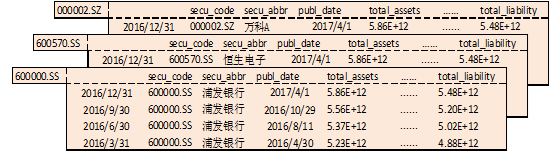

<a id="策略API介绍"></a>

## 策略API介绍

<a id="设置函数"></a>

### 设置函数

<a id="set_universe"></a>

#### set\_universe-设置股票池

```python
set_universe(security_list)
```

##### 使用场景

该函数仅在回测、交易模块可用

##### 接口说明

该函数用于设置或者更新此策略要操作的股票池。

注意事项：

1.  股票策略中，该函数只用于设定get\_history函数的默认security\_list入参，除此之外并无其他用处，因此为非必须设定的函数。

##### 参数

security\_list: 股票列表，支持单支或者多支股票(list\[str\]/str)

##### 返回

None

##### 示例

```python
def initialize(context):
    g.security = ['600570.SS','600571.SS']
    # 将g.security中的股票设置为股票池
    set_universe(g.security)

def handle_data(context, data):
    # 获取初始化设定的股票池行情数据
    his = get_history(5, '1d', 'close', security_list=None)
```

<a id="set_benchmark"></a>

#### set\_benchmark-设置基准

```python
set_benchmark(sids)
```

##### 使用场景

该函数仅在回测、交易模块可用

##### 接口说明

该函数用于设置策略的比较基准，前端展现的策略评价指标都基于此处设置的基准标的。

注意事项：

1.  此函数只能在initialize使用。
2.  回测时若用该函数设置了某个基准指数，那么该基准指数会替代终端页面开启回测时所设定的基准。

##### 参数

sids：股票/指数/ETF代码(str)

##### 默认设置

如果不做基准设置，默认选定沪深300指数(000300.SS)的每日价格作为判断策略好坏和一系列风险值计算的基准。如果要指定其他股票/指数/ETF的价格作为基准，就需要使用set\_benchmark。

##### 返回

None

##### 示例

```python
def initialize(context):
    g.security = '000001.SZ'
    set_universe(g.security)
    #将上证50(000016.SS)设置为参考基准
    set_benchmark('000016.SS')

def handle_data(context, data):
    order('000001.SZ',100)
```

<a id="set_commission"></a>

#### set\_commission-设置佣金费率

```python
set_commission(commission_ratio=0.0003, min_commission=5.0, type="STOCK")
```

##### 使用场景

该函数仅在回测模块可用

##### 接口说明

该函数用于设置佣金费率。

注意事项：

1.  关于回测手续费计算：手续费=佣金费+经手费+印花税。
2.  佣金费=佣金费率\*交易总金额(若佣金费计算后小于设置的最低佣金，则佣金费取最小佣金)。
3.  经手费=经手费率(万分之0.487)\*交易总金额。
4.  印花税=印花税率(千分之1)\*交易总金额，仅卖出时收。

##### 参数

commission\_ratio：佣金费率，默认股票每笔交易的佣金费率是万分之三，ETF基金、LOF基金每笔交易的佣金费率是万分之八。(float)

min\_commission：最低交易佣金，默认每笔交易最低扣5元佣金。(float)

type：交易类型，不传参默认为STOCK(目前只支持STOCK, ETF, LOF)。(string)

##### 返回

None

##### 示例

```python
def initialize(context):
    g.security = '600570.SS'
    set_universe(g.security)
    #将佣金费率设置为万分之三，将最低手续费设置为3元
    set_commission(commission_ratio =0.0003, min_commission=3.0)

def handle_data(context, data):
    pass
```

<a id="set_fixed_slippage"></a>

#### set\_fixed\_slippage-设置固定滑点

```python
set_fixed_slippage(fixedslippage=0.0)
```

##### 使用场景

该函数仅在回测模块可用

##### 接口说明

该函数用于设置固定滑点，滑点在真实交易场景是不可避免的，因此回测中设置合理的滑点有利于让回测逼近真实场景。

注意事项：

1.  滑点如果不足交易品种的最小价差，将不会生效。举例：沪深300期指IF的最小差价是0.2，如果固定滑点设置为0.3，单边为0.15，不足0.2，滑点设置无效。

##### 参数

fixedslippage：固定滑点，委托价格与最后的成交价格的价差设置，这个价差是一个固定的值(比如0.02元，撮合成交时委托价格±0.01元)。最终的成交价格=委托价格±float(fixedslippage)/2。

##### 返回

None

##### 示例

```python
def initialize(context):
    g.security = "600570.SS"
    set_universe(g.security)
    # 将滑点设置为固定的0.2元，即原本买入交易的成交价为10元，则设置之后成交价将变成10.1元
    set_fixed_slippage(fixedslippage=0.2)

def handle_data(context, data):
    pass
```

<a id="set_slippage"></a>

#### set\_slippage-设置滑点

```python
set_slippage(slippage=0.001)
```

##### 使用场景

该函数仅在回测模块可用

##### 接口说明

该函数用于设置滑点比例，滑点在真实交易场景是不可避免的，因此回测中设置合理的滑点有利于让回测逼近真实场景。

注意事项：

无

##### 参数

slippage：滑点比例，委托价格与最后的成交价格的价差设置，这个价差是当时价格的一个百分比(比如设置0.002时，撮合成交时委托价格±当前周期价格\*0.001)。最终成交价格=委托价格±委托价格\*float(slippage)/2。

##### 返回

None

##### 示例

```python
def initialize(context):
    g.security = "600570.SS"
    set_universe(g.security)
    # 将滑点设置为0.002
    set_slippage(slippage=0.002)

def handle_data(context, data):
    pass
```

<a id="set_volume_ratio"></a>

#### set\_volume\_ratio-设置成交比例

```python
set_volume_ratio(volume_ratio=0.25)
```

##### 使用场景

该函数仅在回测模块可用

##### 接口说明

该函数用于设置回测中单笔委托的成交比例，使得盘口流动性方面的设置尽量逼近真实交易场景。

注意事项：

1.  假如委托下单数量大于成交比例计算后的数量，系统会按成交比例计算后的数量撮合，差额部分委托数量不会继续挂单。

##### 参数

volume\_ratio：设置成交比例，默认0.25，即指本周期最大成交数量为本周期市场可成交总量的四分之一(float)

##### 返回

None

##### 示例

```python
def initialize(context):
    g.security = '600570.SS'
    set_universe(g.security)
    #将最大成交数量设置为本周期可成交总量的二分之一
    set_volume_ratio(volume_ratio = 0.5)

def handle_data(context, data):
    pass
```

<a id="set_limit_mode"></a>

#### set\_limit\_mode-设置成交数量限制模式

```python
set_limit_mode(limit_mode='LIMIT')
```

##### 使用场景

该函数仅在回测模块可用

##### 接口说明

该函数用于设置回测的成交数量限制模式。对于月度调仓等低频策略，对流动性冲击不是很敏感，不做成交量限制可以让回测更加便捷。

注意事项：

1.  不做限制之后实际撮合成交量是可以大于该时间段的实际成交总量。

##### 参数

limit\_mode：设置成交数量限制模式，即指回测撮合交易时对成交数量是否做限制进行控制(str)

默认为限制，入参'LIMIT'，不做限制则入参'UNLIMITED'

##### 返回

None

##### 示例

```python
def initialize(context):
    g.security = '600570.SS'
    set_universe(g.security)
    #回测中不限制成交数量
    set_limit_mode('UNLIMITED')

def handle_data(context, data):
    pass
```

<a id="set_yesterday_position"></a>

#### set\_yesterday\_position - 设置底仓

```python
set_yesterday_position(poslist)
```

##### 使用场景

该函数仅在回测模块可用

##### 接口说明

该函数用于设置回测的初始底仓。

注意事项：

1.  该函数会使策略初始化运行就创建出持仓对象，里面包含了设置的持仓信息。
2.  该函数仅支持在股票、两融回测中设置底仓。

##### 参数

poslist：list类型数据，该list中是字典类型的元素，参数不能为空(list\[dict\[str:str\],...\])；

数据格式及参数字段如下：

```
[{
    'sid':标的代码,
    'amount':持仓数量,
    'enable_amount':可用数量,
    'cost_basis':每股的持仓成本价格,
}]
```

参数也可通过csv文件的形式传入，参考接口[convert\_position\_from\_csv](http://180.169.107.9:7766/hub/help/api?weworkcfmcode#convert_position_from_csv)

##### 返回

None

##### 示例

```python
def initialize(context):
    g.security = '600570.SS'
    set_universe(g.security)
    # 设置底仓
    pos={}
    pos['sid'] = "600570.SS"
    pos['amount'] = "1000"
    pos['enable_amount'] = "600"
    pos['cost_basis'] = "55"
    set_yesterday_position([pos])

def handle_data(context, data):
    #卖出100股
    order(g.security, -100)
```

<a id="set_parameters"></a>

#### set\_parameters - 设置策略配置参数

```python
set_parameters(**kwargs)
```

##### 使用场景

该函数仅在交易模块可用

##### 接口说明

该函数用于设置策略中的配置参数。

注意事项：

1.  该函数入参格式必须为a=b样式。
2.  not\_restart\_trade、server\_restart\_not\_do\_before两个入参必须在initialize模块中设置。
3.  not\_restart\_trade入参配置说明(交易场景务必了解)：

-   服务器环境重启拉起交易时，initialize和before\_trading\_start函数会被重复调用，请务必检查策略编写逻辑：

-   避免在这两个函数中设置无法被系统持久化保存的变量，变量一旦被初始化会导致策略逻辑异常。
-   避免在这两个函数中调用委托接口，造成重复委托。

-   您可将not\_restart\_trade入参设置为1，在交易时间段避免重复执行的问题，交易时间段默认为09:00-11:30、13:00-15:30，实际以券商的配置为准。

5.  server\_restart\_not\_do\_before入参配置说明(交易场景务必了解)：

-   服务器环境重启拉起交易时，before\_trading\_start函数默认会被调用，为了避免重复调用带来的一系列问题(同上)，您可将server\_restart\_not\_do\_before入参设置为"1"，即一个交易日内before\_trading\_start函数仅调用一次。

7.  如果想要取消已经设置的配置参数，需要再次调用该接口并传入xxx(具体配置项)="0"。

##### 支持的参数

holiday\_not\_do\_before：交易中节假日是否执行before\_trading\_start。0，执行(缺省)；1，不执行。

tick\_data\_no\_l2：tick\_data中data是否包含order和transaction。0，包含(缺省)；1，不包含。

receive\_other\_response：策略中是否接收非本交易产生的主推。0，不接收(缺省)；1，接收。

receive\_cancel\_response：策略中是否接收撤单委托产生的主推。0，不接收(缺省)；1，接收。

~individual\_data\_in\_dict：策略中调用get\_individual\_entrust/transaction返回的数据类型。0，Panel(缺省)；1，dict。~

~tick\_direction\_in\_dict：策略中调用get\_tick\_direction返回的数据类型。0，OrderedDict(缺省)；1，dict。~

not\_restart\_trade：交易时间段若服务器重启，是否自动执行重新拉起本交易。0，执行(缺省)；1，不执行。

server\_restart\_not\_do\_before：若服务器重启导致重拉交易，是否重复执行before\_trading\_start函数。0，执行(缺省)；1，不执行。

##### 返回

None

##### 示例

```python
def initialize(context):
    # 初始化策略
    g.security = "600570.SS"
    set_universe(g.security)
    # 设置非交易日不执行before_trading_start
    # 设置tick_data中data不包含order和transaction
    # 设置接收非本交易产生的主推
    # 设置接收撤单委托产生的主推
    # 设置交易时间段服务器重启不再拉起本交易
    # 设置服务器重启重拉交易时不再执行before_trading_start函数
    set_parameters(holiday_not_do_before="1", tick_data_no_l2="1", receive_other_response="1",
                   receive_cancel_response="1", not_restart_trade="1", server_restart_not_do_before="1")
    # 取消交易时间段服务器重启不再拉起本交易设置
    # 取消服务器重启重拉交易时不再执行before_trading_start函数设置
    set_parameters(not_restart_trade="0", server_restart_not_do_before="0")

def before_trading_start(context, data):
    log.info("do before_trading_start")
    # 取消非交易日不执行before_trading_start设置
    # 取消tick_data中data不包含order和transaction设置
    # 取消接收非本交易产生的主推设置
    # 取消接收撤单委托产生的主推设置
    set_parameters(holiday_not_do_before="0", tick_data_no_l2="0", receive_other_response="0",
                   receive_cancel_response="0")

def on_order_response(context, order_list):
    log.info("委托主推：%s" % order_list)

def on_trade_response(context, trade_list):
    log.info("成交主推：%s" % trade_list)

def handle_data(context, data):
    pass
```

<a id="set_email_info"></a>

#### set\_email\_info-设置邮件信息

```python
set_email_info(email_address, smtp_code, email_subject)
```

##### 使用场景

该函数仅在交易模块可用

##### 接口说明

该函数用于设置邮件信息，当交易报错终止时会发送提示邮件。

注意事项：

1.  如要使用该函数，需咨询券商当前环境是否支持发送邮件。
2.  当前仅支持设置QQ邮箱地址。

##### 参数

email\_address(str)：邮箱地址(发送方与接收方一致)。

smtp\_code(str)：邮箱SMTP授权码。

email\_subject(str)：邮件主题。

##### 返回

返回设置是否成功True/False(bool)。

##### 示例

```python
def initialize(context):
    g.security = "600570.SS"
    set_universe(g.security)
    # 设置邮件信息
    set_email_info("2222@qq.com", "AABB", "【PTrade量化-策略交易异常终止提醒】")

def before_trading_start(context, data):
    raise BaseException("test send error email")

def handle_data(context, data):
    pass
```

<a id="定时周期性函数"></a>

### 定时周期性函数

<a id="run_daily"></a>

#### run\_daily-按日周期处理

```python
run_daily(context, func, time='9:31')
```

##### 使用场景

该函数仅在回测、交易模块可用

##### 接口说明

该函数用于以日为单位周期性运行指定函数，可对运行触发时间进行指定。

注意事项：

1.  该函数只能在初始化阶段initialize函数中调用。
2.  该函数可以在initialize中多次调用，以实现多个定时任务。 但需要注意的是交易中定时任务线程数限制为5且累计的任务不执行，即run\_daily和run\_interval累计调用超过5次时， 将会因堵塞导致部分定时任务不触发。
3.  股票策略回测中，当回测周期为分钟时，time的取值指定在09:31~11:30与13:00~15:00之间，当回测周期为日时， 无论设定值是多少都只会在15:00执行；交易中不受此时间限制。

##### 参数

context: [Context对象](http://180.169.107.9:7766/hub/help/api?weworkcfmcode#Context)，存放有当前的账户及持仓信息(Context)；

func：自定义函数名称，此函数必须以context作为参数(Callable\[\[Context\], None\])；

time：指定周期运行具体触发运行时间点，默认为9:31分(str)，交易场景可设置范围：00:00~23:59。

##### 返回

None

##### 示例

```python
# 定义一个财务数据获取函数，每天执行一次
def initialize(context):
    run_daily(context, get_finance)
    g.security = '600570.SS'
    set_universe(g.security)

def get_finance(context):
    re = get_fundamentals(g.security,'balance_statement','total_assets')
    log.info(re)

def handle_data(context, data):
    pass
```

<a id="run_interval"></a>

#### run\_interval - 按设定周期处理

```python
run_interval(context, func, seconds=10, interval_timer_ranges="")
```

##### 使用场景

该函数仅在交易模块可用

##### 接口说明

该函数用于以设定时间间隔(单位为秒)周期性运行指定函数，可对运行触发时间间隔进行指定。

注意事项：

1.  该函数只能在初始化阶段initialize函数中调用。
2.  可通过 interval\_timer\_ranges 参数设置运行的时间段。
3.  该函数可以在initialize中多次调用，以实现多个定时任务。但需要注意的是交易中定时任务线程数限制为5且累计的任务不执行，即run\_daily和run\_interval累计调用超过5次时， 将会因堵塞导致部分定时任务不触发。
4.  最小运行时间间隔seconds的设置规则：期货策略为1秒（用户设置值若小于1秒，系统仍当做1秒处理），股票等其他类型策略为3秒。

##### 参数

context: [Context对象](http://180.169.107.9:7766/hub/help/api?weworkcfmcode#Context)，存放有当前的账户及持仓信息(Context)；

func：自定义函数名称，此函数必须以context作为参数(Callable\[\[Context\], None\])；

seconds：设定时间间隔(单位为秒)，取值为正整数(int)。

interval\_timer\_ranges：用于设置指定函数运行的时间范围(str)。

-   每个时间段使用 HH:MM-HH:MM 格式，多个时间段之间用英文逗号分隔。例如："09:15-11:30,13:00-15:00"表示从上午9点15分到11点半和下午1点到3点的时间范围。
-   当前时间大于等于时间段范围的开始时间、小于时间段范围的结束时间时触发 run\_interval 内设置的函数。
-   时间是以24小时制表示的，确保统一格式。
-   如果未定义此参数，系统将默认使用券商配置时间范围进行处理。
-   如果时间段在数据更新范围外，可能会导致获取到未更新的历史数据，建议设置当前业务可交易的时间范围。

##### 返回

None

##### 示例

```python
# 定义一个周期处理函数，每10秒执行一次
def initialize(context):
    # 设置 interval_handle 函数在9:15~11:30与13:00~15:00时间段内执行
    run_interval(context, interval_handle, seconds=10, interval_timer_ranges="09:15-11:30,13:00-15:00")
    g.security = "600570.SS"
    set_universe(g.security)

def interval_handle(context):
    snapshot = get_snapshot(g.security)
    log.info(snapshot)

def handle_data(context, data):
    pass
```

<a id="获取信息函数"></a>

### 获取信息函数

<a id="获取基础信息"></a>

### 获取基础信息

<a id="get_trading_day"></a>

#### get\_trading\_day - 获取交易日期

```python
get_trading_day(day)
```

##### 使用场景

该函数在研究、回测、交易模块可用

##### 接口说明

该函数用于获取当前时间数天前或数天后的交易日期。

注意事项：

1.  默认情况下，回测中当前时间为策略中调用该接口的回测日日期(context.blotter.current\_dt)。
2.  默认情况下，研究中当前时间为调用当天日期。
3.  默认情况下，交易中当前时间为调用当天日期。

##### 参数

day：表示天数，正的为数天后，负的为数天前，day取0表示获取当前交易日，如果当前日期为非交易日则返回上一交易日的日期。day默认取值为0，不建议获取交易所还未公布的交易日期(int)；

##### 返回

date：datetime.date日期对象

##### 示例

```python
def initialize(context):
    g.security = ['600670.SS', '000001.SZ']
    set_universe(g.security)

def handle_data(context, data):
    # 获取后一天的交易日期
    next_trading_date = get_trading_day(1)
    log.info(next_trading_date)
    # 获取前一天的交易日期
    previous_trading_date = get_trading_day(-1)
    log.info(previous_trading_date)
```

<a id="get_all_trades_days"></a>

#### get\_all\_trades\_days - 获取全部交易日期

```python
get_all_trades_days(date=None)
```

##### 使用场景

该函数在研究、回测、交易模块可用

##### 接口说明

该函数用于获取某个日期之前的所有交易日日期。

注意事项：

1.  默认情况下，回测中date为策略中调用该接口的回测日日期(context.blotter.current\_dt)。
2.  默认情况下，研究中date为调用当天日期。
3.  默认情况下，交易中date为调用当天日期。
4.  该接口返回的最早的交易日日期为："2005-01-04"。

##### 参数

date：如'2016-02-13'或'20160213'

##### 返回

一个包含所有交易日的numpy.ndarray

##### 示例

```python
def initialize(context):
    # 获取当前回测日期之前的所有交易日
    all_trades_days = get_all_trades_days()
    log.info(all_trades_days)
    all_trades_days_date = get_all_trades_days('20150312')
    log.info(all_trades_days_date)
    g.security = ['600570.SS', '000001.SZ']
    set_universe(g.security)

def handle_data(context, data):
    pass
```

<a id="get_trade_days"></a>

#### get\_trade\_days - 获取指定范围交易日期

```python
get_trade_days(start_date=None, end_date=None, count=None)
```

##### 使用场景

该函数在研究、回测、交易模块可用

##### 接口说明

该函数用于获取指定范围交易日期。

注意事项：

1.  默认情况下，回测中end\_date为策略中调用该接口的回测日日期(context.blotter.current\_dt)。
2.  默认情况下，研究中end\_date为调用当天日期。
3.  默认情况下，交易中end\_date为调用当天日期。

##### 参数

start\_date：开始日期，与count二选一，不可同时使用。如'2016-02-13'或'20160213',开始日期最早不超过1990年(str)；

end\_date：结束日期，如'2016-02-13'或'20160213'。如果输入的结束日期大于今年则至多返回截止到今年的数据(str)；

count：数量，与start\_date二选一，不可同时使用，必须大于0。表示获取end\_date往前的count个交易日，包含end\_date当天。count建议不大于3000，即返回数据的开始日期不早于1990年(int)；

##### 返回

一个包含指定范围交易日的numpy.ndarray

##### 示例

```python
def initialize(context):
    # 获取指定范围内交易日
    trade_days = get_trade_days('2016-01-01', '2016-02-01')
    log.info(trade_days)
    g.security = ['600570.SS', '000001.SZ']
    set_universe(g.security)

def handle_data(context, data):
    # 获取回测日期往前10天的所有交易日，包含历史回测日期
    trading_days = get_trade_days(count=10)
    log.info(trading_days)
```

<a id="get_trading_day_by_date"></a>

#### get\_trading\_day\_by\_date - 按日期获取指定交易日

```python
get_trading_day_by_date(query_date, day=0)
```

##### 使用场景

该函数在研究、回测、交易模块可用

##### 接口说明

该函数用于根据输入日期获取指定的交易日。

注意事项：

1.  query\_date为必传入参。
2.  该函数主要使用场景：按固定自然日调仓。

##### 参数

query\_date：查询日期,如"20230213"(str)；

day：表示天数，正的为数天后，负的为数天前，day取0表示获取当前交易日，如果当前日期为非交易日则返回下一交易日的日期。day默认取值为0(int)；

##### 返回

date：交易日日期(str)

##### 示例

```python
def initialize(context):
    g.security = ['600570.SS', '000001.SZ']
    set_universe(g.security)

def handle_data(context, data):
    current_date = context.blotter.current_dt.strftime('%Y-%m-%d')
    trading_date = get_trading_day_by_date("20230501", 0)
    if trading_date == current_date:
        log.info("今日是5月1日之后首个交易日")
```

<a id="获取市场信息"></a>

### 获取市场信息

<a id="get_market_list"></a>

#### get\_market\_list-获取市场列表

```python
get_market_list()
```

##### 使用场景

该函数在研究、回测、交易模块可用

##### 接口说明

该函数用于返回当前市场列表目录。

注意事项：

1.  回测和交易中仅限before\_trading\_start和after\_trading\_end中使用。

##### 参数

无

##### 返回

返回pandas.DataFrame对象，返回字段包括:

finance\_mic - 市场编码(str:str)

finance\_name - 市场名称(str:str)

##### 示例

```python
get_market_list()
```

如返回：

|  | finance\_mic | finance\_name |
| --- | --- | --- |
| 1 | SS | 上海证券交易所 |
| 2 | SZ | 深圳证券交易所 |
| 3 | CSI | 中证指数 |
| 4 | XBHS | 沪深板块 |

<a id="get_market_detail"></a>

#### get\_market\_detail-获取市场详细信息

```python
get_market_detail(finance_mic)
```

##### 使用场景

该函数在研究、回测、交易模块可用

##### 接口说明

该函数用于返回市场编码对应的详细信息。

注意事项：

1.  回测和交易中仅限before\_trading\_start和after\_trading\_end中使用。
2.  仅支持get\_market\_list接口所返回的四个市场数据。

##### 参数

finance\_mic: 市场代码，相关市场编码参考get\_market\_list返回信息(str)。

##### 返回

返回市场详细信息，类型为pandas.DataFrame对象，返回字段包括：

产品代码: prod\_code(str:str)

产品名称: prod\_name(str:str)

类型代码: hq\_type\_code(str:str)

时间规则: trade\_time\_rule(str:numpy.int64)

返回如下:

```python
      hq_type_code prod_code prod_name  trade_time_rule
0              MRI    000001      上证指数                0
1              MRI    000002      Ａ股指数                0
2              MRI    000003      Ｂ股指数                0
3              MRI    000004      工业指数                0
4              MRI    000005      商业指数                0
5              MRI    000006      地产指数                0
6              MRI    000007      公用指数                0
7              MRI    000008      综合指数                0
```

##### 示例

```python
# 获取上海证券交易所相关信息 'XSHG'/'SS'
get_market_detail('XSHG')
```

<a id="获取行情信息"></a>

### 获取行情信息

<a id="get_history"></a>

#### get\_history - 获取历史行情

```python
get_history(count, frequency='1d', field='close', security_list=None, fq=None, include=False, fill='nan', is_dict=False)
```

##### 使用场景

该函数仅在回测、交易、研究模块可用

##### 接口说明

该接口用于获取最近N条历史行情K线数据。支持多股票、多行情字段获取。

注意事项：

1.  该接口只能获取2005年后的数据。
2.  针对停牌场景，我们没有跳过停牌的日期，无论对单只股票还是多只股票进行调用，时间轴均为二级市场交易日日历， 停牌时使用停牌前的数据填充，成交量为0，日K线可使用成交量为0的逻辑进行停牌日过滤。
3.  证监会行业、聚源行业、概念板块、地域板块所对应标的的行情数据为非标准的交易所下发数据，是由数据源自行按照成分股分类规则进行计算的，存在与三方数据源不一致的情况。如用户需要在策略中使用，应自行评估该数据的合理性。
4.  该接口与get\_price接口不支持多线程同时调用，即在run\_daily或run\_interval等函数中不要与handle\_data等框架模块同一时刻调用get\_history或get\_price接口，否则会偶现获取数据为空的现象

##### 参数

count： K线数量，大于0，返回指定数量的K线行情；必填参数；入参类型：int；

frequency：K线周期，现有支持1分钟线(1m)、5分钟线(5m)、15分钟线(15m)、30分钟线(30m)、60分钟线(60m)、120分钟线(120m)、日线(1d)、周线(1w/weekly)、月线(mo/monthly)、季度线(1q/quarter)和年线(1y/yearly)频率的数据；选填参数，默认为'1d'；入参类型：str；

field：指明数据结果集中所支持输出的行情字段；选填参数，默认为\['open','high','low','close','volume','money','price'\]；入参类型：list\[str,str\]或str；输出字段包括：

-   open -- 开盘价，字段返回类型：numpy.float64；
-   high -- 最高价，字段返回类型：numpy.float64；
-   low --最低价，字段返回类型：numpy.float64；
-   close -- 收盘价，字段返回类型：numpy.float64；
-   volume -- 交易量，字段返回类型：numpy.float64；
-   money -- 交易金额，字段返回类型：numpy.float64；
-   price -- 最新价，字段返回类型：numpy.float64；
-   is\_open -- 是否开盘，字段返回类型：numpy.int64(仅日线返回)；
-   preclose -- 昨收盘价，字段返回类型：numpy.float64(仅日线返回)；
-   high\_limit -- 涨停价，字段返回类型：numpy.float64(仅日线返回)；
-   low\_limit -- 跌停价，字段返回类型：numpy.float64(仅日线返回)；
-   unlimited -- 判断查询日是否是无涨跌停限制(1:该日无涨跌停限制;0:该日不是无涨跌停限制)，字段返回类型：numpy.int64(仅日线返回)；

security\_list：要获取数据的股票列表；选填参数，None表示在上下文中的universe中选中的所有股票；入参类型：list\[str,str\]或str；

fq：数据复权选项，支持包括，pre-前复权，post-后复权，dypre-动态前复权，None-不复权；选填参数，默认为None；入参类型：str；

include：是否包含当前周期，True -包含，False-不包含；选填参数，默认为False；入参类型：bool；

fill：行情获取不到某一时刻的分钟数据时，是否用上一分钟的数据进行填充该时刻数据，'pre'-用上一分钟数据填充，'nan'-NaN进行填充(仅交易有效)；选填参数，默认为'nan'；入参类型：str；

is\_dict：返回是否是字典(dict)格式{str: array()}，True -是，False-不是；选填参数，默认为False；返回为字典格式取数速度相对较快；入参类型：bool；

##### 返回

###### dict类型

正常返回dict类型数据，异常时返回None(NoneType)。

OrderedDict(\[(股票代码(str), array(\[日期时间(numpy.int64), 开盘价(numpy.float64), 最高价(numpy.float64), 最低价(numpy.float64), 收盘价(numpy.float64), 成交量(numpy.float64), 成交额(numpy.float64), 最新价(numpy.float64)\]\]))\])

OrderedDict(\[('000001.SZ', array(\[(202309220931, 11.03, 11.08, 11.03, 11.07, 2289400.0, 25302018.0, 11.07),... \]))\])

###### 非dict类型

-   (python3.5、python3.11版本均支持)第一种返回数据：

当获取单支股票(单只股票必须为字符串类型security\_list='600570.SS'，不能用security\_list=\['600570.SS'\])的时候，无论行情字段field入参单个或多个，返回的都是pandas.DataFrame对象，行索引是datetime.datetime对象，列索引是行情字段,为str类型。比如：

如果当前时间是2017-04-18，get\_history(5, '1d', 'open', '600570.SS', fq=None, include=False)将返回：

|  | open |
| --- | --- |
| 2017-04-11 | 40.30 |
| 2017-04-12 | 40.08 |
| 2017-04-13 | 40.03 |
| 2017-04-14 | 40.04 |
| 2017-04-17 | 39.90 |

-   (仅python3.11版本支持)第二种返回数据：

当获取多支股票(多只股票必须为list类型，特殊情况：当list只有一个股票时仍然当做多股票处理，比如security\_list=\['600570.SS'\])的时候，无论行情字段field入参是单个还是多个，返回的是pandas.DataFrame对象，行索引是datetime.datetime对象，列索引是股票代码code和取的字段,为str类型。比如：

如果当前时间是2017-04-18，get\_history(5, '1d', 'open', \['600570.SS','600571.SS'\], fq=None, include=False)将返回：

|  | code | open |
| --- | --- | --- |
| 2017-04-11 | 600570.SS | 40.30 |
| 2017-04-12 | 600570.SS | 40.08 |
| 2017-04-13 | 600570.SS | 40.03 |
| 2017-04-14 | 600570.SS | 40.04 |
| 2017-04-17 | 600570.SS | 39.90 |
| 2017-04-11 | 600571.SS | 17.81 |
| 2017-04-12 | 600571.SS | 17.56 |
| 2017-04-13 | 600571.SS | 17.42 |
| 2017-04-14 | 600571.SS | 17.40 |
| 2017-04-17 | 600571.SS | 17.49 |

假如要对获取查询多只代码种某单只代码或多只代码的数据，可以通过x.query('code in \["xxxxxx.SS"\]')的方法获取。

比如:

dataframe\_info = get\_history(2, frequency='1d', field=\['open','close'\], security\_list=\['600570.SS', '600571.SS'\], fq=None, include=False)

则获取600570.SS的数据为：df = dataframe\_info.query('code in \["600570.SS"\]')

-   (仅python3.5版本支持)第三种返回数据：

当获取多支股票(多只股票必须为list类型，特殊情况：当list只有一个股票时仍然当做多股票处理，比如security\_list=\['600570.SS'\])的时候，如果行情字段field入参为单个，返回的是pandas.DataFrame对象，行索引是datetime.datetime对象，列索引是股票代码的编号,为str类型。比如：

如果当前时间是2017-04-18，get\_history(5, '1d', 'open', \['600570.SS','600571.SS'\], fq=None, include=False)将返回：

|  | 600570.SS | 600571.SS |
| --- | --- | --- |
| 2017-04-11 | 40.30 | 17.81 |
| 2017-04-12 | 40.08 | 17.56 |
| 2017-04-13 | 40.03 | 17.42 |
| 2017-04-14 | 40.04 | 17.40 |
| 2017-04-17 | 39.90 | 17.49 |

-   (仅python3.5版本支持)第四种返回数据：

当获取多支股票(多只股票必须为list类型，特殊情况：当list只有一个股票时仍然当做多股票处理，比如security\_list=\['600570.SS'\])的时候，如果行情字段field入参为多个，则返回pandas.Panel对象，items索引是行情字段(如'open'、'close'等)，里面是很多pandas.DataFrame对象，每个pandas.DataFrame的行索引是datetime.datetime对象， 列索引是股票代码,为str类型，比如:

如果当前时间是2015-01-07，get\_history(2, frequency='1d', field=\['open','close'\], security\_list=\['600570.SS', '600571.SS'\], fq=None, include=False)\['open'\]将返回:

|  | 600570.SS | 600571.SS |
| --- | --- | --- |
| 2015-01-05 | 54.77 | 26.93 |
| 2015-01-06 | 51.00 | 25.83 |

假如要对panel索引中的对象进行转换，比如将items索引由行情字段转换成股票代码，可以通过panel\_info = panel\_info.swapaxes("minor\_axis", "items")的方法转换。

比如:

panel\_info = get\_history(2, frequency='1d', field=\['open','close'\], security\_list=\['600570.SS', '600571.SS'\], fq=None, include=False)

按默认索引：df = panel\_info\['open'\]

对默认索引做转换：panel\_info = panel\_info.swapaxes("minor\_axis", "items")

转换之后的索引：df = panel\_info\['600570.SS'\]

##### 示例

```python
def initialize(context):
    g.security = ['600570.SS', '000001.SZ']
    set_universe(g.security)

def before_trading_start(context, data):
    # 获取农业版块过去10天的每日收盘价
    industry_info = get_history(10, frequency="1d", field="close", security_list="A01000.XBHS")
    log.info(industry_info)

def handle_data(context, data):
    # 股票池中全部股票过去5天的每日收盘价
    his = get_history(5, '1d', 'close', security_list=g.security)
    log.info('股票池中全部股票过去5天的每日收盘价')
    log.info(his)

    # 获取600570(恒生电子)过去5天的每天收盘价,
    # 一个pd.Series对象, index是datatime
    log.info('获取600570(恒生电子)过去5天的每天收盘价')
    his_ss = his.query('code in ["600570.SS"]')['close']
    log.info(his_ss)

    # 获取600570(恒生电子)昨天(数组最后一项)的收盘价
    log.info('获取600570(恒生电子)昨天的收盘价')
    log.info(his_ss[-1])

    # 获取每一列的平均值
    log.info('获取600570(恒生电子)每一列的平均值')
    log.info(his_ss.mean())

    # 获取股票池中全部股票的过去10分钟的成交量
    his1 = get_history(10, '1m', 'volume')
    log.info('获取股票池中全部股票的过去10分钟的成交量')
    log.info(his1)

    # 获取恒生电子的过去5天的每天的收盘价
    his2 = get_history(5, '1d', 'close', security_list='600570.SS')
    log.info('获取恒生电子的过去5天的每天的收盘价')
    log.info(his2)

    # 获取恒生电子的过去5天的每天的后复权收盘价
    his3 = get_history(5, '1d', 'close', security_list='600570.SS', fq='post')
    log.info('获取恒生电子的过去5天的每天的后复权收盘价')
    log.info(his3)

    # 获取恒生电子的过去5周的每周的收盘价
    his4 = get_history(5, '1w', 'close', security_list='600570.SS')
    log.info('获取恒生电子的过去5周的每周的收盘价')
    log.info(his4)

    # 获取多只股票的开盘价和收盘价数据
    dataframe_info = get_history(2, frequency='1d', field=['open','close'], security_list=g.security)
    open_df = dataframe_info[['code', 'open']]
    log.info('获所有股票的取开盘价数据')
    log.info(open_df)
    df = open_df.query('code in ["600570.SS"]')['open']
    log.info('仅获取恒生电子的开盘价数据')
    log.info(df)
```

<a id="get_price"></a>

#### get\_price - 获取历史数据

```python
get_price(security, start_date=None, end_date=None, frequency='1d', fields=None, fq=None, count=None, is_dict=False)
```

##### 使用场景

该函数在研究、回测、交易模块可用

##### 接口说明

该接口用于获取指定日期前N条的历史行情K线数据或者指定时间段内的历史行情K线数据。支持多股票、多行情字段获取。

注意事项：

1.  start\_date与count必须且只能选择输入一个，不能同时输入或者同时都不输入。
2.  针对停牌场景，我们没有跳过停牌的日期，无论对单只股票还是多只股票进行调用，时间轴均为二级市场交易日日历， 停牌时使用停牌前的数据填充，成交量为0，日K线可使用成交量为0的逻辑进行停牌日过滤。
3.  数据返回内容不包括当天数据。
4.  count只针对'daily', 'weekly', 'monthly', 'quarter', 'yearly', '1d', '1m', '5m', '15m', '30m', '60m', '120m', '1w', 'mo', '1q', '1y'频率有效，并且输入日期的类型需与频率对应。
5.  'weekly', '1w', 'monthly', 'mo', 'quarter', '1q', 'yearly', '1y'频率不支持start\_date和end\_date组合的入参， 只支持end\_date和count组合的入参形式。
6.  返回的周线数据是由日线数据进行合成。
7.  该接口只能获取2005年后的数据。
8.  证监会行业、聚源行业、概念板块、地域板块所对应标的的行情数据为非标准的交易所下发数据，是由数据源自行按照成分股分类规则进行计算的，存在与三方数据源不一致的情况。如用户需要在策略中使用，应自行评估该数据的合理性。
9.  该接口与get\_history接口不支持多线程同时调用，即在run\_daily或run\_interval等函数中不要与handle\_data等框架模块同一时刻调用get\_history或get\_price接口，否则会偶现获取数据为空的现象。

##### 参数

security：一支股票代码或者一个股票代码的list(list\[str\]/str)

start\_date：开始时间，默认为空，回测中输入请小于回测日期，交易、研究中输入请小于当前日期，且均小于等于end\_date。传入格式仅支持：YYYYmmdd、YYYY-mm-dd、YYYY-mm-dd HH:MM、YYYYmmddHHMM，如'20150601'、'2015-06-01'、'2015-06-01 10:00'、'201506011000'(str)；

end\_date：结束时间，默认为空，回测中输入请小于回测日期，交易、研究中输入请小于当前日期。传入格式仅支持：YYYYmmdd、YYYY-mm-dd、YYYY-mm-dd HH:MM、YYYYmmddHHMM，如'20150601'、'2015-06-01'、'2015-06-01 14:00'、'201506011400'(str)；

frequency： 单位时间长度，现有支持1分钟线(1m)、5分钟线(5m)、15分钟线(15m)、30分钟线(30m)、60分钟线(60m)、120分钟线(120m)、日线(1d)、周线(1w/weekly)、月线(mo/monthly)、季度线(1q/quarter)和年线(1y/yearly)频率数据(str)；

fields：指明数据结果集中所支持输出字段(list\[str\]/str)，输出字段包括 ：

-   open -- 开盘价(numpy.float64)；
-   high -- 最高价(numpy.float64)；
-   low --最低价(numpy.float64)；
-   close -- 收盘价(numpy.float64)；
-   volume -- 交易量(numpy.float64)；
-   money -- 交易金额(numpy.float64)；
-   price -- 最新价(numpy.float64)；
-   is\_open -- 是否开盘(numpy.int64)(仅日线返回)；
-   preclose -- 昨收盘价(numpy.float64)(仅日线返回)；
-   high\_limit -- 涨停价(numpy.float64)(仅日线返回)；
-   low\_limit -- 跌停价(numpy.float64)(仅日线返回)；
-   unlimited -- 判断查询日是否无涨跌停限制(1：该日无涨跌停限制；0：该日有涨跌停限制)(numpy.int64)(仅日线返回)；

fq：数据复权选项，支持包括，pre-前复权，post-后复权，dypre-动态前复权，None-不复权(str)；

count：大于0，不能与start\_date同时输入，获取end\_date前count根的数据，不支持除天('daily'/'1d')、分钟('1m')、5分钟线('5m')、15分钟线('15m')、30分钟线('30m')、60分钟线('60m')、120分钟线('120m')、周('weekly'/'1w')、('monthly'/'mo')、('quarter'/'1q')和('yearly'/'1y')以外的其它频率(int)；

is\_dict：返回是否是字典(dict)格式{str: array()}，True -是，False-不是；选填参数，默认为False；返回为字典格式取数速度相对较快，入参类型：bool；

##### 返回

###### dict类型

正常返回dict类型数据，异常时返回None(NoneType)。

OrderedDict(\[(股票代码(str), array(\[日期时间(numpy.int64), 开盘价(numpy.float64), 最高价(numpy.float64), 最低价(numpy.float64), 收盘价(numpy.float64), 成交量(numpy.float64), 成交额(numpy.float64), 最新价(numpy.float64)\]\]))\])

OrderedDict(\[('600570.SS', array(\[(201706010931, 37.1, 37.14, 37.05, 37.09, 128200.0, 4756263.0, 37.09),...\]))\])

###### 非dict类型

get\_price对于多股票和多字段不同场景下获取返回数据的规则与[get\_history](http://180.169.107.9:7766/hub/help/api?weworkcfmcode#get_history)一致，如下：

-   (python3.5、python3.11版本均支持)第一种返回数据：

当获取单支股票(单只股票必须为字符串类型security='600570.SS'，不能用security=\['600570.SS'\])和单个或多个字段的时候，返回的是pandas.DataFrame对象，行索引是datetime.datetime对象，列索引是行情字段，为str类型。

例如，输入为get\_price(security='600570.SS',start\_date='20170201',end\_date='20170213',frequency='1d')时，将返回：

```python

                 open	high	 low    close	 volume	         money	       price is_open  preclose high_limit low_limit unlimited
2017-02-03	44.47	44.50	43.58	43.90	4418325.0	193895820.0	43.90	1	44.26	48.69	  39.83 	0
2017-02-06	43.91	44.30	43.66	44.10	4428487.0	194979290.0	44.10	1	43.90	48.29	  39.51 	0
2017-02-07	44.05	44.07	43.34	43.52	5649251.0	246776480.0	43.52	1	44.10	48.51	  39.69 	0
2017-02-08	43.59	44.78	43.53	44.59	12570233.0	557883600.0	44.59	1	43.52	47.87	  39.17 	0
2017-02-09	44.74	45.28	44.39	44.74	9240223.0	413875390.0	44.74	1	44.59	49.05	  40.13 	0
2017-02-10	44.80	44.98	44.41	44.62	8097465.0	361757300.0	44.62	1	44.74	49.21	  40.27 	0
2017-02-13	44.32	45.98	44.02	44.89	14931596.0	672360490.0	44.89	1	44.62	49.08	  40.16 	0
```

-   (仅python3.11版本支持)第二种返回数据：

当获取多支股票(多只股票必须为list类型，特殊情况：当list只有一个股票时仍然当做多股票处理，比如security=\['600570.SS'\])时候，返回的是pandas.DataFrame对象，行索引是datetime.datetime对象，列索引是股票代码code和取的字段，为str类型。

例如，输入为get\_price(\['600570.SS'\], start\_date='20170201', end\_date='20170213', frequency='1d', fields='open')时，将返回：

```python

              code     open
2017-02-03  600570.SS  44.47
2017-02-06  600570.SS  43.91
2017-02-07  600570.SS  44.05
2017-02-08  600570.SS  43.59
2017-02-09  600570.SS  44.74
2017-02-10  600570.SS  44.80
2017-02-13  600570.SS  44.32
```

例如，输入为get\_price(\['600570.SS','600571.SS'\], start\_date='20170201', end\_date='20170213', frequency='1d', fields=\['open','close'\])\[\['code', 'open'\]\]时，将返回：

```python

               code    open
2017-02-03  600570.SS  44.47
2017-02-06  600570.SS  43.91
2017-02-07  600570.SS  44.05
2017-02-08  600570.SS  43.59
2017-02-09  600570.SS  44.74
2017-02-10  600570.SS  44.80
2017-02-13  600570.SS  44.32
2017-02-03  600571.SS  19.36
2017-02-06  600571.SS  19.00
2017-02-07  600571.SS  19.27
2017-02-08  600571.SS  19.10
2017-02-09  600571.SS  19.47
2017-02-10  600571.SS  19.57
2017-02-13  600571.SS  19.22
```

假如要对获取查询多只代码种某单只代码或多只代码的数据，可以通过x.query('code in \["xxxxxx.SS"\]')的方法获取。

-   (仅python3.5版本支持)第三种返回数据：

当获取多支股票(多只股票必须为list类型，特殊情况：当list只有一个股票时仍然当做多股票处理，比如security=\['600570.SS'\])和单个字段的时候，返回的是pandas.DataFrame对象，行索引是datetime.datetime对象，列索引是股票代码的编号，为str类型。

例如，输入为get\_price(\['600570.SS'\], start\_date='20170201', end\_date='20170213', frequency='1d', fields='open')时，将返回：

```python

              600570.SS
2017-02-03      44.47
2017-02-06      43.91
2017-02-07      44.05
2017-02-08      43.59
2017-02-09      44.74
2017-02-10      44.80
2017-02-13      44.32
```

-   (仅python3.5版本支持)第四种返回数据：

如果是获取多支股票(多只股票必须为list类型，特殊情况：当list只有一个股票时仍然当做多股票处理，比如security=\['600570.SS'\])和多个字段，则返回pandas.Panel对象，items索引是行情字段，为str类型(如'open'、'close'等)，里面是很多pandas.DataFrame对象，每个pandas.DataFrame的行索引是datetime.datetime对象， 列索引是股票代码，为str类型。

例如，输入为get\_price(\['600570.SS','600571.SS'\], start\_date='20170201', end\_date='20170213', frequency='1d', fields=\['open','close'\])\['open'\]时，将返回：

```python

             600570.SS   600571.SS
2017-02-03    44.47        19.36
2017-02-06    43.91        19.00
2017-02-07    44.05        19.27
2017-02-08    43.59        19.10
2017-02-09    44.74        19.47
2017-02-10    44.80        19.57
2017-02-13    44.32        19.22
```

假如要对panel索引中的对象进行转换，比如将items索引由行情字段转换成股票代码，可以通过panel\_info = panel\_info.swapaxes("minor\_axis", "items")的方法转换。

##### 示例

```python
def initialize(context):
    g.security = '600570.SS'
    set_universe(g.security)

def handle_data(context, data):
    # 获得600570.SS(恒生电子)的2015年01月的天数据，只获取open字段
    price_open = get_price('600570.SS', start_date='20150101', end_date='20150131', frequency='1d')['open']
    log.info(price_open)
    # 获取指定结束日期前count天到结束日期的所有开盘数据
    # price_open = get_price('600570.SS', end_date='20150131', frequency='daily', count=10)['open']
    # log.info(price_open)
    # 获取股票指定结束时间前count分钟到指定结束时间的所有数据
    # stock_info = get_price('600570.SS', end_date='2015-01-31 10:00', frequency='1m', count=10)
    # log.info(stock_info)
    # 获取指定结束日期前count周到结束日期所在周的所有开盘数据
    # week_open = get_price('600570.SS', end_date='20150131', frequency='1w', count=10)['open']
    # log.info(week_open)

    # 获取多只股票
    # 获取沪深300的2015年1月的天数据，返回一个[pandas.DataFrame]
    security_list = get_index_stocks('000300.XBHS', '20150101')
    price = get_price(security_list, start_date='20150101', end_date='20150131')
    log.info(price)
    # 获取某股票开盘价，行索引是[datetime.datetime]对象，列索引是行情字段

    price_open = price.query('code in [@security_list[0]]')['open']
    log.info(price_open)

    # 获取农业版块指定结束日期前count天到结束日期的数据
    industry_info = get_price("A01000.XBHS", end_date="20210315", frequency="daily", count=10)
    log.info(industry_info)
```

<a id="get_individual_entrust"></a>

#### get\_individual\_entrust- 获取逐笔委托行情

```python
get_individual_entrust(stocks=None, data_count=50, start_pos=0, search_direction=1, is_dict=False)
```

##### 使用场景

该函数在交易模块可用

##### 接口说明

该接口用于获取当日逐笔委托行情数据。

注意事项：

1.  沪深市场都有逐笔委托数据。
2.  逐笔委托，逐笔成交数据需开通level2行情才能获取到数据，否则无数据返回。
3.  当策略入参is\_dict为True时返回的数据类型为dict，返回dict类型数据的速度比(python3.11版本支持)DataFrame,(python3.5版本支持)Panel类型数据有大幅提升。

##### 参数

stocks: 默认为当前股票池中代码列表(list\[str\])；

data\_count: 数据条数，默认为50，最大为200(int)；

start\_pos: 起始位置，默认为0(int)；

search\_direction: 搜索方向(1向前，2向后)，默认为1(int)；

is\_dict: 返回类型（False-(python3.11版本支持)DataFrame,(python3.5版本支持)Panel; True-dict），默认为False；

##### 返回

###### dict类型

正常返回dict类型数据，异常时返回None(NoneType)。

返回的数据格式如下：

{股票代码(str): \[\[时间戳毫秒级(int), 价格(float), 委托数量(int), 委托编号(int), 委托方向(int)\], ...\], "fields": \["business\_time", "hq\_px", "business\_amount", "order\_no", "business\_direction", "trans\_kind"\]}

{"600570.SS": \[\[20220913105747848, 36.16, 700, 5383145, 0, 4\], ...\], "fields": \["business\_time", "hq\_px", "business\_amount", "order\_no", "business\_direction", "trans\_kind"\]}

###### 非dict类型

默认返回(python3.11版本支持)DataFrame,(python3.5版本支持)Panel类型，入参is\_dict为True时返回dict类型。

-   1.(仅python3.11版本支持)DataFrame类型类型，异常时返回None(NoneType)

输出字段如下所示：

1.  code: 代码(str)；
2.  business\_time: 时间戳毫秒级(int)；
3.  hq\_px: 价格(float)；
4.  business\_amount: 委托数量(int)；
5.  order\_no: 委托编号(int)；
6.  business\_direction: [成交方向](http://180.169.107.9:7766/hub/help/api?weworkcfmcode#%E6%88%90%E4%BA%A4%E6%96%B9%E5%90%91)(int)；
7.  trans\_kind: [委托类型](http://180.169.107.9:7766/hub/help/api?weworkcfmcode#%E5%A7%94%E6%89%98%E7%B1%BB%E5%9E%8B)(int)；

-   2.(仅python3.5版本支持)正常返回Pandas.panel对象，异常时返回None(NoneType)

Items axis: 股票代码列表(str)；

Major\_axis axis: 数据索引为自然数列(DataFrame)；

Minor\_axis axis: 包含以下信息：

1.  business\_time: 时间戳毫秒级(str:numpy.int64)；
2.  hq\_px: 价格(str:numpy.int64)；
3.  business\_amount: 委托数量(str:numpy.int64)；
4.  order\_no: 委托编号(str:numpy.int64)；
5.  business\_direction: [成交方向](http://180.169.107.9:7766/hub/help/api?weworkcfmcode#%E6%88%90%E4%BA%A4%E6%96%B9%E5%90%91)(str:numpy.int64)；
6.  trans\_kind: [委托类型](http://180.169.107.9:7766/hub/help/api?weworkcfmcode#%E5%A7%94%E6%89%98%E7%B1%BB%E5%9E%8B)(str:numpy.int64)；

##### 示例

```python
def initialize(context):
    g.security = "000001.SZ"
    set_universe(g.security)

def before_trading_start(context, data):
    g.flag = False

def handle_data(context, data):
    if not g.flag:
        # 获取当前股票池逐笔委托数据
        entrust = get_individual_entrust()
        log.info(entrust)
        # 获取指定股票列表逐笔委托数据
        entrust = get_individual_entrust(["000002.SZ", "000032.SZ"])
        log.info(entrust)
        # 获取委托量
        if entrust is not None:
            business_amount = entrust.query('code in ["000002.SZ"]')["business_amount"]
            log.info("逐笔数据的委托量为：%s" % business_amount)

        # 返回字典类型数据
        entrust = get_individual_entrust([g.security], is_dict=True)
        log.info("逐笔委托数据为：%s" % entrust)
        g.flag = True
```

<a id="get_individual_transaction"></a>

#### get\_individual\_transaction - 获取逐笔成交行情

```python
get_individual_transaction(stocks=None, data_count=50, start_pos=0, search_direction=1, is_dict=False)
```

##### 使用场景

该函数在交易模块可用

##### 接口说明

该接口用于获取当日逐笔成交行情数据。

注意事项：

1.  沪深市场都有逐笔成交数据。
2.  逐笔委托，逐笔成交数据需开通level2行情才能获取到数据，否则无数据返回。
3.  当策略入参is\_dict为True时返回的数据类型为dict，返回dict类型数据的速度比(python3.11版本支持)DataFrame,(python3.5版本支持)Panel类型数据有大幅提升。

##### 参数

stocks: 默认为当前股票池中代码列表(list\[str\])；

data\_count: 数据条数，默认为50，最大为200(int)；

start\_pos: 起始位置，默认为0(int)；

search\_direction: 搜索方向(1向前，2向后)，默认为1(int)；

is\_dict: 返回类型（False-(python3.11版本支持)DataFrame,(python3.5版本支持)Panel; True-dict），默认为False；

##### 返回

###### dict类型

正常返回dict类型数据，异常时返回None(NoneType)。

返回的数据格式如下：

{股票代码(str): \[\[时间戳毫秒级(int), 价格(float), 成交数量(int), 成交编号(int), 成交方向(int), 叫买方编号(int), 叫卖方编号(int), 成交标记(int), 盘后逐笔成交序号标识(int), 成交通道信息(int)\], ...\], "fields": \["business\_time", "hq\_px", "business\_amount", "trade\_index", "business\_direction", "buy\_no", "sell\_no", "trans\_flag", 'trans\_identify\_am", "channel\_num"\]}

{"600570.SS": \[\[20220913111141472, 36.47, 100, 3286989, 1, 5807243, 5804930, 0, 0, 2\], ...\], "fields": \["business\_time", "hq\_px", "business\_amount", "trade\_index", "business\_direction", "buy\_no", "sell\_no", "trans\_flag", 'trans\_identify\_am", "channel\_num"\]}

###### 非dict类型

默认返回(python3.11版本支持)DataFrame,(python3.5版本支持)Panel类型，入参is\_dict为True时返回dict类型。

-   1.(仅python3.11版本支持)DataFrame类型类型，异常时返回None(NoneType)

输出字段如下所示：

-   code: 代码(str)；
-   business\_time: 时间戳毫秒级(int)；
-   hq\_px: 价格(float)；
-   business\_amount: 成交数量(int)；
-   trade\_index: 成交编号(int)；
-   business\_direction: [成交方向](http://180.169.107.9:7766/hub/help/api?weworkcfmcode#%E6%88%90%E4%BA%A4%E6%96%B9%E5%90%91)(int)；
-   buy\_no: 叫买方编号(int)；
-   sell\_no: 叫卖方编号(int)；
-   trans\_flag: [成交标记](http://180.169.107.9:7766/hub/help/api?weworkcfmcode#%E6%88%90%E4%BA%A4%E6%A0%87%E8%AE%B0)(int)；
-   trans\_identify\_am: [盘后逐笔成交序号标识](http://180.169.107.9:7766/hub/help/api?weworkcfmcode#%E7%9B%98%E5%90%8E%E9%80%90%E7%AC%94%E6%88%90%E4%BA%A4%E5%BA%8F%E5%8F%B7%E6%A0%87%E8%AF%86)(int)；
-   channel\_num: 成交通道信息(int)；

-   2.(仅python3.5版本支持)正常返回Pandas.panel对象，异常时返回None(NoneType)

Items axis: 股票代码列表(str)；

Major\_axis axis: 数据索引为自然数列(DataFrame)；

Minor\_axis axis: 包含以下信息：

-   business\_time: 时间戳毫秒级(str:numpy.int64)；
-   hq\_px: 价格(str:numpy.float64)；
-   business\_amount: 成交数量(str:numpy.int64)；
-   trade\_index: 成交编号(str:numpy.int64)；
-   business\_direction: [成交方向](http://180.169.107.9:7766/hub/help/api?weworkcfmcode#%E6%88%90%E4%BA%A4%E6%96%B9%E5%90%91)(str:numpy.int64)；
-   buy\_no: 叫买方编号(str:numpy.int64)；
-   sell\_no: 叫卖方编号(str:numpy.int64)；
-   trans\_flag: [成交标记](http://180.169.107.9:7766/hub/help/api?weworkcfmcode#%E6%88%90%E4%BA%A4%E6%A0%87%E8%AE%B0)(str:numpy.int64)；
-   trans\_identify\_am: [盘后逐笔成交序号标识](http://180.169.107.9:7766/hub/help/api?weworkcfmcode#%E7%9B%98%E5%90%8E%E9%80%90%E7%AC%94%E6%88%90%E4%BA%A4%E5%BA%8F%E5%8F%B7%E6%A0%87%E8%AF%86)(str:numpy.int64)；
-   channel\_num: 成交通道信息(str:numpy.int64)；

##### 示例

```python
def initialize(context):
    g.security = "000001.SZ"
    set_universe(g.security)

def before_trading_start(context, data):
    g.flag = False

def handle_data(context, data):
    if not g.flag:
        # 获取当前股票池逐笔成交数据
        transaction = get_individual_transaction()
        log.info(transaction)
        # 获取指定股票列表逐笔成交数据
        transaction = get_individual_transaction(["000002.SZ", "000032.SZ"])
        log.info(transaction)
        # 获取成交量
        if transaction is not None:
            business_amount = transaction.query('code in ["000002.SZ"]')["business_amount"]
            log.info("逐笔数据的成交量为：%s" % business_amount)

        # 返回字典类型数据
        transaction = get_individual_transaction([g.security], is_dict=True)
        log.info("逐笔成交数据为：%s" % transaction)
        g.flag = True
```

<a id="get_tick_direction"></a>

#### get\_tick\_direction- 获取分时成交行情

```python
get_tick_direction(symbols=None, query_date=0, start_pos=0, search_direction=1, data_count=50, is_dict=False)
```

##### 使用场景

该函数在交易模块可用

##### 接口说明

该接口用于获取当日分时成交行情数据。

注意事项：

1.  沪深市场都有分时成交数据。
2.  当策略入参is\_dict为True时返回的数据类型为dict，返回dict类型数据的速度比OrderedDict类型数据有提升。

##### 参数

symbols: 单只标的代码(str)或代码列表(list\[str\])；

query\_date: 查询日期，默认为0，返回当日日期数据(目前行情只支持查询当日的数据，格式为YYYYMMDD)(int)；

start\_pos: 起始位置，默认为0(int)；

search\_direction: 搜索方向(1向前，2向后)，默认为1(int)；

data\_count: 数据条数，默认为50，最大为200(int)；

is\_dict: 返回类型（False-OrderedDict; True-dict），默认为False；

##### 返回

入参is\_dict为True时返回dict类型，为False(默认)时返回OrderedDict类型。

###### dict类型

返回的数据格式如下：

{股票代码(str): \[\[时间戳毫秒级(int), 价格(float), 价格(int), 成交数量(int), 成交金额(int), 成交笔数(int), 成交方向(int), 持仓量(int), 分笔关联的逐笔开始序号(int), 分笔关联的逐笔结束序号(int)\], ...\], "fields": \["time\_stamp", "hq\_px", "hq\_px64", "business\_amount", "business\_balance", "business\_count", "business\_direction", "amount", "start\_index", "end\_index"\]}

{"600570.SS": \[\[20220915132138000, 36.18, 0, 2600, 94062, 6, 1, 0, 0, 0\], "fields": \["time\_stamp", "hq\_px", "hq\_px64", "business\_amount", "business\_balance", "business\_count", "business\_direction", "amount", "start\_index", "end\_index"\]}

###### OrderedDict类型

返回结果字段介绍：

-   time\_stamp: 时间戳毫秒级(int)；
-   hq\_px: 价格(float)；
-   hq\_px64: 价格(int)(行情暂不支持，返回均为0)；
-   business\_amount: 成交数量(int)；
-   business\_balance: 成交金额(int)；
-   business\_count: 成交笔数(int)；
-   business\_direction: [成交方向](http://180.169.107.9:7766/hub/help/api?weworkcfmcode#%E6%88%90%E4%BA%A4%E6%96%B9%E5%90%91)(int)；
-   amount: 持仓量(int)(行情暂不支持，返回均为0)；
-   start\_index: 分笔关联的逐笔开始序号(int)(行情暂不支持，返回均为0)；
-   end\_index: 分笔关联的逐笔结束序号(int)(行情暂不支持，返回均为0)；

##### 示例

```python
def initialize(context):
    g.security = "600570.SS"
    set_universe(g.security)

def handle_data(context, data):
    # 获取分时成交数据
    direction_data = get_tick_direction([g.security])
    log.info(direction_data)
    # 获取成交量
    business_amount = direction_data[g.security]["business_amount"]
    log.info("分时成交的成交量为：%s" % business_amount)

    # 返回字典类型数据
    # 获取字典类型分时成交数据
    direction_data = get_tick_direction([g.security], is_dict=True)
    log.info(direction_data)
```

<a id="get_sort_msg"></a>

#### get\_sort\_msg - 获取板块、行业的快照信息

```python
get_sort_msg(sort_type_grp=None, sort_field_name=None, sort_type=1, data_count=100)
```

##### 使用场景

该函数在交易模块可用

##### 接口说明

该接口用于获取板块、行业的快照信息(可按指定字段进行排序展示)。

注意事项：

证监会行业、聚源行业、概念板块、地域板块所对应标的的行情数据为非标准的交易所下发数据，是由数据源自行按照成分股分类规则进行计算的，存在与三方数据源不一致的情况。如用户需要在策略中使用，应自行评估该数据的合理性

##### 参数

sort\_type\_grp: 板块或行业的代码(list\[str\]/str)；(暂时只支持XBHS.DY地域、XBHS.GN概念、XBHS.ZJHHY证监会行业、XBHS.ZS指数、XBHS.HY行业等)

sort\_field\_name: 需要排序的字段(str)；该字段支持输入的参数如下：

-   preclose\_px: 昨日收盘价；
-   open\_px: 今日开盘价；
-   last\_px: 最新价；
-   high\_px: 最高价；
-   low\_px: 最低价；
-   wavg\_px: 加权平均价；
-   business\_amount: 总成交量；
-   business\_balance: 总成交额；
-   px\_change: 涨跌额；
-   amplitude: 振幅；
-   px\_change\_rate: 涨跌幅；
-   circulation\_amount: 流通股本；
-   total\_shares: 总股本；
-   market\_value: 市值；
-   circulation\_value: 流通市值；
-   vol\_ratio: 量比；
-   rise\_count: 上涨家数；
-   fall\_count: 下跌家数；

sort\_type: 排序方式，默认降序(0:升序，1:降序)(int)；

data\_count: 数据条数，默认为100，最大为10000(int)；

##### 返回

正常返回一个List列表，里面包含板块、行业代码的涨幅排名信息(list\[dict{str:str,...},...\])，

返回每个代码的信息包含以下字段内容：

-   prod\_code: 行业代码(str:str)；
-   prod\_name: 行业名称(str:str)；
-   hq\_type\_code: 行业板块代码(str:str)；
-   time\_stamp: 时间戳毫秒级(str:int)；
-   trade\_mins: 交易分钟数(str:int)；
-   trade\_status: [交易状态](http://180.169.107.9:7766/hub/help/api?weworkcfmcode#%E4%BA%A4%E6%98%93%E7%8A%B6%E6%80%81)(str:str)；
-   preclose\_px: 昨日收盘价(str:float)；
-   open\_px: 今日开盘价(str:float)；
-   last\_px: 最新价(str:float)；
-   high\_px: 最高价(str:float)；
-   low\_px: 最低价(str:float)；
-   wavg\_px: 加权平均价(str:float)；
-   business\_amount: 总成交量(str:int)；
-   business\_balance: 总成交额(str:int)；
-   px\_change: 涨跌额(str:float)；
-   amplitude: 振幅(str:int)；
-   px\_change\_rate: 涨跌幅(str:float)；
-   circulation\_amount: 流通股本(str:int)；
-   total\_shares: 总股本(str:int)；
-   market\_value: 市值(str:int)；
-   circulation\_value: 流通市值(str:int)；
-   vol\_ratio: 量比(str:float)；
-   shares\_per\_hand: 每手股数(str:int)；
-   rise\_count: 上涨家数(str:int)；
-   fall\_count: 下跌家数(str:int)；
-   member\_count: 成员个数(str:int)；
-   rise\_first\_grp: 领涨股票(其包含以下五个字段)(str:list\[dict{str:int,str:str,str:str,str:float,str:float},...\])；

-   prod\_code: 股票代码(str:str)；
-   prod\_name: 证券名称(str:str)；
-   hq\_type\_code: 类型代码(str:str)；
-   last\_px: 最新价(str:float)；
-   px\_change\_rate: 涨跌幅(str:float)；

-   fall\_first\_grp: 领跌股票(其包含以下五个字段)(str:list\[dict{str:int,str:str,str:str,str:float,str:float},...\])；

-   prod\_code: 股票代码(str:str)；
-   prod\_name: 证券名称(str:str)；
-   hq\_type\_code: 类型代码(str:str)；
-   last\_px: 最新价(str:float)；
-   px\_change\_rate: 涨跌幅(str:float)；

##### 示例

```python
def initialize(context):
    g.security = '000001.SZ'
    set_universe(g.security)

def handle_data(context, data):
    #获取XBHS.DY板块按preclose_px字段排序的排名信息
    sort_data = get_sort_msg(sort_type_grp='XBHS.DY', sort_field_name='preclose_px', sort_type=1, data_count=100)
    log.info(sort_data)
    #获取sort_data排序第一条代码的数据
    sort_data_first = sort_data[0]
    log.info(sort_data_first)
```

<a id="get_gear_price"></a>

#### get\_gear\_price - 获取指定代码的档位行情价格

```python
get_gear_price(sids)
```

##### 使用场景

该函数仅在交易模块可用

##### 接口说明

该接口用于获取指定代码的档位行情价格。

注意事项：

1.  获取实时行情快照失败时返回档位内容为空dict({"bid\_grp": {}, "offer\_grp": {}})。
2.  若无L2行情时，委托笔数字段返回0。

##### 参数

sids：股票代码(list\[str\]/str)；

##### 返回

包含以下信息(dict\[str:dict\[int:list\[float,int,int\],...\],...\])：

-   bid\_grp:委买档位(str:dict\[int:list\[float,int,int\],...\])；
-   offer\_grp:委卖档位(str:dict\[int:list\[float,int,int\],...\])；

```python
单只代码返回：
{'bid_grp': {1: [价格, 委托量,委托笔数], 2: [价格, 委托量,委托笔数], 3: [价格, 委托量,委托笔数], 4: [价格, 委托量,委托笔数], 5: [价格, 委托量,委托笔数]},
 'offer_grp': {1: [价格, 委托量,委托笔数], 2: [价格, 委托量,委托笔数], 3: [价格, 委托量,委托笔数], 4: [价格, 委托量,委托笔数], 5: [价格, 委托量,委托笔数]}}
多只代码返回：
{代码：{'bid_grp': {1: [价格, 委托量,委托笔数], 2: [价格, 委托量,委托笔数], 3: [价格, 委托量,委托笔数], 4: [价格, 委托量,委托笔数], 5: [价格, 委托量,委托笔数]},
 'offer_grp': {1: [价格, 委托量,委托笔数], 2: [价格, 委托量,委托笔数], 3: [价格, 委托量,委托笔数], 4: [价格, 委托量,委托笔数], 5: [价格, 委托量,委托笔数]}}
}
```

##### 示例

```python
def initialize(context):
    g.security = '600570.SS'
    set_universe(g.security)

def handle_data(context, data):
    #获取600570.SS当前档位行情
    gear_price = get_gear_price('600570.SS')
    log.info(gear_price)
    #获取600571.SS当前档位行情
    gear_price = get_gear_price('600571.SS')
    log.info(gear_price)
```

<a id="get_snapshot"></a>

#### get\_snapshot - 取行情快照

```python
get_snapshot(security)
```

##### 使用场景

该函数仅在交易模块可用

##### 接口说明

该接口用于获取实时行情快照。

注意事项：

证监会行业、聚源行业、概念板块、地域板块所对应标的的行情数据为非标准的交易所下发数据，是由数据源自行按照成分股分类规则进行计算的，存在与三方数据源不一致的情况。如用户需要在策略中使用，应自行评估该数据的合理性

##### 参数

security： 单只股票代码或者多只股票代码组成的列表，必填字段(list\[str\]/str)；

##### 返回

正常返回一个dict类型数据，包含每只股票代码的行情快照信息，其中key为股票代码，value为对应的快照信息。异常返回空dict，如{}(dict\[str:dict\[...\]\])

快照包含以下信息：

-   amount:持仓量(str:int)(期货字段,股票返回0)；
-   bid\_grp:委买档位(第一档包含委托队列(仅L2支持))(str:dict\[int:list\[float,int,int,{int:int,...}\],int:list\[float,int,int\]...\])；
-   business\_amount:总成交量(str:int)；
-   business\_amount\_in:内盘成交量(str:int)；
-   business\_amount\_out:外盘成交量(str:int)；
-   business\_balance:总成交额(str:float)；
-   business\_count:成交笔数(str:int)
-   circulation\_amount:流通股本(str:int)；
-   current\_amount:最近成交量(现手)(str:int)；
-   down\_px:跌停价格(str:float)；
-   end\_trade\_date:最后交易日(str:str)
-   entrust\_diff:委差(str:float)；
-   entrust\_rate:委比(str:float)；
-   high\_px:最高价(str:float)；
-   hsTimeStamp:时间戳(str:float)；
-   last\_px:最新成交价(str:float)；
-   low\_px:最低价(str:float)；
-   offer\_grp:委卖档位(第一档包含委托队列(仅L2支持))(str:dict\[int:list\[float,int,int,{int:int,...}\],int:list\[float,int,int\]...\])；
-   open\_px:今开盘价(str:float)；
-   pb\_rate:市净率(str:float)；
-   pe\_rate:动态市盈率(str:float)；
-   preclose\_px:昨收价(str:float)；
-   prev\_settlement:昨结算(str:float)(期货字段,股票返回0.0)；
-   px\_change\_rate:涨跌幅(str:float)；
-   settlement:结算价(str:float)(期货字段,股票返回0.0)
-   start\_trade\_date:首个交易日(str:float)
-   tick\_size:最小报价单位(str:float)
-   total\_bid\_turnover:委买金额(str:int)；
-   total\_bidqty:委买量(str:int)；
-   total\_offer\_turnover:委卖金额(str:int)
-   total\_offerqty:委卖量(str:int)；
-   trade\_mins:交易分钟数(str:int)
-   trade\_status:[交易状态](http://180.169.107.9:7766/hub/help/api?weworkcfmcode#%E4%BA%A4%E6%98%93%E7%8A%B6%E6%80%81)(str:str)；
-   turnover\_ratio:换手率(str:int)；
-   up\_px:涨停价格(str:float)；
-   vol\_ratio:量比(str:float)；
-   wavg\_px:加权平均价(str:float)；
-   iopv:基金份额参考净值(str:float)；

字段备注:

-   bid\_grp -- 委买档位，{'bid\_grp': {1: \[价格, 委托量,委托笔数,委托对列{}\], 2: \[价格, 委托量,委托笔数\], 3: \[价格, 委托量,委托笔数\], 4: \[价格, 委托量,委托笔数\], 5: \[价格, 委托量,委托笔数\]}} ；
-   offer\_grp -- 委卖档位，{'offer\_grp': {1: \[价格, 委托量,委托笔数,委托对列{}\], 2: \[价格, 委托量,委托笔数\], 3: \[价格, 委托量,委托笔数\], 4: \[价格, 委托量,委托笔数\], 5: \[价格, 委托量,委托笔数\]}} ；
-   total\_bid\_turnover/total\_offer\_turnover,委买金额/委卖金额主推数据(tick数据中)不支持(值为0)，仅在线请求中支持；

返回如下:

```python
{'600570.SS': {'offer_grp': {1: [44.47, 3300, 0, {}], 2: [44.48, 2800, 0], 3: [44.49, 3900, 0], 4: [44.5, 17300, 0], 5: [44.51, 1600, 0]}, 'open_px': 44.91, 'pe_rate': 4294573.83, 'pb_rate': 11.42, 'entrust_diff': -100.0, 'entrust_rate': -0.2092, 'total_bidqty': 18900, 'preclose_px': 45.2, 'total_offer_turnover': 0, 'business_amount_out': 2600706, 'px_change_rate': -1.62, 'turnover_ratio': 0.0042, 'total_bid_turnover': 0, 'vol_ratio': 1.12, 'hsTimeStamp': 20220622102358580, 'amount': 0, 'prev_settlement': 0.0, 'circulation_amount': 1461560480, 'low_px': 44.31, 'down_px': 40.68, 'bid_grp': {1: [44.45, 600, 0, {}], 2: [44.44, 600, 0], 3: [44.43, 8300, 0], 4: [44.42, 9200, 0], 5: [44.41, 200, 0]}, 'business_balance': 274847503.0, 'business_amount': 6161800, 'business_amount_in': 3561094, 'last_px': 44.47, 'total_offerqty': 28900, 'up_px': 49.72, 'wavg_px': 44.6, 'high_px': 45.05, 'trade_status': 'TRADE', 'iopv': '0.0'}}
```

##### 示例

```python
def initialize(context):
    g.security = '600570.SS'
    set_universe(g.security)

def handle_data(context, data):
    # 行情快照
    snapshot = get_snapshot(g.security)
    log.info(snapshot)
```

<a id="get_trend_data"></a>

#### get\_trend\_data - 获取集中竞价期间代码数据

```python
get_trend_data(date=None, stocks=None, market=None)
```

##### 使用场景

该函数在研究、回测、交易模块可用

##### 接口说明

获取集中竞价期间代码数据。

注意事项：

1.  不传参数时，默认返回当日XSHE,XSHG市场所有代码的数据。
2.  stocks和market不能同时入参。

获取失败时返回空dict{}

##### 参数

date：日期(格式为：YYYYmmdd)(str)；

stocks：股票代码(str/list\[str\])；

market：市场(str/list\[str\])

##### 返回

正常返回一个dict类型数据，包含每只代码的信息

包含以下信息：

-   time\_stamp:时间戳(int)；
-   hq\_px:价格(float)；
-   wavg\_px:加权价格(float)；
-   business\_amount:总成交量(int)；
-   business\_balance:总成交额(int)；
-   amount:持仓量(int)；

##### 示例

```python
def initialize(context):
    g.security = '600570.SS'
    set_universe(g.security)

def handle_data(context, data):
    trend_data = get_trend_data(stocks='600570.SS')
    log.info(trend_data)
    trend_data = get_trend_data("20230308")
    log.info(trend_data['600570.SS'])
    trend_data = get_trend_data(market=["XSHG", "XSHE"])
    log.info(trend_data['600570.SS'])
```

<a id="获取证券信息"></a>

### 获取证券信息

<a id="get_stock_name"></a>

#### get\_stock\_name - 获取证券名称

```python
get_stock_name(stocks)
```

##### 使用场景

该函数在研究、回测、交易模块可用

##### 接口说明

该接口可获取股票、可转债、ETF等名称。

注意事项：

1.  交易场景下，默认每个交易日的09:07分~09:09之间完成当天数据的更新，因此在9:10分之后正常情况是可以获取到当天更新的数据的，比如当日新股的基础信息。如果当日未更新，新股返回空dict

##### 参数

stocks：证券代码(list\[str\]/str)；

##### 返回

证券名称字典，dict类型，key为证券代码，value为证券名称(dict\[str:str\])。当没有查询到相关数据或者输入有误时value为None(NoneType)；

```python
{'600570.SS': '恒生电子'}
```

##### 示例

```python
def initialize(context):
    g.security = ['600570.SS', '600571.SS']
    set_universe(g.security)

def handle_data(context, data):
    #获取600570.SS股票名称
    stock_name = get_stock_name(g.security[0])
    log.info(stock_name)
    #获取股票池所有的证券名称
    stock_names = get_stock_name(g.security)
    log.info(stock_names)
```

<a id="get_stock_info"></a>

#### get\_stock\_info - 获取证券基础信息

```python
get_stock_info(stocks, field=None)
```

##### 使用场景

该函数在研究、回测、交易模块可用

##### 接口说明

该接口可获取股票、可转债、ETF等基础信息。

注意事项：

1.  field不做入参时默认只返回stock\_name字段。

##### 参数

stocks：证券代码(list\[str\]/str)；

field：指明数据结果集中所支持输出字段(list\[str\]/str)，输出字段包括 ：

-   stock\_name -- 证券代码对应公司名(str:str)；
-   listed\_date -- 证券上市日期(str:str)；
-   de\_listed\_date -- 证券退市日期，若未退市，返回2900-01-01(str:str)；

##### 返回

嵌套dict类型，包含内容为field中指定内容，若field=None，返回证券基础信息仅包含对应公司名(dict\[str:dict\[str:str,...\],...\])

```python
{'600570.SS': {'stock_name': '恒生电子', 'listed_date': '2003-12-16', 'de_listed_date': '2900-01-01'}}
```

##### 示例

```python
def initialize(context):
    g.security = ['600570.SS', '600571.SS']
    set_universe(g.security)

def handle_data(context, data):
    #获取单支证券的基础信息
    stock_info = get_stock_info(g.security[0])
    log.info(stock_info)
    #获取多支证券的基础信息
    stock_infos = get_stock_info(g.security, ['stock_name','listed_date','de_listed_date'])
    log.info(stock_infos)
```

<a id="get_stock_status"></a>

#### get\_stock\_status - 获取证券状态信息

```python
get_stock_status(stocks, query_type='ST', query_date=None)
```

##### 使用场景

该函数在研究、回测、交易模块可用

##### 接口说明

该接口用于获取指定日期证券的ST、停牌、退市等属性。

注意事项：

无

##### 参数

stocks: 例如 \['000001.SZ','000003.SZ'\]。该字段必须输入，否则返回None(list\[str\]/str)；

query\_type: 支持以下四种类型属性的查询，默认为'ST'(str)；

具体支持输入的字段包括 ：

-   'ST' - 查询是否属于ST证券
-   'HALT' - 查询是否停牌
-   'DELISTING' - 查询是否退市
-   'DELISTING\_SORTING' - 查询是否退市整理期(只支持交易场景下查询当日数据，查询历史返回空字典)

query\_date: 格式为YYYYmmdd，默认为None,表示当前日期(回测为回测当前周期，研究与交易则取系统当前时间)(str)；

##### 返回

返回dict类型，每支证券对应的值为True或False(dict\[str:bool,...\])。当没有查询到相关数据或者输入有误时返回None(NoneType)；

```python
{'600570': None}
```

##### 示例

```python
def initialize(context):
    g.security = ['600397.SS', '600701.SS', '000001.SZ']
    set_universe(g.security)

def handle_data(context, data):
    stocks_list = g.security
    filter_stocks = []
    # 判断证券是否为ST、停牌或者退市
    st_status = get_stock_status(stocks_list, 'ST')
    # 将不是ST的证券筛选出来
    for i in stocks_list:
        if st_status[i] is not True:
            filter_stocks.append(i)
    # 获取证券停牌信息
    # halt_status = get_stock_status(stocks_list, 'HALT')
    # 获取指定日期的对应属性
    # halt_status = get_stock_status(stocks_list, 'HALT', '20180312')
    # 获取证券退市信息
    # delist_status = get_stock_status(stocks_list, 'DELISTING')
    log.info('筛选不是ST的证券列表: %s' % filter_stocks)
```

<a id="get_underlying_code"></a>

#### get\_underlying\_code - 获取证券的关联代码

```python
get_underlying_code(symbols)
```

##### 使用场景

该函数在交易模块可用

##### 接口说明

该接口用于获取证券的关联代码。

注意事项：

无

##### 参数

symbols: 需要查询的代码(str/list)

##### 返回

正常返回一个dict字典，里面包含需要查询的证券，关联类型和关联代码(dict{str:\[int,str\],...})，

返回每个代码的信息包含以下字段内容：

-   underlying\_type: [关联类型](http://180.169.107.9:7766/hub/help/api?weworkcfmcode#%E5%85%B3%E8%81%94%E7%B1%BB%E5%9E%8B)(int)；
-   underlying\_code: 关联代码(str)；

##### 示例

```python
def initialize(context):
    g.security = '000001.SZ'
    set_universe(g.security)

def handle_data(context, data):
    #获取110063.SS的关联的代码信息
    underlying_code_info = get_underlying_code("110063.SS")
    log.info(underlying_code_info)
    #获取110063.SS的正股代码
    underlying_code = underlying_code_info["110063.SS"][1]
    log.info(underlying_code)
```

<a id="get_stock_exrights"></a>

#### get\_stock\_exrights - 获取证券除权除息信息

```python
get_stock_exrights(stock_code, date=None)
```

##### 使用场景

该函数在研究、回测、交易模块可用

##### 接口说明

该接口用于获取证券除权除息信息。

注意事项：

无

##### 参数

stock\_code; str类型, 证券代码(str)；

date: 查询该日期的除权除息信息，默认获取该证券历史上所有除权除息信息，e.g. '20180228'/20180228/datetime.date(2018,2,28)(str/int/datetime.date)

##### 返回

输入日期若没有除权除息信息则返回None(NoneType),有相关数据则返回pandas.DataFrame类型数据

例如输入get\_stock\_exrights('600570.SS')，返回

```python

         allotted_ps   rationed_ps   rationed_px   bonus_ps   exer_forward_a   exer_forward_b   exer_backward_a   exer_backward_b
date
20040604  0.0          0.0           0.0           0.43       0.046077         -1.433            1.000000         0.430
20050601  0.5          0.0           0.0           0.20       0.046077         -1.413            1.500000         0.630
20050809  0.4          0.0           0.0           0.00       0.069115         -1.404            2.100000         0.630
20060601  0.4          0.0           0.0           0.11       0.096762         -1.404            2.940000         0.861
20070423  0.3          0.0           0.0           0.10       0.135466         -1.394            3.822000         1.155
20080528  0.6          0.0           0.0           0.07       0.176106         -1.380            6.115200         1.422
20090423  0.5          0.0           0.0           0.10       0.281770         -1.368            9.172799         2.034
20100510  0.4          0.0           0.0           0.05       0.422654         -1.340            12.841919        2.492
20110517  0.0          0.0           0.0           0.05       0.591716         -1.318            12.841919        3.134
20120618  0.0          0.0           0.0           0.08       0.591716         -1.289            12.841919        4.162
20130514  0.0          0.0           0.0           0.10       0.591716         -1.242            12.841919        5.446
20140523  0.0          0.0           0.0           0.16       0.591716         -1.182            12.841919        7.501
20150529  0.0          0.0           0.0           0.18       0.591716         -1.088            12.841919        9.812
20160530  0.0          0.0           0.0           0.26       0.591716         -0.981            12.841919        13.151
20170510  0.0          0.0           0.0           0.10       0.591716         -0.827            12.841919        14.435
20180524  0.0          0.0           0.0           0.29       0.591716         -0.768            12.841919        18.159
20190515  0.3          0.0           0.0           0.32       0.591716         -0.597            16.694494        22.269
20200605  0.3          0.0           0.0           0.53       0.769231         -0.407            21.702843        31.117
```

返回结果字段介绍：

-   date -- 日期(索引列，类型为int64)；
-   allotted\_ps -- 每股送股(str:numpy.float64)；
-   rationed\_ps -- 每股配股(str:numpy.float64)；
-   rationed\_px -- 配股价(str:numpy.float64)；
-   bonus\_ps -- 每股分红(str:numpy.float64)；
-   exer\_forward\_a -- 前复权除权因子A；用于计算前复权价格(前复权价格=A\*价格+B)(str:numpy.float64)
-   exer\_forward\_b -- 前复权除权因子B；用于计算前复权价格(前复权价格=A\*价格+B)(str:numpy.float64)
-   exer\_backward\_a -- 后复权除权因子A；用于计算后复权价格(后复权价格=A\*价格+B)(str:numpy.float64)
-   exer\_backward\_b -- 后复权除权因子B；用于计算后复权价格(后复权价格=A\*价格+B)(str:numpy.float64)

##### 示例

```python
def initialize(context):
    g.security = '600570.SS'
    set_universe(g.security)

def handle_data(context, data):
    stock_exrights = get_stock_exrights(g.security)
    log.info('the stock exrights info of security %s:\n%s' % (g.security, stock_exrights))
```

<a id="get_stock_blocks"></a>

#### get\_stock\_blocks - 获取证券所属板块信息

```python
get_stock_blocks(stock_code)
```

##### 使用场景

该函数在研究、回测、交易模块可用

##### 接口说明

该接口用于获取证券所属板块。

注意事项：

1.  该函数获取的是当下的数据，因此回测不能取到真正匹配回测日期的数据，注意未来函数。
2.  已退市证券无法成功获取数据，接口会返回None。
3.  聚源行业、概念板块、地域板块的成分股分类规则由数据源决定，存在与三方数据源不一致的情况。如用户需要在策略中使用，应自行评估该数据的合理性

##### 参数

stock\_code: 证券代码(str)；

##### 返回

获取成功返回dict类型，包含所属行业、板块等详细信息(dict\[str:list\[list\[str,str\],...\],...\])，获取失败返回None(NoneType)。返回数据如：

```python
{
'HGT': [['HGTHGT.XBHK', '沪股通']],
'HY': [['710200.XBHS', '计算机应用']],
'DY': [['DY1172.XBHS', '浙江板块']],
'ZJHHY': [['I65000.XBHS', '软件和信息技术服务业']],
'GN': [['003596.XBHS', '融资融券'], ['003631.XBHS', '转融券标的'], ['003637.XBHS', '互联网金融'], ['003665.XBHS', '电商概念'], ['003707.XBHS', '沪股通'], ['003718.XBHS', '证金持股'], ['003800.XBHS', '人工智能'], ['003830.XBHS', '区块链'], ['031027.XBHS', 'MSCI概念'], ['B10003.XBHS', '蚂蚁金服概念']]
}
```

##### 示例

```python
def initialize(context):
    g.security = '600570.SS'
    set_universe(g.security)

def handle_data(context, data):
    blocks = get_stock_blocks(g.security)
    log.info('security %s in these blocks:\n%s' % (g.security, blocks))
```

<a id="get_index_stocks"></a>

#### get\_index\_stocks- 获取指数成分股

```python
get_index_stocks(index_code,date)
```

##### 使用场景

该函数在研究、回测、交易模块可用

##### 接口说明

该接口用于获取一个指数在平台可交易的成分股列表，[指数列表](http://180.169.107.9:7766/data/index)

注意事项：

1.  在回测中，date不入参默认取当前回测周期所属历史日期。
2.  在研究中，date不入参默认取的是当前日期。
3.  在交易中，date不入参默认取的是当前日期。

##### 参数

index\_code：指数代码，如沪深300：000300.SS或000300.XBHS(str)

date：日期，输入形式必须为'YYYYMMDD'，如'20170620'，不输入默认为当前日期(str)；

##### 返回

返回股票代码的list(list\[str,...\])。

```python
['000001.SZ', '000002.SZ', '000063.SZ', '000069.SZ', '000100.SZ', '000157.SZ', '000425.SZ', '000538.SZ', '000568.SZ', '000625.SZ', '000651.SZ', '000725.SZ', '000728.SZ', '000768.SZ', '000776.SZ',
 '000783.SZ', '000786.SZ', ..., '603338.SS', '603939.SS', '603233.SS', '600426.SS', '688126.SS', '600079.SS', '600521.SS', '600143.SS', '000800.SZ'] 
```

##### 示例

```python
def initialize(context):
    g.security = '600570.SS'
    set_universe(g.security)

def before_trading_start(context, data):
    # 获取当前所有沪深300的股票
    g.stocks = get_index_stocks('000300.XBHS')
    log.info(g.stocks)
    # 获取2016年6月20日所有沪深300的股票, 设为股票池
    g.stocks = get_index_stocks('000300.XBHS','20160620')
    set_universe(g.stocks)
    log.info(g.stocks)

def handle_data(context, data):
    pass
```

<a id="get_industry_stocks"></a>

#### get\_industry\_stocks- 获取行业成份股

```python
get_industry_stocks(industry_code)
```

##### 使用场景

该函数在研究、回测、交易模块可用

##### 接口说明

该接口用于获取一个行业的所有股票，[行业列表](http://180.169.107.9:7766/data/industry_concept)

注意事项：

1.  该函数获取的是当下的数据，因此回测不能取到真正匹配回测日期的数据，注意未来函数。
2.  聚源行业、概念板块、地域板块的成分股分类规则由数据源决定，存在与三方数据源不一致的情况。如用户需要在策略中使用，应自行评估该数据的合理性

##### 参数

industry\_code: 行业编码，尾缀必须是.XBHS 如农业股：A01000.XBHS(str)

##### 返回

返回股票代码的list(list\[str,...\])

```python
['300970.SZ', '300087.SZ', '300972.SZ', '002772.SZ', '000998.SZ', '002041.SZ', '600598.SS', '600371.SS', '600506.SS', '300511.SZ', '600359.SS', '600354.SS', '601118.SS', '600540.SS', '300189.SZ',
 '600313.SS', '600108.SS'] 
```

##### 示例

```python
def initialize(context):
    g.security = '600570.SS'
    set_universe(g.security)

def before_trading_start(context, data):
    # 获取农业的股票, 设为股票池
    stocks = get_industry_stocks('A01000.XBHS')
    set_universe(stocks)
    log.info(stocks)

def handle_data(context, data):
    pass
```

<a id="get_fundamentals"></a>

#### get\_fundamentals-获取财务数据

```python
get_fundamentals(security, table, fields = None, date = None, start_year = None, end_year = None, report_types = None, merge_type = None, is_dataframe = False)
```

##### 使用场景

该函数可在研究、回测、交易模块使用

##### 接口说明

该接口用于获取财务三大报表数据、日频估值数据、各项财务能力指标数据。

注意事项：

1.  growth\_ability（成长能力指标）、profit\_ability（盈利能力指标）、eps（每股指标）、operating\_ability（营运能力指标）、debt\_paying\_ability（偿债能力指标）五张表的数据非pit类型数据（即:按日期请求返回最近发布的财务数据）。

    非pit类型数据在一个财报期范围内按日期请求数据时，假如某股票并未发布该期财报，将无法获取到财务数据。

    如以下情况：

    get\_fundamentals('600570.SS','eps',date='20240301')

    2024-01-01~2024-03-31为2023年年报的披露期，但实际上恒生电子年报披露日期为2024-03-19，date按20240301请求时，会判断为此次请求的是2023年年报，但实际未发布，因此会返回None。

    建议用户输入年份范围内对应季度获取财务数据，但需注意未来数据的影响。实际操作可以参考单因子策略demo获取数据的方法。

2.  科创板存托凭证(九号公司:689009.SS)没有财务报表披露信息。

##### 参数

为保持各表接口统一，输入字段略有不同，具体可参见 [财务数据的API接口说明](http://180.169.107.9:7766/data/finance)

security：一支股票代码或者多只股票代码组成的list(list\[str\])

table：财务数据表名，输入具体表名可查询对应表中信息(str)

| 表名 | 包含内容 |
| --- | --- |
| valuation | 估值数据 |
| balance\_statement | 资产负债表 |
| income\_statement | 利润表 |
| cashflow\_statement | 现金流量表 |
| growth\_ability | 成长能力指标 |
| profit\_ability | 盈利能力指标 |
| eps | 每股指标 |
| operating\_ability | 营运能力指标 |
| debt\_paying\_ability | 偿债能力指标 |

fields：指明数据结果集中所需输出业务字段，支持多个业务字段输出(list类型)，如fields=\['settlement\_provi', 'client\_provi'\](list\[str\])；输出具体字段请参考 [财务数据的API接口说明](http://180.169.107.9:7766/data/finance)

date：查询日期，按日期查询模式，返回查询日期之前对应的财务数据，输入形式如'20170620'；支持datetime.date时间格式输入，不能与start\_year与end\_year同时作用；支持按日期查询模式，不传入date时默认取回测日期的上一个交易日数据(str)；

start\_year：查询开始年份，按年份查询模式，返回输入年份范围内对应的财务数据，如'2015'，start\_year与end\_year必须同时输入，且不能与date同时作用(str)

end\_year：查询截止年份，按年份查询模式，返回输入年份范围内对应的财务数据，如'2015'，start\_year与end\_year必须同时输入，且不能与date同时作用(str)

report\_types：财报类型；如果为年份查询模式(start\_year/end\_year)，不输入report\_types返回当年可查询到的全部类型财报；如果为日期查询模式(date)，不输入report\_types返回距离指定日期最近一份财报(str)。

-   '1':表示获取一季度财报
-   '2':表示获取半年报
-   '3':表示获取截止到三季度财报
-   '4':表示获取年度财报

~(已废弃)date\_type：数据参考时间设置，该参数只适用于按日期查询模式(date参数模式)(int) ：~

-   ~(已废弃)date\_type不传或传入date\_type = None，返回发布日期(publ\_date)在查询日期(date)之前指定财报类型数据(report\_types)，若未指定财报类型(report\_types)则默认为离查询日期(date)最近季度的数据，数据未公布用NAN填充~
-   ~(已废弃)date\_type传入1，返回会计周期(end\_date)在查询日期(date)之前指定财报类型数据(report\_types)，若未指定财报类型(report\_types)则默认为查询日期(date)最近季度会计周期的数据，数据未公布用NAN填充~

merge\_type：数据更新设置；相关财务数据信息会不断进行修正更新，为了避免未来数据影响，可以通过参数获取原始发布或最新发布数据信息；只有部分表包含此字段(int) ：

-   merge\_type不传或传入merge\_type = None，获取首次发布的数据，即使实际数据发生变化，也只返回原样数据信息；回测场景为避免未来数据建议使用此模式
-   merge\_type传入1，获取已发布财报数据的更新数据，更新数据范围包括但不限于相关日期数据，研究场景或交易场景建议使用此模式，但需要指定报告期，否则会获取到历史最近一期有过更新情况的财报数据(不一定是最近一个财报期)

is\_dataframe：True-返回DataFrame格式;False-返回pandas.Panel格式(默认,仅python3.5的按年份查询模式有效)。

注意：

-   date字段与start\_year/end\_year不能同时输入，否则按日期查询模式(date参数模式)
-   当date和start\_year/end\_year相关数据都不传入时，默认为按日期查询模式(date参数模式)，研究和回测中date取值有所不同：在研究中，date取的是当前日期；回测中取回测日期的上一个交易日数据
-   fields不传入的情况下，date必须传入，否则会报错。正确调用示例：get\_fundamentals('600570.XSHG', 'balance\_statement', date='2018-06-01')

##### 返回

返回值形式根据输入参数类型不同而有所区分：

1.(python3.11、python3.5版本均支持)按日期查询模式(date参数模式)返回数据类型为pandas.DataFrame类型，索引为股票代码，如get\_fundamentals('600000.SS','balance\_statement',date='20161201')将返回：

|  | secu\_abbr | end\_date | publ\_date | total\_assets | …… | total\_liability |
| --- | --- | --- | --- | --- | --- | --- |
| 600000.SS | 浦发银行 | 2016-09-30 | 2016-10-29 | 5.56e+12 | ...... | 5.20e+12 |

2.(python3.11版本支持)按年份查询模式(start\_year/end\_year参数模式)返回数据类型为pandas.DataFrame类型，索引为股票代码(secu\_code)和对应会计日期(end\_date)。

3.(python3.5版本支持)按年份查询模式(start\_year/end\_year参数模式)返回数据类型为pandas.Panel类型，索引为股票代码，其中包含的DataFrame索引为返回股票对应会计日期(end\_date)，如get\_fundamentals(\['600000.SS', '600570.SS', '000002.SZ'\], 'balance\_statement', start\_year='2016', end\_year='2016')将返回：



##### 示例

```python
import time
def initialize(context):
    g.security = '600570.SS'
    set_universe(g.security)

def before_trading_start(context, data):
     # 假设取4000股*10年一季报数据为4万条，之后再取中报又是4万条，因为规则要求每秒不得调用超过100次(单次最大调用量是500条数据)，调用过程就需要sleep1秒，防止流控触发。
     funda_data = get_fundamentals(g.security, 'balance_statement', fields = 'total_assets', start_year='2011', end_year='2020', report_types = '1')
     time.sleep(1)
     funda_data = get_fundamentals(g.security, 'balance_statement', fields = 'total_assets', start_year='2010', end_year='2020', report_types = '2')
def handle_data(context, data):
     # 获取股票池
     stocks = get_index_stocks('000906.XBHS')
     # 指定股票池
     stocks = ['600000.SS','600570.SS']

     # 获取数据的两种模式
     # 1. 按日期查询模式(默认以发布日期为参考时间)：返回输入日期之前对应的财务数据
     # 在回测中获取单一股票中对应回测日期资产负债表中资产总计(total_assets)数据
     #(回测中date默认获取回测日期，无需传入date，除非在回测中获取指定某个日期的数据，日期格式如”20160628”)
     get_fundamentals('600000.SS', 'balance_statement', 'total_assets')

     # 获取股票池中对应上市公司在2016年6月28日之前发布的最近季度(即2016年一季度)
     # 的资产负债表中资产总计(total_assets)数据，如果到查询日期为止一季度数据还,未发布则所有数据用Nan填充
     get_fundamentals(stocks, 'balance_statement', 'total_assets','20160628')

     # 获取股票池中对应上市公司在2016年6月28日最近会计周期(即20160331)的资产负
     # 债表中资产总计(total_assets)数据，如果未查到相关数据则用Nan填充
     get_fundamentals(stocks, 'balance_statement', 'total_assets','20160628', date_type=1)

     # 获取股票池中对应上市公司发布日期在2016年6月28日之前，年度(即2015年年报)
     # 资产负债表中资产总计(total_assets)数据，如果到查询日期为止还未发布则所有数据用Nan填充
     get_fundamentals(stocks, 'balance_statement', 'total_assets', '20160628', report_types='4')

     # 获取股票池中对应上市公司2016年6月28日最近季度资产负债表中对应fields字段数据
     fields =['sold_buyback_secu_proceeds','specific_account_payable']
     get_fundamentals(stocks, 'balance_statement', fields,'20160628',)

     # 获取股票池中对应上市公司2016年6月28日最近季度资产负债表中对应fields字段最新数据，
     # 如果最近更新日期(发布日期)在2016年6月28日之后则无法获取对应数据
     fields =['sold_buyback_secu_proceeds','specific_account_payable']
     get_fundamentals(stocks, 'balance_statement', fields,'20160628',merge_type=1)

     # 2. 按年份查询模式：返回输入年份范围内对应季度的财务数据
     # 获取公司浦发银行(600000.SS)从2013年至2015年第一季度资产负债表中资产总计(total_assets)数据
     get_fundamentals('600000.SS','balance_statement','total_assets',start_year='2013',end_year='2015', report_types='1')

     # 获取股票池中对应上市公司从2013年至2015年年度资产负债表中对应fields字段数据
     fields =['sold_buyback_secu_proceeds','specific_account_payable']
     get_fundamentals(stocks,'balance_statement',fields,start_year='2013',end_year='2015', report_types='4')
```

<a id="get_Ashares"></a>

#### get\_Ashares - 获取指定日期A股代码列表

```python
get_Ashares(date=None)
```

##### 使用场景

该函数在研究、回测、交易模块可用

##### 接口说明

该接口用于获取指定日期沪深市场的所有A股代码列表

注意事项：

1.  在回测中，date不入参默认取回测日期，默认值会随着回测日期变化而变化，等于context.blotter.current\_dt。
2.  在研究中，date不入参默认取当天日期。
3.  在交易中，date不入参默认取当天日期。

##### 参数

date：格式为YYYYmmdd

##### 返回

股票代码列表，list类型(list\[str,...\])

```python
['000001.SZ', '000002.SZ', '000004.SZ', '000005.SZ', '000006.SZ', '000007.SZ', '000008.SZ', '000009.SZ', '000010.SZ', '000011.SZ', '000012.SZ', '000014.SZ', '000016.SZ', '000017.SZ', '000018.SZ', '000019.SZ',
 '000020.SZ', '000021.SZ', '000023.SZ', '000024.SZ', '000025.SZ', '000026.SZ', '000027.SZ',..., '603128.SS', '603167.SS', '603333.SS', '603366.SS', '603399.SS', '603766.SS', '603993.SS'] 
```

##### 示例

```python
def initialize(context):
    g.security = '600570.SS'
    set_universe(g.security)

def handle_data(context, data):
    #沪深A股代码
    ashares = get_Ashares()
    log.info('%s A股数量为%s' % (context.blotter.current_dt,len(ashares)))
    ashares = get_Ashares('20130512')
    log.info('20130512 A股数量为%s'%len(ashares))
```

<a id="get_etf_list"></a>

#### get\_etf\_list - 获取ETF代码

```python
get_etf_list()
```

##### 使用场景

该函数仅支持PTrade客户端可用、仅在股票交易模块可用，对接jz\_ufx、ATP、云订柜台不支持该函数

##### 接口说明

该接口用于获取柜台返回的ETF代码列表

注意事项：

无

##### 返回

正常返回一个list类型对象，包含所有ETF代码。异常返回空list，如\[\](list\[str,...\])。

```python
['510010.SS', '510020.SS', '510030.SS', '510050.SS', '510060.SS', '510180.SS', '510300.SS', '510310.SS', '510330.SS', '511800.SS', '511810.SS', '511820.SS', '511830.SS', '511880.SS', '511990.SS', '512010.SS',
 '512510.SS', '159001.SZ', '159003.SZ', '159005.SZ', '159901.SZ', '159903.SZ', '159905.SZ', '159906.SZ', '159909.SZ', '159910.SZ', '159919.SZ', '159923.SZ', '159923.SZ', '159924.SZ', '159925.SZ', '159927.SZ',
 '159928.SZ', '159929.SZ']
```

##### 示例

```python
def initialize(context):
    g.security = '600570.SS'
    set_universe(g.security)

def handle_data(context, data):
    #ETF代码列表
    etf_code_list = get_etf_list()
    log.info('ETF列表为%s' % etf_code_list)
```

<a id="get_etf_info"></a>

#### get\_etf\_info - 获取ETF信息

```python
get_etf_info(etf_code)
```

##### 使用场景

该函数仅支持PTrade客户端可用、仅在股票交易模块可用，对接jz\_ufx、ATP、云订柜台不支持该函数

##### 接口说明

该接口用于获取单支或者多支ETF的信息。

注意事项：

无

##### 参数

etf\_code : 单支ETF代码或者一个ETF代码的list，必传参数(list\[str\]/str)

##### 返回

正常返回一个dict类型字段，包含每只ETF信息，key为ETF代码，values为包含etf信息的dict。异常返回空dict，如{}(dict\[str:dict\[...\]\])

返回结果字段介绍：

-   etf\_redemption\_code -- 申赎代码(str:str)；
-   publish -- 是否需要发布IOPV(str:int)；
-   report\_unit -- 最小申购、赎回单位(str:int)；
-   cash\_balance -- 现金差额(str:float)；
-   max\_cash\_ratio -- 现金替代比例上限(str:float)；
-   pre\_cash\_component -- T-1日申购基准单位现金余额(str:float)；
-   nav\_percu -- T-1日申购基准单位净值(str:float)；
-   nav\_pre -- T-1日基金单位净值(str:float)；
-   allot\_max -- 申购上限(str:float)；
-   redeem\_max -- 赎回上限(str:float)；

字段备注:

-   publish -- 是否需要发布IOPV，1是需要发布，0是不需要发布；

返回如下:

```python
{'510020.SS': {'nav_percu': 206601.39, 'redeem_max': 0.0, 'nav_pre': 0.207, 'report_unit': 1000000, 'max_cash_ratio': 0.4,
                'cash_balance': -813.75, 'etf_redemption_code': '510021', 'pre_cash_component': 598.39, 'allot_max': 0.0, 'publish': 1}}
```

##### 示例

```python
def initialize(context):
    g.security = '600570.SS'
    set_universe(g.security)

def handle_data(context, data):
    #ETF信息
    etf_info = get_etf_info('510020.SS')
    log.info(etf_info)
    etfs_info = get_etf_info(['510020.SS','510050.SS'])
    log.info(etfs_info)
```

<a id="get_etf_stock_list"></a>

#### get\_etf\_stock\_list - 获取ETF成分券列表

```python
get_etf_stock_list(etf_code)
```

##### 使用场景

该函数仅支持PTrade客户端可用、仅在股票交易模块可用，对接jz\_ufx、ATP、云订柜台不支持该函数

##### 接口说明

该接口用于获取目标ETF的成分券列表

注意事项：

无

##### 参数

etf\_code : 单支ETF代码，必传参数(str)

##### 返回

正常返回一个list类型字段，包含每只etf代码所对应的成分股。异常返回空list，如\[\](list\[str,...\])

```python
['600000.SS', '600010.SS', '600016.SS'] 
```

##### 示例

```python
def initialize(context):
    g.security = '600570.SS'
    set_universe(g.security)

def before_trading_start(context, data):
    #ETF成分券列表
    stock_list = get_etf_stock_list('510020.SS')
    log.info(stock_list)

def handle_data(context, data):
    pass
```

<a id="get_etf_stock_info"></a>

#### get\_etf\_stock\_info - 获取ETF成分券信息

```python
get_etf_stock_info(etf_code,security)
```

##### 使用场景

该函数仅支持PTrade客户端可用、仅在股票交易模块可用，对接jz\_ufx、ATP、云订柜台不支持该函数

##### 接口说明

该接口用于获取ETF成分券信息。

注意事项：

无

##### 参数

etf\_code : 单支ETF代码，必传参数(str)

security : 单只股票代码或者一个由多只股票代码组成的列表，必传参数(list\[str\]/str)

##### 返回

正常返回一个dict类型字段，包含每只etf代码中成分股的信息。异常返回空dict，如{}(dict\[str:dict\[...\]\])

返回结果字段介绍：

-   code\_num -- 成分券数量(str:float)；
-   cash\_replace\_flag -- [现金替代标志](http://180.169.107.9:7766/hub/help/api?weworkcfmcode#%E7%8E%B0%E9%87%91%E6%9B%BF%E4%BB%A3%E6%A0%87%E5%BF%97)(str:str)；
-   replace\_ratio -- 保证金率(溢价比率)，允许现金替代标的此字段有效(str:float)；
-   replace\_balance -- 替代金额,必须现金替代标的此字段有效(str:float)；
-   is\_open -- 停牌标志，0-停牌，1-非停牌(str:int)；

返回如下:

```python
{'600000.SS': {'cash_replace_flag': '1', 'replace_ratio': 0.1, 'is_open': 1, 'code_num': 4700.0, 'replace_balance': 0.0}}
```

##### 示例

```python
def initialize(context):
    g.security = '600570.SS'
    set_universe(g.security)

def handle_data(context, data):
    #ETF成分券信息
    stock_info = get_etf_stock_info('510050.SS','600000.SS')
    log.info(stock_info)
    stocks_info = get_etf_stock_info('510050.SS',['600000.SS','600036.SS'])
    log.info(stocks_info)
```

<a id="get_ipo_stocks"></a>

#### get\_ipo\_stocks - 获取当日IPO申购标的

```python
get_ipo_stocks()
```

##### 使用场景

该函数仅支持Ptrade客户端可用、仅在股票交易模块可用，对接jz\_ufx不支持该函数

##### 接口说明

该接口用于获取当日IPO申购标的信息

注意事项：

无

##### 返回

正常返回一个dict类型对象，key为各个分类市场，value为市场对应的申购代码列表。异常返回空dict，如{}({str:\[\],str:\[\],...})。分类市场明细如下：

-   上证普通代码；
-   上证科创板代码；
-   深证普通代码；
-   深证创业板代码；
-   可转债代码；

```python
{'深证普通代码': ['002952.SZ', '072318.SZ'], '深证创业板代码': ['300765.SZ'], '上证普通代码': ['732116.SS', '732136.SS', '732367.SS', '732378.SS', '732380.SS', '732616.SS', '780086.SS', '780211.SS', '780860.SS', '718001.SS', '783012.SS', '783127.SS'], '可转债代码': ['718001.SS', '783012.SS', '783127.SS', '072318.SZ'], '上证科创板代码': ['787006.SS']}
```

##### 示例

```python
def initialize(context):
    g.security = '600570.SS'
    set_universe(g.security)

def handle_data(context, data):
    # 当日可转债IPO申购标的
    ipo_stocks = get_ipo_stocks().get('可转债代码')
    log.info('可转债IPO申购标的列表为%s' % ipo_stocks)
```

<a id="get_cb_list"></a>

#### get\_cb\_list-获取可转债市场代码表

```python
get_cb_list()
```

##### 使用场景

该函数仅在交易模块可用

##### 接口说明

返回当前可转债市场的所有代码列表(包含停牌代码)。

注意事项：

1.  为减小对行情服务压力，该函数在交易模块中同一分钟内多次调用返回当前分钟首次查询的缓存数据。

##### 参数

无

##### 返回

返回当前可转债市场的所有代码列表(包含停牌代码)(list)。失败则返回空列表\[\]。

##### 示例

```python
def initialize(context):
    g.security = "600570.SS"
    set_universe(g.security)
    run_daily(context, get_trade_cb_list, "9:25")


def before_trading_start(context, data):
    # 每日清空，避免取到昨日市场代码表
    g.trade_cb_list = []


def handle_data(context, data):
    pass


# 获取当天可交易的可转债代码列表
def get_trade_cb_list(context):
    cb_list = get_cb_list()
    cb_snapshot = get_snapshot(cb_list)
    # 代码有行情快照并且交易状态不在暂停交易、停盘、长期停盘、退市状态的判定为可交易代码
    g.trade_cb_list = [cb_code for cb_code in cb_list if
                       cb_snapshot.get(cb_code, {}).get("trade_status") not in
                       [None, "HALT", "SUSP", "STOPT", "DELISTED"]]
    log.info("当天可交易的可转债代码列表为：%s" % g.trade_cb_list)
```

<a id="get_cb_info"></a>

#### get\_cb\_info - 获取可转债基础信息

```python
get_cb_info()
```

##### 使用场景

该函数仅在研究、交易模块可用

##### 接口说明

获取可转债基础信息。

注意事项：

1.  获取失败时返回空DataFrame。
2.  此API依靠可转债基础数据权限，使用前请与券商确认是否有此权限，无权限时调用返回空DataFrame。

##### 参数

无

##### 返回

正常返回一个DataFrame类型数据，包含每只可转债的信息

包含以下信息：

-   bond\_code:可转债代码(str)；
-   bond\_name:可转债名称(str)；
-   stock\_code:股票代码(str)；
-   stock\_name:股票名称(str)；
-   list\_date:上市日期(str)；
-   premium\_rate:溢价率(float)；
-   convert\_date:转股起始日(str)；
-   maturity\_date:到期日(str)；
-   convert\_rate:转股比例(float)；
-   convert\_price:转股价格(float)；
-   convert\_value:转股价值(float)；

##### 示例

```python
def initialize(context):
    g.security = '600570.SS'
    set_universe(g.security)

def handle_data(context, data):
    df = get_cb_info()
    log.info(df)
```

<a id="get_reits_list"></a>

#### get\_reits\_list - 获取基础设施公募REITs基金代码列表

```python
get_reits_list(date=None)
```

##### 使用场景

该函数在研究、回测、交易模块可用

##### 接口说明

该接口用于获取指定日期沪深市场的所有公募REITs基金代码列表

注意事项：

1.  在回测中，date不入参默认取回测日期，默认值会随着回测日期变化而变化，等于context.blotter.current\_dt。
2.  在研究中，date不入参默认取当天日期。
3.  在交易中，date不入参默认取当天日期。

##### 参数

date：格式为YYYYmmdd

##### 返回

公募REITs基金代码列表，list类型(list\[str,...\])

```python
['180101.SZ', '180102.SZ', '180103.SZ', '180201.SZ', '180202.SZ', '180301.SZ', '180401.SZ', '180501.SZ', '180801.SZ', '508000.SS', '508001.SS', '508006.SS', '508008.SS', '508009.SS', '508018.SS', '508021.SS',
'508027.SS', '508028.SS', '508056.SS', '508058.SS', '508066.SS', '508068.SS', '508077.SS', '508088.SS', '508096.SS', '508098.SS', '508099.SS'] 
```

##### 示例

```python
def initialize(context):
    g.security = '600570.SS'
    set_universe(g.security)

def handle_data(context, data):
    # 公募REITs基金代码
    ashares = get_reits_list()
    log.info('%s 公募REITs基金数量为%s' % (context.blotter.current_dt,len(ashares)))
    ashares = get_reits_list('20230403')
    log.info('20230403 公募REITs基金数量为%s'%len(ashares))
```

<a id="获取其他信息"></a>

### 获取其他信息

<a id="get_position"></a>

#### get\_position - 获取单只标的持仓信息

```python
get_position(security)
```

##### 使用场景

该函数仅在回测、交易模块可用

##### 接口说明

该接口用于获取某个标的持仓信息详情。

注意事项：

无

##### 参数

security：标的代码，如'600570.SS'。

支持品种：

1.  股票
2.  ETF
3.  LOF
4.  期货
5.  期权
6.  港股通

##### 返回

返回一个[Position对象](http://180.169.107.9:7766/hub/help/api?weworkcfmcode#Position)(Position)。

```python
<Position {'business_type': 'stock', 'short_amount': 0, 'contract_multiplier': 1, 'short_pnl': 0, 'delivery_date': None, 'today_short_amount': 0, 'last_sale_price': 118.7, 'sid': '600570.SS',
'enable_amount': 100, 'margin_rate': 1, 'amount': 200, 'long_amount': 0, 'short_cost_basis': 0, 'today_long_amount': 0, 'cost_basis': 117.9, 'long_pnl': 0, 'long_cost_basis': 0}>
```

##### 示例

```python
def initialize(context):
    g.security = '600570.SS'
    set_universe(g.security)

def handle_data(context, data):
    position = get_position(g.security)
    log.info(position)
```

<a id="get_positions"></a>

#### get\_positions - 获取多只标的持仓信息

```python
get_positions(security)
```

##### 使用场景

该函数仅在回测、交易模块可用

##### 接口说明

该接口用于获取多个标的的持仓信息详情。

注意事项：

无

##### 参数

security：标的代码，可以是一个列表，不传时默认为获取所有持仓(list\[str\]/str)；

支持品种：

1.  股票
2.  ETF
3.  LOF
4.  期货
5.  期权
6.  港股通

##### 返回

返回一个数据字典，键为股票代码，值为[Position对象](http://180.169.107.9:7766/hub/help/api?weworkcfmcode#Position)(dict\[str:Position\])，如下：

注意：四位尾缀或者两位尾缀代码皆可作为键取到返回的数据字典值，如'600570.XSHG'或者'600570.SS'。

```python
{'600570.XSHG': <Position {'business_type': 'stock', 'short_amount': 0, 'contract_multiplier': 1, 'short_pnl': 0, 'delivery_date': None, 'today_short_amount': 0, 'last_sale_price': 118.7, 'sid': '600570.SS',
'enable_amount': 100, 'margin_rate': 1, 'amount': 200, 'long_amount': 0, 'short_cost_basis': 0, 'today_long_amount': 0, 'cost_basis': 117.9, 'long_pnl': 0, 'long_cost_basis': 0}>}
```

##### 示例

```python
def initialize(context):
    g.security = ['600570.SS','600000.SS']
    set_universe(g.security)

def handle_data(context, data):
    log.info(get_positions('600570.SS'))
    log.info(get_positions(g.security))
    log.info(get_positions())
```

<a id="get_all_positions"></a>

#### get\_all\_positions - 获取全部持仓信息

```python
get_all_positions()
```

##### 使用场景

该函数仅在交易模块可用

##### 接口说明

该接口用于获取当前账户的持仓信息详情。

注意事项：

1.  因不同柜台返回的字段存在差异，当该接口返回的字段不在返回字段描述中时请咨询券商人员。
2.  不同柜台返回的字段值类型不一致，比如不同柜台返回的enable\_amount类型有可能为str/float/int，需要策略中对此做兼容。
3.  该接口返回当前账户所有的持仓信息，包含国债逆回购产生的新标准券、打新中签尚未上市等量化不支持标的的持仓。
4.  为减小对柜台压力，该函数返回的是缓存的账户定时同步持仓查询数据。

##### 参数

无。

##### 返回

返回一个列表，包含不同标的字典类型的持仓信息。不同交易类型返回不同字段的持仓信息。

```python
[{'position_str': '0111900000000001926516100010000000000A027483621600010', 'fund_account': '19265161', 'exchange_type': '1', 'stock_account': 'A027483621', 'stock_code': '600010', 'stock_name': '包钢股份', 'stock_type': '0', 'current_amount': 8300.0, 'enable_amount': 0.0, 'last_price': 1.86, 'cost_price': 1.862, 'keep_cost_price': 1.862, 'income_balance': -18.22, 'hand_flag': '0', 'market_value': 15438.0, 'av_buy_price': 0.0, 'av_income_balance': 0.0, 'client_id': '19265161', 'cost_balance': 15443.25, 'hold_amount': 0.0, 'uncome_buy_amount': 0.0, 'uncome_sell_amount': 0.0, 'entrust_sell_amount': 0.0, 'real_buy_amount': 8300.0, 'real_sell_amount': 0.0, 'asset_price': 1.86, 'delist_flag': '0', 'delist_date': 0, 'par_value': 1.0, 'income_balance_nofare': -5.25, 'frozen_amount': 0.0, 'profit_ratio': -0.11, 'sub_stock_type': '!', 'stbtrans_type': ' ', 'stb_layer_flag': ' ', 'av_cost_price': 1.861, 'income_flag': ' ', 'real_sell_balance': 0.0, 'real_buy_balance': 15443.25, 'sum_buy_amount': 0.0, 'sum_buy_balance': 0.0, 'sum_sell_amount': 0.0, 'sum_sell_balance': 0.0, 'correct_amount': 0.0, 'stbtrans_flag': ' ', 'stock_name_long': '包钢股份', 'pre_dr_price': 1.86, 'close_price': 1.86, 'hold_cost_price': 1.861, 'comb_hold_flag': '0', 'store_unit': 1},]
                            
```

###### 股票

```python
    exchange_type  交易类别
    stock_code  证券代码
    stock_name  证券名称
    stock_type  证券类别
    hold_amount  持有数量
    current_amount  当前数量
    enable_amount  可用数量
    real_buy_amount  回报买入数量
    real_sell_amount  回报卖出数量
    uncome_buy_amount  未回买入数量
    uncome_sell_amount  未回卖出数量
    entrust_sell_amount  委托卖出数量
    last_price  最新价
    cost_price  成本价
    keep_cost_price  保本价
    income_balance  盈亏金额
    market_value  证券市值
    av_buy_price  买入均价
    av_income_balance  实现盈亏
    cost_balance  持仓成本
    delist_flag  退市标志
    delist_date  退市日期
    income_balance_nofare  无费用盈亏
    frozen_amount  冻结数量
    profit_ratio  盈亏比例(%)
    asset_price  市值价
    av_cost_price  摊薄成本价
```

###### 融资融券

```python
    exchange_type  交易类别
    stock_code  证券代码
    stock_name  证券名称
    current_amount  当前数量
    hold_amount  持有数量
    enable_amount  可用数量
    last_price  最新价
    cost_price  成本价
    income_balance  盈亏金额
    income_balance_nofare  无费用盈亏
    market_value  证券市值
    av_buy_price  买入均价
    av_income_balance  实现盈亏
    cost_balance  持仓成本
    uncome_buy_amount  未回买入数量
    uncome_sell_amount  未回卖出数量
    entrust_sell_amount  委托卖出数量
    real_buy_amount  回报买入数量
    real_sell_amount  回报卖出数量
    asset_price  市值价
    assure_ratio  担保折算率
    profit_ratio  盈亏比例(%)
    sum_buy_amount  累计买入数量
    sum_buy_balance  累计买入金额
    sum_sell_amount  累计卖出数量
    sum_sell_balance  累计卖出金额
    real_buy_balance  回报买入金额
    real_sell_balance  回报卖出金额
    av_cost_price  摊薄成本价
```

###### 期货

```python
    futu_exch_type  交易类别
    futu_code  合约代码
    entrust_bs  委托方向
    begin_amount  期初数量
    enable_amount  可用数量
    real_enable_amount  当日开仓可用数量
    hold_income_float  持仓浮动盈亏
    hold_income  期货盯市盈亏
    hold_margin  持仓保证金
    average_price  平均价
    average_hold_price  持仓均价
    tas_average_hold_price  TAS持仓均价
    futu_last_price  最新价格
    hedge_type  投机/套保类型
    real_amount  成交数量
    real_open_balance  回报开仓金额
    old_open_balance  老仓持仓成交额
    real_current_amount  今总持仓
    old_current_amount  老仓持仓数量
    tas_current_amount  TAS持仓数量
    combinable_amount  可组合持仓数量
```

###### 期权

```python
    exchange_type  交易类别
    opthold_type  期权持仓类别
    option_code  期权合约编码
    stock_code  证券代码
    optcontract_id  合约交易代码
    option_name  期权合约简称
    option_type  期权属性
    current_amount  当前数量
    hold_amount  持有数量
    enable_amount  可用数量
    optcomb_used_amount  组合策略占用数量
    real_open_amount  回报开仓数量
    real_drop_amount  回报平仓数量
    entrust_drop_amount  委托平仓数量
    last_price  最新价
    opt_last_price  期权最新价
    opt_cost_price  开仓均价
    exercise_price  行权价格
    market_value  证券市值
    cost_balance  持仓成本
    income_balance  盈亏金额
    exercise_income  行权盈亏
    exercise_profit_ratio  行权盈亏比例
    duty_used_bail  义务仓占用保证金
    real_hold_margin  动态持仓保证金
    static_hold_margin  静态持仓保证金
    exercise_date  行权日期
    amount_per_hand  合约乘数
    opt_hedge_amount  对冲后持仓量
```

###### 港股通

```python
    exchange_type  交易类别
    stock_code  证券代码
    stock_name  证券名称
    hold_amount  持有数量
    current_amount  当前数量
    enable_amount  可用数量
    real_buy_amount  回报买入数量
    real_sell_amount  回报卖出数量
    uncome_buy_amount  未回买入数量
    uncome_sell_amount  未回卖出数量
    entrust_sell_amount  委托卖出数量
    last_price  最新价
    cost_price  成本价
    keep_cost_price  保本价
    income_balance  盈亏金额
    market_value  证券市值
    av_buy_price  买入均价
    av_income_balance  实现盈亏
    cost_balance  持仓成本
    delist_flag  退市标志
    delist_date  退市日期
    frozen_amount  冻结数量
    profit_ratio  盈亏比例(%)
```

###### 字段备注

-   delist\_date：默认为0。

##### 示例

```python
def initialize(context):
    g.security = "600570.SS"
    set_universe(g.security)

def before_trading_start(context, data):
    g.flag = False

def handle_data(context, data):
    if not g.flag:
        # 打印当前账户全部持仓
        log.info(get_all_positions())
        g.flag = True
```

<a id="get_trades_file"></a>

#### get\_trades\_file - 获取对账数据文件

```python
get_trades_file(save_path='')
```

##### 使用场景

该函数仅在回测模块可用

##### 接口说明

该接口用于获取对账数据文件

注意事项：

1.  文件目录的命名需要遵守如下规则：

-   长度不能超过256个字符。
-   名称中不能出下如下字符：:?,@#$&();\\"\\'<>\`~!%^\*

##### 参数

save\_path：导出对账数据存储的路径， 默认在notebook的根目录下(str)；

##### 返回

成功返回导出文件的路径(str)，失败返回None(NoneType)；

```python
导出数据格式的说明:
交易数据文件的组织格式为csv文件，表头信息为：
订单编号，成交编号，委托编号，标的代码，交易类型，成交数量，成交价，成交金额，交易费用，交易时间，对应的表头字段为：
[order_id,trading_id,entrust_id,security_code,order_type,volume,price,total_money,trading_fee, trade_time]
```

注意：

order\_id列中可能出现如下几种取值：

1、M000000，通过外部系统委托的成交数据；

2、类似a6fbc145958843cc86639b23fbcfdc4c的字符串，通过平台委托的成交数据；

3、H000000，引入对账数据接口前的版本产生的交易数据；

##### 示例

```python
def initialize(context):
    g.security = '600570.SS'
    set_universe(g.security)

def handle_data(context, data):
    # 委托
    order_obj = order(g.security, 100)
    log.info('订单编号为：%s'% order_obj)

def after_trading_end(context, data):
    # 获取对账数据，存放到默认目录
    data_path = get_trades_file()
    log.info(data_path)

    # 获取对账数据，存放到notebook下的指定目录
    user_data_path = get_trades_file('user_data/data')
    log.info(user_data_path)
```

<a id="convert_position_from_csv"></a>

#### convert\_position\_from\_csv - 获取设置底仓的参数列表(股票)

```python
convert_position_from_csv(path)
```

##### 使用场景

该函数仅在回测模块可用

##### 接口说明

该接口用于从csv文件中获取设置底仓的参数列表

注意事项：

1.  文件目录的命名需要遵守如下规则：

-   长度不能超过256个字符。
-   名称中不能出下如下字符：:?,@#$&();\\"\\'<>\`~!%^\*

##### 参数

path: csv文件对应路径及文件名(需要在研究中上传该文件)(str)；

csv文件内容格式要求如下:

```
sid,enable_amount,amount,cost_basis
600570.SS,10000,10000,45
```

-   sid: 标的代码(str)；
-   amount: 持仓数量(str)；
-   enable\_amount: 可用数量(str)；
-   cost\_basis: 每股的持仓成本价格(str)：

##### 返回

用于设置底仓的参数列表，该list中是字典类型的元素；

返回一个list，该list中是一个字典类型的元素(list\[dict\[str:str\],...\])，如：

```
[{
    'sid':标的代码,
    'amount':持仓数量,
    'enable_amount':可用数量,
    'cost_basis':每股的持仓成本价格,
}]
```

##### 示例

```python
def initialize(context):
    g.security = '600570.SS'
    set_universe(g.security)
    # 设置底仓
    poslist= convert_position_from_csv("Poslist.csv")
    set_yesterday_position(poslist)

def handle_data(context, data):
    # 卖出100股
    order(g.security, -100)
```

<a id="get_user_name"></a>

#### get\_user\_name - 获取登录终端的资金账号

```python
get_user_name(login_account=True)
```

##### 使用场景

该函数仅在回测、交易模块可用

##### 接口说明

该接口用于获取登录终端的账号

注意事项：

1.  回测中无论是否传入login\_account参数均返回登录终端的资金账号。
2.  交易中login\_account参数不传或传入True时返回登录终端的资金账号。
3.  交易中login\_account参数传入False时返回当前策略绑定账号，如两融交易返回对应信用账号。

##### 参数

login\_account(bool)：默认返回登录终端的资金账号，交易中传入False时返回当前策略绑定账号；

##### 返回

返回登录终端的资金账号/当前策略绑定账号(str)或者None。如果查询成功返回登录终端的资金账号/当前交易策略绑定账号(str)，失败则返回None(NoneType)。

##### 示例

```python
def initialize(context):
    g.security = "600570.SS"
    set_universe(g.security)
    g.current_id = get_user_name(False)

def before_trading_start(context, data):
    g.flag = False

def handle_data(context, data):
    # 账号为234567890且当日未委托过，担保品买卖100股
    if g.current_id == "234567890" and not g.flag:
        margin_trade(g.security, 100)
        g.flag = True
```

<a id="get_deliver"></a>

#### get\_deliver - 获取历史交割单信息

```python
get_deliver(start_date, end_date)
```

##### 使用场景

该函数仅在交易模块使用；仅支持before\_trading\_start和after\_trading\_end阶段调用，对接ATP柜台不支持该函数

##### 接口说明

该接口用来获取账户历史交割单信息。

注意事项：

1.  开始日期start\_date和结束日期end\_date为必传字段。
2.  仅支持查询上一个交易日(包含)之前的交割单信息。
3.  因不同柜台返回的字段存在差异，因此接口返回的为柜台原数据，使用时请根据实际柜台信息做字段解析。
4.  该接口仅支持查询普通股票账户(非两融)。

##### 参数

start\_date: 开始日期，输入形式仅支持"YYYYmmdd"，如'20170620'；

end\_date: 结束日期，输入形式仅支持"YYYYmmdd"，如'20170620'；

##### 返回

返回一个list类型对象(list\[dict,...\])，包含一个或N个dict，每个dict为一条交割单信息，其中包含柜台返回的字段信息，失败则返回\[\]。

```python
[{'entrust_way': '7', 'exchange_fare': 0.04, 'post_balance': 3539128.83, 'stock_account': '0010110920', 'exchange_farex': 0.0, 'fare0': 0.5, 'report_milltime': 110400187, 'business_balance': 2987.0, 'exchange_fare5': 0.0, 'fare_remark': '内部:.5( | ,费用类别:9999)', 'client_id': '10110920', 'uncome_flag': '0', 'exchange_fare0': 0.03, 'exchange_fare2': 0.0, 'fare1': 0.0, 'init_date': 20210811, 'stock_code': '162605', 'occur_amount': 1000.0, 'report_time': 110400, 'entrust_bs': '1', 'seat_no': '123456', 'business_id': '0110351000000242', 'business_amount': 1000.0, 'business_time': 110351, 'fund_account': '10110920', 'begin_issueno': ' ', 'post_amount': 1000.0, 'correct_amount': 0.0, 'money_type': '0', 'client_name': '客户10110920', 'business_type': '0', 'business_flag': 4002, 'clear_balance': -2987.5, 'exchange_fare1': 0.0, 'date_back': 20210811, 'branch_no': 1011, 'serial_no': 153, 'occur_balance': -2987.5, 'stock_name': '景顺鼎益', 'curr_time': 173028, 'exchange_fare4': 0.0, 'brokerage': 0.0, 'business_name': '证券买入', 'order_id': 'F04Z', 'business_times': 1, 'entrust_date': 20210811, 'remark': '证券买入;uft节点:31;', 'exchange_fare6': 0.0, 'standard_fare0': 0.5, 'exchange_fare3': 0.01, 'farex': 0.0, 'clear_fare0': 0.46, 'entrust_no': '38', 'profit': 0.0, 'exchange_type': '2', 'fare2': 0.0, 'business_no': 181, 'stock_type': 'L', 'fare3': 0.0, 'business_status': '0', 'business_price': 2.987, 'position_str': '020210811010110000000153', 'stock_name_long': '景顺鼎益LOF', 'report_no': '38', 'correct_balance': 0.0, 'exchange_rate': 0.0}] 
```

##### 示例

```python
def initialize(context):
    g.security = "600570.SS"
    set_universe(g.security)

def before_trading_start(context, data):
    h = get_deliver('20210101', '20211117')
    log.info(h)

def handle_data(context, data):
    pass
```

<a id="get_fundjour"></a>

#### get\_fundjour - 获取历史资金流水信息

```python
get_fundjour(start_date, end_date)
```

##### 使用场景

该函数仅在交易模块使用；仅支持before\_trading\_start和after\_trading\_end阶段调用，对接jz\_ufx、ATP、云订柜台不支持该函数

##### 接口说明

该接口用来获取账户历史资金流水信息。

注意事项：

1.  开始日期start\_date和结束日期end\_date为必传字段。
2.  仅支持查询上一个交易日(包含)之前的资金流水信息。
3.  因不同柜台返回的字段存在差异，因此接口返回的为柜台原数据，使用时请根据实际柜台信息做字段解析。
4.  该接口仅支持查询普通股票账户(非两融)。

##### 参数

start\_date: 开始日期，输入形式仅支持"YYYYmmdd"，如'20170620'；

end\_date: 结束日期，输入形式仅支持"YYYYmmdd"，如'20170620'；

##### 返回

返回一个list类型对象(list\[dict,...\])，包含一个或N个dict，每个dict为一条资金流水，其中包含柜台返回的字段信息，失败则返回\[\]。

```python
[{'post_balance': 3260341.36, 'init_date': 20210104, 'asset_prop': '0', 'serial_no': 1, 'business_flag': 4002, 'occur_balance': -10598.21, 'exchange_type': '0', 'stock_name': ' ', 'business_date': 20210104, 'business_price': 0.0, 'bank_no': '0', 'occur_amount': 0.0, 'remark': '证券买入,恒生电子,100股,价格105.93', 'stock_account': ' ', 'money_type': '0', 'fund_account': '10110920', 'position_str': '20210104010110000000001', 'bank_name': '内部银行', 'business_name': '证券买入', 'stock_code': ' ', 'curr_date': 20210104, 'entrust_bs': ' ', 'business_time': 171730}] 
```

##### 示例

```python
def initialize(context):
    g.security = "600570.SS"
    set_universe(g.security)

def before_trading_start(context, data):
    h = get_fundjour('20210101', '20211117')
    log.info(h)

def handle_data(context, data):
    pass
```

<a id="get_research_path"></a>

#### get\_research\_path - 获取研究路径

```python
get_research_path()
```

##### 使用场景

该函数可在回测、交易模块使用

##### 接口说明

该接口用于获取研究界面根目录路径。

注意事项：

无

##### 参数

无

##### 返回

返回一个字符串类型对象(str)

##### 示例

```python
def initialize(context):
    g.security = "600570.SS"
    set_universe(g.security)
    path = get_research_path()

def handle_data(context, data):
    pass
```

<a id="get_trade_name"></a>

#### get\_trade\_name - 获取交易名称

```python
get_trade_name()
```

##### 使用场景

该函数仅在交易模块使用

##### 接口说明

该接口用于获取当前交易的名称。

注意事项：

1.  当获取失败时，返回空字符串。

##### 参数

无

##### 返回

当前交易名称(str)。

##### 示例

```python
def initialize(context):
    g.security = "600570.SS"
    set_universe(g.security)

def handle_data(context, data):
    name = get_trade_name()
```

<a id="get_lucky_info"></a>

#### get\_lucky\_info - 获取历史中签信息

```python
get_lucky_info(start_date, end_date)
```

##### 使用场景

该函数仅在交易模块使用，对接jz\_ufx不支持该函数

##### 接口说明

该接口用于获取指定时间范围内的中签信息。

注意事项：

1.  为减小对柜台压力，该函数在股票交易模块中同一分钟内多次调用返回当前分钟首次查询的缓存数据。

##### 参数

start\_date：开始日期(str)，输入形式仅支持"YYYYmmdd"，如"20220928"。

end\_date：结束日期(str)，输入形式仅支持"YYYYmmdd"，如"20220929"。

##### 返回

正常返回一个列表套字典数据，异常或无中签信息时返回一个空列表。

返回的数据格式如下：

\[{'stock\_code': 证券代码(str), 'occur\_amount': 发生数量(float), 'business\_price': 成交价格(float), 'stock\_name': 证券名称(str), 'init\_date': 交易日期(int)}, ...\]

\[{'stock\_code': '371002.SZ', 'occur\_amount': 10.0, 'business\_price': 100.0, 'stock\_name': '崧盛发债', 'init\_date': 20220928}, ...\]

##### 示例

```python
def initialize(context):
    # 初始化策略
    g.security = "600570.SS"
    set_universe(g.security)

def before_trading_start(context, data):
    pre_date = str(get_trading_day(-1)).replace("-", "")
    current_date = context.blotter.current_dt.strftime("%Y%m%d")
    # 获取上一交易日至今天中签信息
    lucky_info = get_lucky_info(pre_date, current_date)
    log.info(lucky_info)

def handle_data(context, data):
    pass
```

<a id="交易相关函数"></a>

### 交易相关函数

注意：代码精度位为3位小数的类型(后台已保护为3位)，如ETF、国债；代码精度为2位小数类型，需要在传参时限制价格参数的精度，如股票。

<a id="股票交易函数"></a>

### 股票交易函数

<a id="order"></a>

#### order-按数量买卖

```python
order(security, amount, limit_price=None)
```

##### 使用场景

该函数仅在回测、交易模块可用

##### 接口说明

该接口用于买卖指定数量为amount的股票，同时支持国债逆回购

注意事项：

1.  支持交易场景的逆回购交易。委托方向为卖出(amount必须为负数)，逆回购最小申购金额为1000元(10张)，因此本接口amount入参应大于等于10(10张)，否则会导致委托失败。
2.  回测场景，amount有最小下单数量校验，股票、ETF、LOF：100股，可转债：10张；交易场景接口不做amount校验，直接报柜台。
3.  交易场景如果limit\_price字段不入参，系统会默认用行情快照数据最新价报单，假如行情快照获取失败会导致委托失败，系统会在日志中增加提醒。
4.  由于下述原因，回测中实际买入或者卖出的股票数量有时候可能与委托设置的不一样，针对上述内容调整，系统会在日志中增加警告信息：

-   根据委托买入数量与价格经计算后的资金数量，大于当前可用资金。
-   委托卖出数量大于当前可用持仓数量。
-   每次交易股票时取整100股，交易可转债时取整10张，但是卖出所有股票时不受此限制。
-   股票停牌、股票未上市或者退市、股票不存在。
-   回测中每天结束时会取消所有未完成交易。

##### 参数

security: 股票代码(str)；

amount: 交易数量，正数表示买入，负数表示卖出(int)；

limit\_price：买卖限价(float)；

##### 返回

[Order对象](http://180.169.107.9:7766/hub/help/api?weworkcfmcode#Order)中的id或者None。如果创建订单成功，则返回Order对象的id(str)，失败则返回None(NoneType)。

##### 示例

```python
def initialize(context):
    g.security = ['600570.SS', '000001.SZ']
    set_universe(g.security)

def handle_data(context, data):
    #以系统最新价委托
    order('600570.SS', 100)
    # 逆回购1000元
    order('131810.SZ', -10)
    #以39块价格下一个限价单
    order('600570.SS', 100, limit_price=39)
```

<a id="order_target"></a>

#### order\_target - 指定目标数量买卖

```python
order_target(security, amount, limit_price=None)
```

##### 使用场景

该函数仅在回测、交易模块可用

##### 接口说明

该接口用于买卖股票，直到股票最终数量达到指定的amount

注意事项：

1.  该函数不支持逆回购交易。
2.  该函数在委托股票时取整100股，委托可转债时取整10张。
3.  交易场景如果limit\_price字段不入参，系统会默认用行情快照数据最新价报单，假如行情快照获取失败会导致委托失败，系统会在日志中增加提醒。
4.  该接口的使用有场景限制，回测可以正常使用，交易谨慎使用。回测场景下撮合是引擎计算的，因此成交之后持仓信息的更新是瞬时的，但交易场景下信息的更新依赖于柜台数据的返回，无法做到瞬时同步，可能造成重复下单。具体原因如下：

-   柜台返回持仓数据体现当日变化(由柜台配置决定)：交易场景中持仓信息同步有时滞，一般在6秒左右，假如在这6秒之内连续下单两笔或更多order\_target委托，由于持仓数量不会瞬时更新，会造成重复下单。
-   柜台返回持仓数据体现当日变化(由柜台配置决定)：第一笔委托未完全成交，如果不对第一笔做撤单再次order\_target相同的委托目标数量，引擎不会计算包括在途的总委托数量，也会造成重复下单。
-   柜台返回持仓数据不体现当日变化(由柜台配置决定)：这种情况下持仓数量只会一天同步一次，必然会造成重复下单。

6.  针对以上几种情况，假如要在交易场景使用该接口，首先要确定券商柜台的配置，是否实时更新持仓情况，其次需要增加订单和持仓同步的管理，来配合order\_target使用。

##### 参数

security: 股票代码(str)；

amount: 期望的最终数量(int)；

limit\_price：买卖限价(float)；

##### 返回

[Order对象](http://180.169.107.9:7766/hub/help/api?weworkcfmcode#Order)中的id或者None。如果创建订单成功，则返回Order对象的id(str)，失败则返回None(NoneType)。

##### 示例

```python
def initialize(context):
    g.security = ['600570.SS', '000001.SZ']
    set_universe(g.security)

def handle_data(context, data):
    #买卖恒生电子股票数量到100股
    order_target('600570.SS', 100)
    #卖出恒生电子所有股票
    if data['600570.SS']['close'] > 39:
        order_target('600570.SS', 0)
```

<a id="order_value"></a>

#### order\_value - 指定目标价值买卖

```python
order_value(security, value, limit_price=None)
```

##### 使用场景

该函数仅在回测、交易模块可用

##### 接口说明

该接口用于买卖指定价值为value的股票

注意事项：

1.  该函数不支持逆回购交易。
2.  该函数在委托股票时取整100股，委托可转债时取整10张。
3.  交易场景如果limit\_price字段不入参，系统会默认用行情快照数据最新价报单，假如行情快照获取失败会导致委托失败，系统会在日志中增加提醒。

##### 参数

security：股票代码(str)；

value：股票价值(float)

limit\_price：买卖限价(float)

##### 返回

[Order对象](http://180.169.107.9:7766/hub/help/api?weworkcfmcode#Order)中的id或者None。如果创建订单成功，则返回Order对象的id(str)，失败则返回None(NoneType)。

##### 示例

```python
def initialize(context):
    g.security = ['600570.SS', '000001.SZ']
    set_universe(g.security)

def handle_data(context, data):
    #买入价值为10000元的恒生电子股票
    order_value('600570.SS', 10000)

    if data['600570.SS']['close'] > 39:
        #卖出价值为10000元的恒生电子股票
        order_value('600570.SS', -10000)
```

<a id="order_target_value"></a>

#### order\_target\_value - 指定持仓市值买卖

```python
order_target_value(security, value, limit_price=None)
```

##### 使用场景

该函数仅在回测、交易模块可用

##### 接口说明

该接口用于调整股票持仓市值到value价值

注意事项：

1.  该函数不支持逆回购交易。
2.  该函数在委托股票时取整100股，委托可转债时取整10张。
3.  交易场景如果limit\_price字段不入参，系统会默认用行情快照数据最新价报单，假如行情快照获取失败会导致委托失败， 系统会在日志中增加提醒。
4.  该接口的使用有场景限制，回测可以正常使用，交易谨慎使用。回测场景下撮合是引擎计算的，因此成交之后持仓信息的更新是瞬时的，但交易场景下信息的更新依赖于柜台数据的返回，无法做到瞬时同步，可能造成重复下单。具体原因如下：

-   柜台返回持仓数据体现当日变化(由柜台配置决定)：交易场景中持仓信息同步有时滞，一般在6秒左右，假如在这6秒之内连续下单两笔或更多order\_target\_value委托，由于持仓市值不会瞬时更新，会造成重复下单。
-   柜台返回持仓数据体现当日变化(由柜台配置决定)：第一笔委托未完全成交，如果不对第一笔做撤单再次order\_target\_value相同的委托目标金额，引擎不会计算包括在途的总委托数量，也会造成重复下单。
-   柜台返回持仓数据不体现当日变化(由柜台配置决定)：这种情况下持仓金额只会一天同步一次，必然会造成重复下单。

针对以上几种情况，假如要在交易场景使用该接口，首先要确定券商柜台的配置，是否实时更新持仓情况，其次需要增加订单和持仓同步的管理，来配合order\_target\_value使用。

##### 参数

security: 股票代码(str)；

value: 期望的股票最终价值(float)；

limit\_price：买卖限价(float)；

##### 返回

[Order对象](http://180.169.107.9:7766/hub/help/api?weworkcfmcode#Order)中的id或者None。如果创建订单成功，则返回Order对象的id(str)，失败则返回None(NoneType)。

##### 示例

```python
def initialize(context):
    g.security = ['600570.SS', '000001.SZ']
    set_universe(g.security)

def handle_data(context, data):
    #买卖股票到指定价值
    order_target_value('600570.SS', 10000)

    #卖出当前所有恒生电子的股票
    if data['600570.SS']['close'] > 39:
        order_target_value('600570.SS', 0)
```

<a id="order_market"></a>

#### order\_market - 按市价进行委托

```python
order_market(security, amount, market_type, limit_price=None)
```

##### 使用场景

该函数仅在交易模块可用

##### 接口说明

该接口用于使用多种市价类型进行委托

注意事项：

1.  支持逆回购交易。委托方向为卖出(amount必须为负数)，逆回购最小申购金额为1000元(10张)，因此本接口amount入参应大于等于10(10张)，否则会导致委托失败。
2.  不支持可转债交易。
3.  该函数中market\_type是必传字段，如不传入参数会出现报错。
4.  该函数委托上证股票时limit\_price是必传字段，如不传入参数会出现报错。

##### 参数

security：股票代码(str)；

amount：交易数量(int)，正数表示买入，负数表示卖出；

market\_type：[市价委托类型](http://180.169.107.9:7766/hub/help/api?weworkcfmcode#%E5%B8%82%E4%BB%B7%E5%A7%94%E6%89%98%E7%B1%BB%E5%9E%8B)(int)，上证股票支持参数0、1、2、4，深证股票支持参数0、2、3、4、5，必传参数；

limit\_price：保护限价(float)，委托上证股票时必传参数；

##### 返回

[Order对象](http://180.169.107.9:7766/hub/help/api?weworkcfmcode#Order)中的id或者None。如果创建订单成功，则返回Order对象的id(str)，失败则返回None(NoneType)。

##### 示例

```python
def initialize(context):
    g.security = "600570.SS"
    set_universe(g.security)

def before_trading_start(context, data):
    g.flag = False

def handle_data(context, data):
    if not g.flag:
        # 以35保护限价按对手方最优价格买入100股
        order_market(g.security, 100, 0, 35)
        # 以35保护限价按最优五档即时成交剩余转限价买入100股
        order_market(g.security, 100, 1, 35)
        # 以35保护限价按本方最优价格买入100股
        order_market(g.security, 100, 2, 35)
        # 以35保护限价按最优五档即时成交剩余撤销买入100股
        order_market(g.security, 100, 4, 35)

        # 按对手方最优价格买入100股
        order_market("000001.SZ", 100, 0)
        # 按本方最优价格买入100股
        order_market("000001.SZ", 100, 2)
        # 按即时成交剩余撤销买入100股
        order_market("000001.SZ", 100, 3)
        # 按最优五档即时成交剩余撤销买入100股
        order_market("000001.SZ", 100, 4)
        # 按全额成交或撤单买入100股
        order_market("000001.SZ", 100, 5)
        g.flag = True
```

<a id="ipo_stocks_order"></a>

#### ipo\_stocks\_order - 新股一键申购

```python
ipo_stocks_order(submarket_type=None, black_stocks=None)
```

##### 使用场景

该函数仅在交易模块可用，对接jz\_ufx不支持该函数

##### 接口说明

该接口用于一键申购当日全部新股

注意事项：

1.  申购黑名单的股票代码必须为申购代码，代码可以是6位数(不带尾缀)，也可以带尾缀入参,比如：black\_stocks='787001'或black\_stocks='787001.SS'。

##### 参数

submarket\_type：[申购代码所属市场](http://180.169.107.9:7766/hub/help/api?weworkcfmcode#%E7%94%B3%E8%B4%AD%E4%BB%A3%E7%A0%81%E6%89%80%E5%B1%9E%E5%B8%82%E5%9C%BA)，不传时默认申购全部新股(int)；

black\_stocks：黑名单股票，可以是单个股票或者股票列表，传入的黑名单股票将不做申购，不传时默认申购全部新股(str/list)；

##### 返回

返回dict类型，包含委托代码、委托编号、委托状态(委托失败为0，委托成功为1)、委托数量等信息(dict\[str:dict\[str:str,str:int,str:float\],...\])

```python
{'732116.SS': {'entrust_no': '205001', 'entrust_status': 1, 'redemption_amount': 1000}, '732100.SS': {'entrust_no': '205002', 'entrust_status': 1, 'redemption_amount': 2000}}
                            
```

##### 示例

```python
import time
def initialize(context):
    g.security = "600570.SS"
    set_universe(g.security)
    g.flag = False

def before_trading_start(context, data):
    g.flag = False

def handle_data(context, data):
    if not g.flag:
        # 上证普通代码
        log.info("申购上证普通代码：")
        ipo_stocks_order(submarket_type=0)
        time.sleep(5)
        # 上证科创板代码
        log.info("申购上证科创板代码：")
        ipo_stocks_order(submarket_type=1)
        time.sleep(5)
        # 深证普通代码
        log.info("申购深证普通代码：")
        ipo_stocks_order(submarket_type=2)
        time.sleep(5)
        # 深证创业板代码
        log.info("申购深证创业板代码：")
        ipo_stocks_order(submarket_type=3)
        time.sleep(5)
        # 可转债代码
        log.info("申购可转债代码：")
        ipo_stocks_order(submarket_type=4)
        time.sleep(5)
        g.flag = True
```

<a id="after_trading_order"></a>

#### after\_trading\_order - 盘后固定价委托(股票)

```python
after_trading_order(security, amount, entrust_price)
```

##### 使用场景

该函数仅支持PTrade客户端可用、仅在股票交易模块可用，对接ATP柜台不支持该函数

##### 接口说明

该接口用于盘后固定价委托申报

注意事项：

1.  entrust\_price为必传字段。

##### 参数

security: 股票代码(str)；

amount: 交易数量，正数表示买入，负数表示卖出(int)；

entrust\_price：买卖限价(float)；

##### 返回

[Order对象](http://180.169.107.9:7766/hub/help/api?weworkcfmcode#Order)中的id或者None。如果创建订单成功，则返回Order对象的id(str)，失败则返回None(NoneType)。

##### 示例

```python
def initialize(context):
    g.security = "300001.SZ"
    set_universe(g.security)
    # 15:00-15:30期间使用run_daily进行盘后固定价委托
    run_daily(context, order_test, time="15:15")
    g.flag = False

def order_test(context):
    snapshot = get_snapshot(g.security)
    if snapshot is not None:
        last_px = snapshot[g.security].get("last_px", 0)
        if last_px > 0:
            after_trading_order(g.security, 200, float(last_px))

def handle_data(context, data):
    if not g.flag:
        snapshot = get_snapshot(g.security)
        if snapshot is not None:
            last_px = snapshot[g.security].get("last_px", 0)
            if last_px > 0:
                after_trading_order(g.security, 200, float(last_px))
                g.flag = True
```

<a id="after_trading_cancel_order"></a>

#### after\_trading\_cancel\_order - 盘后固定价委托撤单(股票)

```python
after_trading_cancel_order(order_param)
```

##### 使用场景

该函数仅支持PTrade客户端可用、仅在股票交易模块可用，对接ATP柜台不支持该函数

##### 接口说明

该接口用于盘后固定价委托取消订单，根据Order对象或order\_id取消订单。

注意事项：

无

##### 参数

order\_param: [Order对象](http://180.169.107.9:7766/hub/help/api?weworkcfmcode#Order)或者order\_id(Order/str)

##### 返回

None(NoneType)

##### 示例

```python
import time

def initialize(context):
    g.security = "300001.SZ"
    set_universe(g.security)
    # 15:00-15:30期间使用run_daily进行盘后固定价委托、盘后固定价委托撤单
    run_daily(context, order_test, time="15:15")
    g.flag = False

def order_test(context):
    snapshot = get_snapshot(g.security)
    if snapshot is not None:
        last_px = snapshot[g.security].get("last_px", 0)
        if last_px > 0:
            order_id = after_trading_order(g.security, 200, float(last_px))
            time.sleep(5)
            after_trading_cancel_order(order_id)


def handle_data(context, data):
    if not g.flag:
        snapshot = get_snapshot(g.security)
        if snapshot is not None:
            last_px = snapshot[g.security].get("last_px", 0)
            if last_px > 0:
                order_id = after_trading_order(g.security, 200, float(last_px))
                time.sleep(5)
                after_trading_cancel_order(order_id)
                g.flag = True
```

<a id="etf_basket_order"></a>

#### etf\_basket\_order - ETF成分券篮子下单

```python
etf_basket_order(etf_code ,amount, price_style=None, position=True, info=None)
```

##### 使用场景

该函数仅支持PTrade客户端可用、仅在股票交易模块可用，对接jz\_ufx、ATP、云订柜台不支持该函数

##### 接口说明

该接口用于ETF成分券篮子下单。

注意事项：

无

##### 参数

etf\_code : 单支ETF代码，必传参数(str)

amount : 下单篮子份数, 正数表示买入, 负数表示卖出，必传参数(int)

price\_style : 设定委托价位，可传入’B1’、’B2’、’B3’、’B4’、’B5’、’S1’、’S2’、’S3’、’S4’、’S5’、’new’，分别为买一~买五、卖一~卖五、最新价，默认为最新价(str)

position : 取值True和False，仅在篮子买入时使用。申购是否使用持仓替代，True为使用，该情况下篮子股票买入时使用已有的持仓部分；False为不使用。默认使用持仓替代(bool)

info : dict类型，成份股信息。key为成分股代码，values为dict类型，包含的成分股信息字段作为key(Mapping\[str, Mapping\[str, Union\[int, float\]\]\]):

-   cash\_replace\_flag -- 设定现金替代标志，1为替代，0为不替代，仅允许替代状态的标的传入有效，否则无效，如不传入info或不传入该字段信息系统默认为成分股不做现金替代
-   position\_replace\_flag -- 设定持仓替代标志，1为替代，0为不替代，如不传入info或不传入该字段信息按position参数的设定进行计算
-   limit\_price -- 设定委托价格，如不传入info或不传入该字段信息按price\_style参数的设定进行计算

##### 返回

创建订单成功，正常返回一个dict类型字段， key为股票代码，values为Order对象的id，失败则返回空dict，如{}(dict\[str:str\]))

```python
{'600010.SS': '34e6733d26c14056b2096cafdec253b2', '600028.SS': '4299f7ad527842dd89f2a04cef48b935', '600030.SS': '1729b80b107d408d882a39814fef667d', '600031.SS': 'c17f28961d1248f0b914c62f2e44cd13', '600036.SS': 'ea7274a4e06349308f552d60181bbec8', '600048.SS': 'bd69c204a653483e975d2914c5fe5705', '600104.SS': 'ac8a890df68c453fb93333e19f58be91', '600111.SS': '9c9c5f604c2d43d396c811189699f072'}
                            
```

##### 示例

```python
def initialize(context):
    g.security = get_Ashares()
    set_universe(g.security)

def handle_data(context, data):
    #ETF成分券篮子下单
    etf_basket_order('510050.SS' ,1, price_style='S3',position=True)
    stock_info = {'600000.SS':{'cash_replace_flag':1,'position_replace_flag':1,'limit_price':12}}
    etf_basket_order('510050.SS' ,1, price_style='S2',position=False, info=stock_info)
```

<a id="etf_purchase_redemption"></a>

#### etf\_purchase\_redemption - ETF基金申赎接口

```python
etf_purchase_redemption(etf_code,amount,limit_price=None)
```

##### 使用场景

该函数仅支持PTrade客户端可用、仅在股票交易模块可用，对接jz\_ufx、ATP、云订柜台不支持该函数

##### 接口说明

该接口用于单只ETF基金申赎。

注意事项：

无

##### 参数

etf\_code : 单支ETF代码，必传参数(str)

amount : 基金申赎数量, 正数表示申购, 负数表示赎回(int)

##### 返回

创建订单成功，则返回Order对象的id(str)，失败则返回None(NoneType)。

##### 示例

```python
def initialize(context):
    g.security = '510050.SS'
    set_universe(g.security)

def handle_data(context, data):
    #ETF申购
    etf_purchase_redemption('510050.SS',900000)
    #ETF赎回
    etf_purchase_redemption('510050.SS',-900000,limit_price = 2.9995)
```

<a id="公共交易函数"></a>

### 公共交易函数

<a id="order_tick"></a>

#### order\_tick - tick行情触发买卖

```python
order_tick(sid, amount, priceGear='1', limit_price=None)
```

##### 使用场景

该函数仅在交易模块可用

##### 接口说明

该接口用于在tick\_data模块中进行买卖股票下单，可设定价格档位进行委托。

注意事项：

1.  该函数只能在tick\_data模块中使用。

##### 参数

sid：股票代码(str)；

amount：交易数量，正数表示买入，负数表示卖出(int)

priceGear：盘口档位，level1:1~5买档/-1~-5卖档，level2:1~10买档/-1~-10卖档(str)

limit\_price：买卖限价，当输入参数中也包含priceGear时，下单价格以limit\_price为主(float)；

##### 返回

返回一个委托流水编号(str)

##### 示例

```python
import ast
def initialize(context):
    g.security = "600570.SS"
    set_universe(g.security)

def tick_data(context,data):
    security = g.security
    current_price = ast.literal_eval(data[security]['tick']['bid_grp'][0])[1][0]
    if current_price > 56 and current_price < 57:
        # 以买一档下单
        order_tick(g.security, -100, "1")
        # 以卖二档下单
        order_tick(g.security, 100, "-2")
        # 以指定价格下单
        order_tick(g.security, 100, limit_price=56.5)

def handle_data(context, data):
    pass
```

<a id="cancel_order"></a>

#### cancel\_order - 撤单

```python
cancel_order(order_param)
```

##### 使用场景

该函数仅在回测、交易模块可用

##### 接口说明

该接口用于取消订单，根据[Order对象](http://180.169.107.9:7766/hub/help/api?weworkcfmcode#Order)或order\_id取消订单。

注意事项：

无

##### 参数

order\_param: [Order对象](http://180.169.107.9:7766/hub/help/api?weworkcfmcode#Order)或者order\_id(Order/str)

##### 返回

None(NoneType)

##### 示例

```python
def initialize(context):
    g.security = '600570.SS'
    set_universe(g.security)

def handle_data(context, data):
    _id = order(g.security, 100)

    cancel_order(_id)
    log.info(get_order(_id))
```

<a id="cancel_order_ex"></a>

#### cancel\_order\_ex - 撤单

```python
cancel_order_ex(order_param)
```

##### 使用场景

该函数仅在交易模块可用

##### 接口说明

该接口用于取消订单，根据[get\_all\_orders](http://180.169.107.9:7766/hub/help/api?weworkcfmcode#get_all_orders)返回列表中的单个字典取消订单。

注意事项：

1.  该函数仅可撤[get\_all\_orders](http://180.169.107.9:7766/hub/help/api?weworkcfmcode#get_all_orders)函数返回的可撤状态订单。
2.  账户多个交易运行时调用该函数会撤销其他交易产生的订单，可能对其他正在运行的交易策略产生影响。

##### 参数

order\_param: [get\_all\_orders](http://180.169.107.9:7766/hub/help/api?weworkcfmcode#get_all_orders)函数返回列表的单个字典(dict)

##### 返回

None(NoneType)

##### 示例

```python
def initialize(context):
    g.security = '600570.SS'
    set_universe(g.security)
    g.count = 0

def handle_data(context, data):
    if g.count == 0:
        log.info("当日全部订单为：%s" % get_all_orders())
        # 遍历账户当日全部订单，对已报、部成状态订单进行撤单操作
        for _order in get_all_orders():
            if _order['status'] in ['2', '7']:
                cancel_order_ex(_order)
    if g.count == 1:
        # 查看撤单是否成功
        log.info("当日全部订单为：%s" % get_all_orders())
    g.count += 1
```

<a id="debt_to_stock_order"></a>

#### debt\_to\_stock\_order - 债转股委托

```python
debt_to_stock_order(security, amount)
```

##### 使用场景

该函数仅在交易模块可用

##### 接口说明

该接口用于可转债转股操作。

注意事项：

无

##### 参数

security: 可转债代码(str)

amount: 委托数量(int)

##### 返回

[Order对象](http://180.169.107.9:7766/hub/help/api?weworkcfmcode#Order)中的id或者None。如果创建订单成功，则返回Order对象的id(str)，失败则返回None(NoneType)。

##### 示例

```python
def initialize(context):
    g.security = "600570.SS"
    set_universe(g.security)

def before_trading_start(context, data):
    g.count = 0

def handle_data(context, data):
    if g.count == 0:
        # 对持仓内的国贸转债进行转股操作
        debt_to_stock_order("110033.SS", -1000)
        g.count += 1
    # 查看委托状态
    log.info(get_orders())
    g.count += 1
```

<a id="get_open_orders"></a>

#### get\_open\_orders - 获取未完成订单

```python
get_open_orders(security=None)
```

##### 使用场景

该函数仅在回测、交易模块可用

##### 接口说明

该接口用于获取当天所有未完成的订单，或按条件获取指定未完成的订单。

注意事项：

1.  该接口仅支持获取本策略内的订单
2.  未完成的状态(status(str))包括以下类型:
    '0' -- "未报"
    '1' -- "待报"
    '2' -- "已报"
    '3' -- "已报待撤"
    '4' -- "部成待撤"
    '7' -- "部成"

##### 参数

security：标的代码，如'600570.SS'，不传时默认为获取所有未成交订单(str)；

##### 返回

返回一个list，该list中包含多个[Order对象](http://180.169.107.9:7766/hub/help/api?weworkcfmcode#Order)(list\[Order,...\])。

```python
[<Order {'id': '52e6a3f8a2b7468e92258c52dfcb6d42', 'dt': datetime.datetime(2025, 2, 21, 11, 25, 1, 229575), 'priceGear': 0, 'limit': 34.1, 'symbol': '600570.XSHG', 'amount': 1000, 'created': datetime.datetime(2025, 2, 21, 11, 25, 1, 229575), 'filled': 0, 'status': '2', 'entrust_no': '3596', 'cancel_entrust_no': None}>]
                            
```

##### 示例

```python
def initialize(context):
    g.security = ['600570.SS', '000001.SZ']
    set_universe(g.security)

def handle_data(context, data):
    for _sec in g.security:
        _id = order(_sec, 100, limit_price = 30)
    # 当运行周期为分钟则可获取本周期及之前所有未完成的订单
    dict_list = get_open_orders()
    log.info(dict_list)

# 当运行周期为天，可在after_trading_end中调用此函数获取当天未完成的订单
def after_trading_end(context, data):
    dict_list = get_open_orders()
    log.info(dict_list)
```

<a id="get_order"></a>

#### get\_order - 获取指定订单

```python
get_order(order_id)
```

##### 使用场景

该函数仅在回测、交易模块可用

##### 接口说明

该接口用于获取指定编号订单。

注意事项：

无

获取指定编号订单。

##### 参数

order\_id：订单编号(str)

##### 返回

返回一个list，该list中只包含一个[Order对象](http://180.169.107.9:7766/hub/help/api?weworkcfmcode#Order)(list\[Order\])。

```python
[<Order {'id': '52e6a3f8a2b7468e92258c52dfcb6d42', 'dt': datetime.datetime(2025, 2, 21, 11, 25, 1, 229575), 'priceGear': 0, 'limit': 34.1, 'symbol': '600570.XSHG', 'amount': 1000, 'created': datetime.datetime(2025, 2, 21, 11, 25, 1, 229575), 'filled': 0, 'status': '2', 'entrust_no': '3596', 'cancel_entrust_no': None}>]
                            
```

##### 示例

```python
def initialize(context):
    g.security = '600570.SS'
    set_universe(g.security)

def handle_data(context, data):
    order_id = order(g.security, 100)
    current_order = get_order(order_id)
    log.info(current_order)
```

<a id="get_orders"></a>

#### get\_orders - 获取全部订单

```python
get_orders(security=None)
```

##### 使用场景

该函数仅在回测、交易模块可用

##### 接口说明

该接口用于获取策略内所有订单，或按条件获取指定订单。

注意事项：

无

##### 参数

security：标的代码，如'600570.SS'，不传时默认为获取所有订单(str)；

##### 返回

返回一个list，该list中包含多个[Order对象](http://180.169.107.9:7766/hub/help/api?weworkcfmcode#Order)(list\[Order,...\])。

```python
[<Order {'id': '52e6a3f8a2b7468e92258c52dfcb6d42', 'dt': datetime.datetime(2025, 2, 21, 11, 25, 1, 229575), 'priceGear': 0, 'limit': 34.1, 'symbol': '600570.XSHG', 'amount': 1000, 'created': datetime.datetime(2025, 2, 21, 11, 25, 1, 229575), 'filled': 0, 'status': '2', 'entrust_no': '3596', 'cancel_entrust_no': None}>]
                            
```

##### 示例

```python
def initialize(context):
    g.security = '600570.SS'
    set_universe(g.security)

def handle_data(context, data):
    _id = order(g.security, 100)

    order_obj = get_orders()
    log.info(order_obj)
```

<a id="get_all_orders"></a>

#### get\_all\_orders - 获取账户当日全部订单

```python
get_all_orders(security=None)
```

##### 使用场景

该函数仅在交易模块可用

##### 接口说明

该接口用于获取账户当日所有订单(包含非本交易的订单记录)，或按条件获取指定代码的订单。

注意事项：

1.  该函数返回账户当日在柜台的全部委托记录，不能查询策略中待报、未报状态的委托。
2.  该函数返回的可撤委托仅可通过[cancel\_order\_ex](http://180.169.107.9:7766/hub/help/api?weworkcfmcode#cancel_order_ex)函数进行撤单，且非本交易的委托进行撤单仅可通过本函数查询委托状态更新。
3.  股票、两融业务返回的amount字段区分正负值，卖出为负数；期货业务返回的amount字段不区分正负值，均为正数。
4.  期权业务返回的amount字段不区分正负值，均为正数。
5.  港股通业务返回的amount字段区分正负值，卖出为负数。

##### 参数

security：标的代码，如'600570.SS'，不传时默认为获取所有订单(str)；

##### 返回

返回一个list，该list中包含多条订单记录(list\[dict, ...\])：

股票、两融返回如下：

\[{'symbol': , 'entrust\_no': , 'amount': , 'entrust\_bs': , 'price': , 'status': , 'filled\_amount': , 'entrust\_time': }, ...\]

期货返回如下：

\[{'symbol': , 'entrust\_no': , 'amount': , 'entrust\_bs': , 'price': , 'status': , 'filled\_amount': , 'entrust\_time': , 'futures\_direction': }, ...\]

期权返回如下：

\[{'symbol': , 'entrust\_no': , 'amount': , 'entrust\_bs': , 'price': , 'status': , 'filled\_amount': , 'entrust\_time': , 'option\_direction': , 'covered\_flag': }, ...\]

港股通返回如下：

\[{'symbol': , 'entrust\_no': , 'amount': , 'entrust\_bs': , 'price': , 'status': , 'filled\_amount': , 'entrust\_time': }, ...\]

-   symbol： 股票代码(str)
-   entrust\_no： 委托编号(str)
-   amount： 委托数量(int)
-   entrust\_bs： [委托方向](http://180.169.107.9:7766/hub/help/api?weworkcfmcode#%E5%A7%94%E6%89%98%E6%96%B9%E5%90%91)(int)；
-   price： 委托价格(float)
-   status： [委托状态](http://180.169.107.9:7766/hub/help/api?weworkcfmcode#%E5%A7%94%E6%89%98%E7%8A%B6%E6%80%81)(str)；
-   filled\_amount： 成交数量(int)
-   entrust\_time： 委托时间(str)
-   futures\_direction： 期货开平仓类型，期货专用(str)
-   option\_direction： 期权开平仓类型, 期权专用(str)
-   covered\_flag： 备兑标志，期权专用(str)

##### 示例

```python
def initialize(context):
    g.security = '600570.SS'
    set_universe(g.security)

def handle_data(context, data):
    # 获取账户当日委托600570代码的全部订单
    log.info('当日委托600570代码的全部订单：%s' % get_all_orders(g.security))
    # 获取账户当日全部订单
    log.info('当日全部订单：%s' % get_all_orders())
```

<a id="get_trades"></a>

#### get\_trades - 获取当日成交订单

```python
get_trades()
```

##### 使用场景

该函数仅在回测、交易模块可用

##### 接口说明

该接口用于获取策略内当日已成交订单详情。

注意事项：

1.  为减小对柜台压力，该函数在股票交易模块中同一分钟内多次调用返回当前分钟首次查询的缓存数据。
2.  该接口会返回当日截止到当前时间段内的成交数据。
3.  一个订单编号会对应一笔或多笔成交记录。
4.  不同品种返回字段不同。
5.  股票标的代码尾缀为四位，上证为XSHG，深圳为XSHE，如需对应到代码请做代码尾缀兼容。
6.  获取国债逆回购成交详情时，成交价格字段实际为回购利率。

##### 参数

无

##### 返回

返回数据：

一个订单编号一笔成交：{'订单编号': \[\[\]\]} (dict{str: list\[list\[\]\]})

一个订单编号多笔成交：{'订单编号': \[\[\], \[\], ...\]} (dict{str: list\[list\[\], list\[\], ...\]})

股票返回字段：{'订单编号': \[\[成交编号, 委托编号, 标的代码, 买卖类型, 成交数量, 成交价格, 成交金额, 成交时间\]\]}

期货返回字段：{'订单编号': \[\[成交编号, 委托编号, 标的代码, 买卖类型, 开平仓类型, 成交数量, 成交价格, 成交金额, 成交时间\]\]}

期权返回字段：{'订单编号': \[\[成交编号, 委托编号, 标的代码, 买卖类型, 开平仓类型, 成交数量, 成交价格, 成交金额, 成交时间, 备兑标志\]\]}

港股通返回字段：{'订单编号': \[\[成交编号, 委托编号, 标的代码, 买卖类型, 成交数量, 成交价格, 成交金额, 成交时间\]\]}

-   成交编号：str类型
-   委托编号：str类型
-   标的代码：str类型
-   买卖类型：str类型
-   开平仓类型：开仓、平仓、平今仓，仅支持衍生品业务，str类型
-   成交数量：float类型
-   成交价格：float类型
-   成交金额：float类型
-   成交时间：YYYY-mm-dd HH:MM:SS格式，str类型
-   备兑标志：备兑、非备兑，仅支持期权，str类型

示例如下(股票)：

```python
{'ba6a80d9746347a99c050b29069807c7': [['5001', '700001', '600570.XSHG', '买', 100000.0, 86.60, 8660000.0, '2021-08-15 09:32:00']]}
```

##### 示例

```python
def initialize(context):
    # 初始化策略
    g.security = "600570.SS"
    set_universe(g.security)

def before_trading_start(context, data):
    g.count = 0

def handle_data(context, data):
    if g.count == 0:
        # 按照回购利率1.76委托国债逆回购
        order("204001.SS", -1000, 1.76)
        g.count += 1
    log.info(get_trades())
```

<a id="融资融券专用函数"></a>

### 融资融券专用函数

<a id="融资融券交易类函数"></a>

### 融资融券交易类函数

<a id="margin_trade"></a>

#### margin\_trade - 担保品买卖

```python
margin_trade(security, amount, limit_price=None, market_type=None)
```

##### 使用场景

该函数仅支持PTrade客户端可用，仅在两融回测、两融交易模块可用。

##### 接口说明

该接口用于担保品买卖。

注意事项：

1.  限价和市价委托类型都不传时默认取当前最新价进行限价委托，限价和市价委托类型都传入时以limit\_price为委托限价进行市价委托。
2.  当market\_type传入且委托上证股票时，limit\_price为保护限价字段，必传字段。

##### 参数

security：股票代码(str)；

amount：交易数量(int)，正数表示买入，负数表示卖出；

limit\_price：买卖限价/保护限价(float)；

market\_type：[市价委托类型](http://180.169.107.9:7766/hub/help/api?weworkcfmcode#%E5%B8%82%E4%BB%B7%E5%A7%94%E6%89%98%E7%B1%BB%E5%9E%8B)(int)，上证股票支持参数0、1、2、4，深证股票支持参数0、2、3、4、5；

##### 返回

Order对象中的id或者None。如果创建订单成功，则返回Order对象的id(str)，失败则返回None(NoneType)。

##### 示例

```python
def initialize(context):
    g.security = "600570.SS"
    set_universe(g.security)

def before_trading_start(context, data):
    g.flag = False

def handle_data(context, data):
    if not g.flag:
        # 以系统最新价委托
        margin_trade(g.security, 100)
        # 以46块价格下一个限价单
        margin_trade(g.security, 100, limit_price=46)

        # 以46保护限价按最优五档即时成交剩余转限价买入100股
        margin_trade(g.security, 100, limit_price=46, market_type=1)
        # 按全额成交或撤单买入100股
        margin_trade("000001.SZ", 100, market_type=5)
        g.flag = True
```

<a id="margincash_open"></a>

#### margincash\_open - 融资买入

```python
margincash_open(security, amount, limit_price=None, market_type=None, cash_group=None)
```

##### 使用场景

该函数仅支持PTrade客户端可用，仅在两融交易模块可用。

##### 接口说明

该接口用于融资买入。

注意事项：

1.  限价和市价委托类型都不传时默认取当前最新价进行限价委托，限价和市价委托类型都传入时以limit\_price为委托限价进行市价委托。
2.  当market\_type传入且委托上证股票时，limit\_price为保护限价字段，必传字段。

##### 参数

security：股票代码(str)；

amount：交易数量，输入正数(int)；

limit\_price：买卖限价(float)；

market\_type：[市价委托类型](http://180.169.107.9:7766/hub/help/api?weworkcfmcode#%E5%B8%82%E4%BB%B7%E5%A7%94%E6%89%98%E7%B1%BB%E5%9E%8B)(int)，上证股票支持参数0、1、2、4，深证股票支持参数0、2、3、4、5；

cash\_group：[两融头寸性质](http://180.169.107.9:7766/hub/help/api?weworkcfmcode#%E4%B8%A4%E8%9E%8D%E5%A4%B4%E5%AF%B8%E6%80%A7%E8%B4%A8)(int)，1为普通头寸，2为专项头寸，该字段不入参默认表示普通头寸；

##### 返回

Order对象中的id或者None。如果创建订单成功，则返回Order对象的id(str)，失败则返回None(NoneType)。

##### 示例

```python
def initialize(context):
    g.security = "600570.SS"
    set_universe(g.security)

def before_trading_start(context, data):
    g.flag = False

def handle_data(context, data):
    if not g.flag:
        # 以系统最新价委托
        margincash_open(g.security, 100)
        # 以46块价格下一个限价单
        margincash_open(g.security, 100, limit_price=46)

        # 以46保护限价按最优五档即时成交剩余转限价买入100股
        margincash_open(g.security, 100, limit_price=46, market_type=1)
        # 按全额成交或撤单买入100股
        margincash_open("000001.SZ", 100, market_type=5)
        g.flag = True
```

<a id="margincash_close"></a>

#### margincash\_close - 卖券还款

```python
margincash_close(security, amount, limit_price=None, market_type=None, cash_group=None)
```

##### 使用场景

该函数仅支持PTrade客户端可用，仅在两融交易模块可用。

##### 接口说明

该接口用于卖券还款。

注意事项：

1.  限价和市价委托类型都不传时默认取当前最新价进行限价委托，限价和市价委托类型都传入时以limit\_price为委托限价进行市价委托。
2.  当market\_type传入且委托上证股票时，limit\_price为保护限价字段，必传字段。

##### 参数

security：股票代码(str)；

amount：交易数量，输入正数(int)；

limit\_price：买卖限价(float)；

market\_type：[市价委托类型](http://180.169.107.9:7766/hub/help/api?weworkcfmcode#%E5%B8%82%E4%BB%B7%E5%A7%94%E6%89%98%E7%B1%BB%E5%9E%8B)(int)，上证股票支持参数0、1、2、4，深证股票支持参数0、2、3、4、5；

cash\_group：[两融头寸性质](http://180.169.107.9:7766/hub/help/api?weworkcfmcode#%E4%B8%A4%E8%9E%8D%E5%A4%B4%E5%AF%B8%E6%80%A7%E8%B4%A8)(int)，1为普通头寸，2为专项头寸，该字段不入参默认表示普通头寸；

##### 返回

Order对象中的id或者None。如果创建订单成功，则返回Order对象的id(str)，失败则返回None(NoneType)。

##### 示例

```python
def initialize(context):
    g.security = "600570.SS"
    set_universe(g.security)

def before_trading_start(context, data):
    g.flag = False

def handle_data(context, data):
    if not g.flag:
        # 以系统最新价委托
        margincash_close(g.security, 100)
        # 以46块价格下一个限价单
        margincash_close(g.security, 100, limit_price=46)

        # 以46保护限价按最优五档即时成交剩余转限价卖100股还款
        margincash_close(g.security, 100, limit_price=46, market_type=1)
        # 按全额成交或撤单卖100股还款
        margincash_close("000001.SZ", 100, market_type=5)
        g.flag = True
```

<a id="margincash_direct_refund"></a>

#### margincash\_direct\_refund - 直接还款

```python
margincash_direct_refund(value, cash_group=None)
```

##### 使用场景

该函数仅支持PTrade客户端可用，仅在两融交易模块可用。

##### 接口说明

该接口用于直接还款。

注意事项：

无

##### 参数

value：还款金额(float)；

cash\_group：[两融头寸性质](http://180.169.107.9:7766/hub/help/api?weworkcfmcode#%E4%B8%A4%E8%9E%8D%E5%A4%B4%E5%AF%B8%E6%80%A7%E8%B4%A8)(int)，1为普通头寸，2为专项头寸，该字段不入参默认表示普通头寸；

##### 返回

None

##### 示例

```python
def initialize(context):
    g.security = '600570.SS'
    set_universe(g.security)

def handle_data(context, data):
    # 获取负债总额
    fin_compact_balance = get_margin_asset().get('fin_compact_balance')
    # 还款
    margincash_direct_refund(fin_compact_balance)
```

<a id="marginsec_open"></a>

#### marginsec\_open - 融券卖出

```python
marginsec_open(security, amount, limit_price=None, cash_group=None)
```

##### 使用场景

该函数仅支持PTrade客户端可用，仅在两融交易模块可用。

##### 接口说明

该接口用于融券卖出。

注意事项：

无

##### 参数

security：股票代码(str)；

amount：交易数量，输入正数(int)；

limit\_price：买卖限价(float)；

cash\_group：[两融头寸性质](http://180.169.107.9:7766/hub/help/api?weworkcfmcode#%E4%B8%A4%E8%9E%8D%E5%A4%B4%E5%AF%B8%E6%80%A7%E8%B4%A8)(int)，1为普通头寸，2为专项头寸，该字段不入参默认表示普通头寸；

##### 返回

Order对象中的id或者None。如果创建订单成功，则返回Order对象的id(str)，失败则返回None(NoneType)。

##### 示例

```python
def initialize(context):
    g.security = '600030.SS'
    set_universe(g.security)

def handle_data(context, data):
    security = g.security
    # 融券卖出100股
    marginsec_open(security, 100)
```

<a id="marginsec_close"></a>

#### marginsec\_close - 买券还券

```python
marginsec_close(security, amount, limit_price=None, market_type=None, cash_group=None)
```

##### 使用场景

该函数仅支持PTrade客户端可用，仅在两融交易模块可用。

##### 接口说明

该接口用于买券还券。

注意事项：

1.  限价和市价委托类型都不传时默认取当前最新价进行限价委托，限价和市价委托类型都传入时以limit\_price为委托限价进行市价委托。
2.  当market\_type传入且委托上证股票时，limit\_price为保护限价字段，必传字段。

##### 参数

security：股票代码(str)；

amount：交易数量，输入正数(int)；

limit\_price：买卖限价(float)；

market\_type：[市价委托类型](http://180.169.107.9:7766/hub/help/api?weworkcfmcode#%E5%B8%82%E4%BB%B7%E5%A7%94%E6%89%98%E7%B1%BB%E5%9E%8B)(int)，上证股票支持参数0、1、2、4，深证股票支持参数0、2、3、4、5；

cash\_group：[两融头寸性质](http://180.169.107.9:7766/hub/help/api?weworkcfmcode#%E4%B8%A4%E8%9E%8D%E5%A4%B4%E5%AF%B8%E6%80%A7%E8%B4%A8)(int)，1为普通头寸，2为专项头寸，该字段不入参默认表示普通头寸；

##### 返回

Order对象中的id或者None。如果创建订单成功，则返回Order对象的id(str)，失败则返回None(NoneType)。

##### 示例

```python
def initialize(context):
    g.security = "600030.SS"
    set_universe(g.security)

def before_trading_start(context, data):
    g.flag = False

def handle_data(context, data):
    if not g.flag:
        # 以系统最新价委托
        marginsec_close(g.security, 100)
        # 以46块价格下一个限价单
        marginsec_close(g.security, 100, limit_price=46)

        # 以46保护限价按最优五档即时成交剩余转限价买100股还券
        marginsec_close(g.security, 100, limit_price=46, market_type=1)
        # 按全额成交或撤单买100股还券
        marginsec_close("000001.SZ", 100, market_type=5)
        g.flag = True
```

<a id="marginsec_direct_refund"></a>

#### marginsec\_direct\_refund - 直接还券

```python
marginsec_direct_refund(security, amount, cash_group=None)
```

##### 使用场景

该函数仅支持PTrade客户端可用，仅在两融交易模块可用。

##### 接口说明

该接口用于直接还券。

注意事项：

无

##### 参数

security：股票代码(str)；

amount：交易数量，输入正数(int)；

cash\_group：[两融头寸性质](http://180.169.107.9:7766/hub/help/api?weworkcfmcode#%E4%B8%A4%E8%9E%8D%E5%A4%B4%E5%AF%B8%E6%80%A7%E8%B4%A8)(int)，1为普通头寸，2为专项头寸，该字段不入参默认表示普通头寸；

##### 返回

None

##### 示例

```python
def initialize(context):
    g.security = '600030.SS'
    set_universe(g.security)

def handle_data(context, data):
    security = g.security
    #买100股
    marginsec_direct_refund(security, 100)
```

<a id="融资融券查询类函数"></a>

### 融资融券查询类函数

<a id="get_margincash_stocks"></a>

#### get\_margincash\_stocks - 获取融资标的列表

```python
get_margincash_stocks()
```

##### 使用场景

该函数仅支持PTrade客户端可用，仅在两融交易模块可用，对接顶点HTS柜台暂不支持该函数。

##### 接口说明

该接口用于获取融资标的。

注意事项：

无

##### 参数

无

##### 返回

返回上交所、深交所最近一次披露的的可融资标的列表的list(list\[str,...\])

```python
['000002.SZ', '000519.SZ', '600570.SS', '600519.SS']
```

##### 示例

```python
def initialize(context):
    g.security = '600570.SS'
    set_universe(g.security)

def handle_data(context, data):
    # 获取最新的融资标的列表
    margincash_stocks = get_margincash_stocks()
    log.info(margincash_stocks)
```

<a id="get_marginsec_stocks"></a>

#### get\_marginsec\_stocks - 获取融券标的列表

```python
get_marginsec_stocks()
```

##### 使用场景

该函数仅支持PTrade客户端可用，仅在两融交易模块可用，对接顶点HTS柜台暂不支持该函数。

##### 接口说明

该接口用于获取融券标的。

注意事项：

无

##### 参数

无

##### 返回

返回上交所、深交所最近一次披露的的可融券标的列表的list(list\[str,...\])

```python
['000002.SZ', '000519.SZ', '600570.SS', '600519.SS']
```

##### 示例

```python
def initialize(context):
    g.security = '600570.SS'
    set_universe(g.security)

def handle_data(context, data):
    # 获取最新的融券标的列表
    marginsec_stocks = get_marginsec_stocks()
    log.info(marginsec_stocks)
```

<a id="get_margin_contract"></a>

#### get\_margin\_contract - 合约查询

```python
get_margin_contract(compact_source=None)
```

##### 使用场景

该函数仅支持PTrade客户端可用，仅在两融交易模块可用。

##### 接口说明

该接口用于合约查询。

注意事项：

无

##### 参数

compact\_source：合约来源(int)，0为普通头寸，1为专项头寸，该字段不入参默认表示普通头寸；

##### 返回

正常返回一个DataFrame类型字段，columns为每个合约所包含的信息(相应字段无数据时返回None)，异常返回None(NoneType)

合约包含以下信息：

-   open\_date:开户日期(str:int)；
-   compact\_id:合约编号(str:str)；
-   stock\_code:证券代码(str:str)；
-   entrust\_no:委托编号(str:str)；
-   entrust\_price:委托价格(str:float)；
-   entrust\_amount:委托数量(str:float)；
-   business\_amount:成交数量(str:float)；
-   business\_balance:成交金额(str:float)；
-   compact\_type:[合约类别](http://180.169.107.9:7766/hub/help/api?weworkcfmcode#%E5%90%88%E7%BA%A6%E7%B1%BB%E5%88%AB)(str:str)；
-   compact\_source:合约来源(str:str)；
-   compact\_status:[合约状态](http://180.169.107.9:7766/hub/help/api?weworkcfmcode#%E5%90%88%E7%BA%A6%E7%8A%B6%E6%80%81)(str:str)；
-   repaid\_interest:已还利息(str:float)；
-   repaid\_amount:已还数量(str:float)；
-   repaid\_balance:已还金额(str:float)；
-   used\_bail\_balance:已用保证金(str:float)；
-   ret\_end\_date:归还截止日(str:int)；
-   date\_clear:清算日期(str:int)；
-   fin\_income:融资合约盈亏(str:float)；
-   slo\_income:融券合约盈亏(str:float)；
-   total\_debit:负债总额(str:float)；
-   compact\_interest:合约利息金额(str:float)；
-   real\_compact\_interest:日间实时利息金额(str:float)；
-   real\_compact\_balance:日间实时合约金额(str:float)；
-   real\_compact\_amount:日间实时合约数量(str:float)；

```python

    open_date   compact_id   stock_code   ...   real_compact_balance   real_compact_amount
0   20250218   20250131234567   600570.SS   ...   103235.31   2800
1   20250219   20250131232321   000002.SZ   ...	  532581.10   72130
2   20250220   20250131232131   600519.SS   ...	  444000.00   300
```

##### 示例

```python
def initialize(context):
    g.security = '600570.SS'
    set_universe(g.security)

def handle_data(context, data):
    # 获取最新合约
    df = get_margin_contract()
    log.info(df)
```

<a id="get_margin_contractreal"></a>

#### get\_margin\_contractreal - 实时合约流水查询

```python
get_margin_contractreal()
```

##### 使用场景

该函数仅支持PTrade客户端可用，仅在两融交易模块可用，对接金证集中，金证快订、云订柜台暂不支持该函数。

##### 接口说明

该接口用于实时合约流水查询。

注意事项：

无

##### 参数

无

##### 返回

正常返回一个DataFrame类型字段，columns为每个合约所包含的信息(相应字段无数据时返回None)，异常返回None

实时合约流水包含以下信息：

-   init\_date:交易日期(str:int)；
-   compact\_id:合约编号(str:str)；
-   client\_id:客户编号(str:str)；
-   money\_type:币种类别(str:str)；
-   exchange\_type:[交易类别](http://180.169.107.9:7766/hub/help/api?weworkcfmcode#%E4%BA%A4%E6%98%93%E7%B1%BB%E5%88%AB)，仅包含1和2(str:str)；
-   entrust\_no:委托编号(str:str)；
-   compact\_type:[合约类别](http://180.169.107.9:7766/hub/help/api?weworkcfmcode#%E5%90%88%E7%BA%A6%E7%B1%BB%E5%88%AB)(str:str)；
-   stock\_code:证券代码(str:str)；
-   business\_flag:业务标志(str:int)；
-   occur\_balance:发生金额(str:float)；
-   post\_balance:后资金额(str:float)；
-   occur\_amount:发生数量(str:float)；
-   post\_amount:后证券额(str:float)；
-   occur\_fare:发生费用(str:float)；
-   post\_fare:后余费用(str:float)；
-   occur\_interest:发生利息(str:float)；
-   post\_interest:后余利息(str:float)；
-   remark:备注(str:str)；

```python

    init_date   compact_id   client_id   ...   post_interest   remark
0   20250218   20250131234567   339200779   ...	  58.2   利息
1   20250219   20250131232321   339200779   ...	  61.3   利息
2   20250220   20250131232131   339200779   ...	  77.1   利息
```

##### 示例

```python
def initialize(context):
    g.security = '600570.SS'
    set_universe(g.security)

def handle_data(context, data):
    # 获取实时流水
    df = get_margin_contractreal()
    log.info(df)
```

<a id="get_margin_asset"></a>

#### get\_margin\_asset - 信用资产查询

```python
get_margin_asset()
```

##### 使用场景

该函数仅支持PTrade客户端可用，仅在两融交易模块可用。

##### 接口说明

该接口用于信用资产查询。

注意事项：

无

##### 参数

无

##### 返回

正常返回一个dict类型字段，包含所有信用资产信息。异常返回空dict，如{}(dict\[str:float,...\])

信用资产包含以下信息(相应字段无数据时返回None)：

-   assure\_asset:担保资产(str:float)；
-   total\_debit:负债总额(str:float)；
-   enable\_bail\_balance:可用保证金(str:float)；
-   assure\_enbuy\_balance:买担保品可用资金(str:float)；
-   fin\_enrepaid\_balance:现金还款可用资金(str:float)；
-   fin\_max\_quota:融资额度上限(str:float)；
-   fin\_enable\_quota:融资可用额度(str:float)；
-   fin\_used\_quota:融资已用额度(str:float)；
-   fin\_compact\_balance:融资合约金额(str:float)；
-   fin\_compact\_fare:融资合约费用(str:float)；
-   fin\_compact\_interest:融资合约利息(str:float)；
-   slo\_enable\_quota:融券可用额度(str:float)；
-   slo\_compact\_fare:融券合约费用(str:float)；
-   slo\_compact\_interest:融券合约利息(str:float)；

```python
{'slo_compact_fare': 0.0, 'assure_asset': 22647586233.8, 'fin_compact_interest': 0.0, 'fin_used_quota': 424057.23, 'slo_compact_interest': 0.59, 'fin_enable_quota': 575942.77, 'assure_enbuy_balance': 15796927.64, 'fin_enrepaid_balance': 15796927.64, 'total_debit': 288878.59, 'fin_compact_fare': 0.0, 'slo_enable_quota': 751589.0, 'enable_bail_balance': 16638502122.05, 'fin_max_quota': 1000000.0, 'fin_compact_balance': 156078.0}
                            
```

##### 示例

```python
def initialize(context):
    g.security = '600570.SS'
    set_universe(g.security)

def handle_data(context, data):
    # 获取信用账户资产信息
    margin_asset = get_margin_asset()
    log.info(margin_asset)
```

<a id="get_assure_security_list"></a>

#### get\_assure\_security\_list - 担保券查询

```python
get_assure_security_list()
```

##### 使用场景

该函数仅支持PTrade客户端可用，仅在两融交易模块可用，对接顶点HTS柜台暂不支持该函数。

##### 接口说明

该接口用于担保券查询。

注意事项：

无

##### 参数

无

##### 返回

返回上交所、深交所最近一次披露的担保券列表的list(list\[str,...\])

```python
['000002.SZ', '000519.SZ', '600570.SS', '600519.SS']
                            
```

##### 示例

```python
def initialize(context):
    g.security = '600570.SS'
    set_universe(g.security)

def handle_data(context, data):
    # 获取最新的担保券列表
    assure_security = get_assure_security_list()
    log.info(assure_security)
```

<a id="get_margincash_open_amount"></a>

#### get\_margincash\_open\_amount - 融资标的最大可买数量查询

```python
get_margincash_open_amount(security, price=None, cash_group=None)
```

##### 使用场景

该函数仅支持PTrade客户端可用，仅在两融交易模块可用。

##### 接口说明

该接口用于融资标的最大可买数量查询。

注意事项：

无

##### 参数

security：股票代码(str)；

price：限定价格(float)；

cash\_group：[两融头寸性质](http://180.169.107.9:7766/hub/help/api?weworkcfmcode#%E4%B8%A4%E8%9E%8D%E5%A4%B4%E5%AF%B8%E6%80%A7%E8%B4%A8)(int)，1为普通头寸，2为专项头寸，该字段不入参默认表示普通头寸；

##### 返回

正常返回一个dict类型对象，key为股票代码，values为最大数量。异常返回空dict，如{}(dict\[str:int\])

```python
{'600570.SS': 1900}
```

##### 示例

```python
def initialize(context):
    g.security = '600570.SS'
    set_universe(g.security)

def handle_data(context, data):
    security = g.security
    # 查询恒生电子最大可融资买入数量
    margincash_open_dict = get_margincash_open_amount(security)
    if margincash_open_dict is not None:
        log.info(margincash_open_dict.get(security))
```

<a id="get_margincash_close_amount"></a>

#### get\_margincash\_close\_amount - 卖券还款标的最大可卖数量查询

```python
get_margincash_close_amount(security, price=None, cash_group=None)
```

##### 使用场景

该函数仅支持PTrade客户端可用，仅在两融交易模块可用。

##### 接口说明

该接口用于卖券还款标的最大可卖数量查询。

注意事项：

无

##### 参数

security：股票代码(str)；

price：限定价格(float)；

cash\_group：[两融头寸性质](http://180.169.107.9:7766/hub/help/api?weworkcfmcode#%E4%B8%A4%E8%9E%8D%E5%A4%B4%E5%AF%B8%E6%80%A7%E8%B4%A8)(int)，1为普通头寸，2为专项头寸，该字段不入参默认表示普通头寸；

##### 返回

正常返回一个dict类型对象，key为股票代码，values为最大数量。异常返回空dict，如{}(dict\[str:int\])

```python
{'600570.SS': 1500}
```

##### 示例

```python
def initialize(context):
    g.security = '600570.SS'
    set_universe(g.security)

def handle_data(context, data):
    security = g.security
    # 查询恒生电子最大可卖券还款数量
    margincash_close_dict = get_margincash_close_amount(security)
    if margincash_close_dict is not None:
        log.info(margincash_close_dict.get(security))
```

<a id="get_marginsec_open_amount"></a>

#### get\_marginsec\_open\_amount - 融券标的最大可卖数量查询

```python
get_marginsec_open_amount(security, price=None, cash_group=None)
```

##### 使用场景

该函数仅支持PTrade客户端可用，仅在两融交易模块可用。

##### 接口说明

该接口用于融券标的最大可卖数量查询。

注意事项：

无

##### 参数

security：股票代码(str)；

price：限定价格(float)；

cash\_group：[两融头寸性质](http://180.169.107.9:7766/hub/help/api?weworkcfmcode#%E4%B8%A4%E8%9E%8D%E5%A4%B4%E5%AF%B8%E6%80%A7%E8%B4%A8)(int)，1为普通头寸，2为专项头寸，该字段不入参默认表示普通头寸；

##### 返回

正常返回一个dict类型对象，key为股票代码，values为最大数量。异常返回空dict，如{}(dict\[str:int\])

```python
{'600570.SS': 2500}
```

##### 示例

```python
def initialize(context):
    g.security = '600030.SS'
    set_universe(g.security)

def handle_data(context, data):
    security = g.security
    # 查询中信证券最大可融券卖出数量
    marginsec_open_dict = get_marginsec_open_amount(security)
    if marginsec_open_dict is not None:
        log.info(marginsec_open_dict.get(security))
```

<a id="get_marginsec_close_amount"></a>

#### get\_marginsec\_close\_amount - 买券还券标的最大可买数量查询

```python
get_marginsec_close_amount(security, price=None, cash_group=None)
```

##### 使用场景

该函数仅支持PTrade客户端可用，仅在两融交易模块可用。

##### 接口说明

该接口用于买券还券标的最大可买数量查询。

注意事项：

无

##### 参数

security：股票代码(str)；

price：限定价格(float)；

cash\_group：[两融头寸性质](http://180.169.107.9:7766/hub/help/api?weworkcfmcode#%E4%B8%A4%E8%9E%8D%E5%A4%B4%E5%AF%B8%E6%80%A7%E8%B4%A8)(int)，1为普通头寸，2为专项头寸，该字段不入参默认表示普通头寸；

##### 返回

正常返回一个dict类型对象，key为股票代码，values为最大数量。异常返回空dict，如{}(dict\[str:int\])

```python
{'600570.SS': 3000}
```

##### 示例

```python
def initialize(context):
    g.security = '600030.SS'
    set_universe(g.security)

def handle_data(context, data):
    security = g.security
    # 查询中信证券最大可买券还券数量
    marginsec_close_dict = get_marginsec_close_amount(security)
    if marginsec_close_dict is not None:
        log.info(marginsec_close_dict.get(security))
```

<a id="get_margin_entrans_amount"></a>

#### get\_margin\_entrans\_amount - 现券还券数量查询

```python
get_margin_entrans_amount(security, cash_group=None)
```

##### 使用场景

该函数仅支持PTrade客户端可用，仅在两融交易模块可用。

##### 接口说明

该接口用于现券还券数量查询。

注意事项：

无

##### 参数

security：股票代码(str)；

cash\_group：[两融头寸性质](http://180.169.107.9:7766/hub/help/api?weworkcfmcode#%E4%B8%A4%E8%9E%8D%E5%A4%B4%E5%AF%B8%E6%80%A7%E8%B4%A8)(int)，1为普通头寸，2为专项头寸，该字段不入参默认表示普通头寸；

##### 返回

正常返回一个dict类型对象，key为股票代码，values为最大数量。异常返回空dict，如{}(dict\[str:int\])

```python
{'600570.SS': 1300}
```

##### 示例

```python
def initialize(context):
    g.security = '600030.SS'
    set_universe(g.security)

def handle_data(context, data):
    security = g.security
    # 查询中信证券最大可现券还券数量
    margin_entrans_dict = get_margin_entrans_amount(security)
    if margin_entrans_dict is not None:
        log.info(margin_entrans_dict.get(security))
```

<a id="get_enslo_security_info"></a>

#### get\_enslo\_security\_info - 融券信息查询

```python
get_enslo_security_info(cash_group=None)
```

##### 使用场景

该函数仅支持PTrade客户端可用，仅在两融交易模块可用。

##### 接口说明

该接口用于获取融券信息。

注意事项：

无

##### 参数

cash\_group：[两融头寸性质](http://180.169.107.9:7766/hub/help/api?weworkcfmcode#%E4%B8%A4%E8%9E%8D%E5%A4%B4%E5%AF%B8%E6%80%A7%E8%B4%A8)(int)，1为普通头寸，2为专项头寸，该字段不入参默认表示普通头寸；

##### 返回

正常返回一个dict类型对象，key为股票代码，values为dict，包含返回的相关字段信息，如(dict\[{}, {}\])。异常返回None(NoneType)。

包含以下信息(相应字段无数据时返回None)：

-   exchange\_type: [交易类别](http://180.169.107.9:7766/hub/help/api?weworkcfmcode#%E4%BA%A4%E6%98%93%E7%B1%BB%E5%88%AB)， 仅包含1和2(str)；
-   slo\_ratio: 融券保证金比例(float)；
-   enable\_amount: 可用数量(int)；
-   real\_buy\_amount: 回报买入数量(int)；
-   real\_sell\_amount: 回报卖出数量(int)；
-   slo\_status: 融券状态，包括"0":正常，"1":暂停，"2":作废(str)；
-   cashgroup\_prop: 两融头寸性质，包括"1":普通，"2":专项(str)；

```python
{'688001.SS': {'slo_status': '0', 'real_buy_amount': 0, 'cashgroup_prop': '1', 'enable_amount': 100000000000000, 'slo_ratio': 0.6, 'real_sell_amount': 0, 'exchange_type': '1'}, '010303.SS': {'slo_status': '0', 'real_buy_amount': 0, 'cashgroup_prop': '1', 'enable_amount': 100000000000000, 'slo_ratio': 0.6, 'real_sell_amount': 0, 'exchange_type': '1'}, '810004': {'slo_status': '0', 'real_buy_amount': 0, 'cashgroup_prop': '1', 'enable_amount': 10000, 'slo_ratio': 0.6, 'real_sell_amount': 0, 'exchange_type': '9'}}
                            
```

##### 示例

```python
def initialize(context):
    g.security = '600570.SS'
    set_universe(g.security)

def handle_data(context, data):
    # 获取最新的融券信息
    h = get_enslo_security_info()
    log.info(h)
```

<a id="get_crdt_fund"></a>

#### get\_crdt\_fund - 可融资金信息查询

```python
get_crdt_fund(cash_group=None)
```

##### 使用场景

该函数仅支持PTrade客户端可用，仅在两融交易模块可用。

##### 接口说明

该接口用于获取可融资金信息查询。

注意事项：

无

##### 参数

cash\_group：[两融头寸性质](http://180.169.107.9:7766/hub/help/api?weworkcfmcode#%E4%B8%A4%E8%9E%8D%E5%A4%B4%E5%AF%B8%E6%80%A7%E8%B4%A8)(int)，1为普通头寸，2为专项头寸，该字段不入参默认表示普通头寸；

##### 返回

正常返回一个dict类型对象，key为股票代码，values为dict，包含返回的相关字段信息，如(dict\[{}, {}\])。异常返回None(NoneType)。

包含以下信息(相应字段无数据时返回None)：

-   enable\_balance: 可用资金(float)；
-   real\_buy\_balance: 回报买入金额(float)；
-   real\_sell\_balance: 回报卖出金额(float)；

```python
{'enable_balance': 68258.96, 'real_sell_balance': 446720.12, 'real_buy_balance': 491809.45}
                            
```

##### 示例

```python
def initialize(context):
    g.security = '600570.SS'
    set_universe(g.security)

def handle_data(context, data):
    # 获取可融资金信息
    h = get_crdt_fund()
    log.info(h)
```

<a id="期货专用函数"></a>

### 期货专用函数

<a id="期货交易类函数"></a>

### 期货交易类函数

<a id="buy_open"></a>

#### buy\_open - 多开

```python
buy_open(contract, amount, limit_price=None)
```

##### 使用场景

该函数仅在回测、交易模块可用

##### 接口说明

买入开仓

注意：

不同期货品种每一跳的价格变动都不一样，limit\_price入参的时候要参考对应品种的价格变动规则，如limit\_price不做入参则会以交易的行情快照最新价或者回测的分钟最新价进行报单；

根据交易所规则，每天结束时会取消所有未完成交易；

##### 参数

contract：期货合约代码；

amount：交易数量，正数；

limit\_price：买卖限价；

##### 返回

[Order对象](http://180.169.107.9:7766/hub/help/api?weworkcfmcode#Order)中的id或者None。如果创建订单成功，则返回Order对象的id(str)，失败则返回None(NoneType)。

##### 示例

```python
def initialize(context):
    g.security = ['IF2312.CCFX']
    set_universe(g.security)

def handle_data(context, data):
    #买入开仓
    buy_open('IF2312.CCFX', 1)
```

<a id="sell_close"></a>

#### sell\_close - 多平

```python
sell_close(contract, amount, limit_price=None, close_today=False)
```

##### 使用场景

该函数仅在回测、交易模块可用

##### 接口说明

卖出平仓

注意：

不同期货品种每一跳的价格变动都不一样，limit\_price入参的时候要参考对应品种的价格变动规则，如limit\_price不做入参则会以交易的行情快照最新价或者回测的分钟最新价进行报单；

根据交易所规则，每天结束时会取消所有未完成交易；

##### 参数

contract：期货合约代码；

amount：交易数量，正数；

limit\_price：买卖限价；

close\_today：平仓方式。close\_today=False为优先平昨仓，不足部分再平今仓；close\_today=True为仅平今仓，委托数量若大于今仓系统会调整为今仓数量。close\_today=True仅对上海期货交易所生效，其他交易所无需入参close\_today字段，若设置为True系统会警告，并强行转换为close\_today=False。

##### 返回

[Order对象](http://180.169.107.9:7766/hub/help/api?weworkcfmcode#Order)中的id或者None。如果创建订单成功，则返回Order对象的id(str)，失败则返回None(NoneType)。

##### 示例

```python
def initialize(context):
    g.security = ['IF2312.CCFX']
    set_universe(g.security)

def handle_data(context, data):
    #卖出平仓
    sell_close('IF2312.CCFX', 1)
```

<a id="sell_open"></a>

#### sell\_open - 空开

```python
sell_open(contract, amount, limit_price=None)
```

##### 使用场景

该函数仅在回测、交易模块可用

##### 接口说明

卖出开仓

注意：

不同期货品种每一跳的价格变动都不一样，limit\_price入参的时候要参考对应品种的价格变动规则，如limit\_price不做入参则会以交易的行情快照最新价或者回测的分钟最新价进行报单；

根据交易所规则，每天结束时会取消所有未完成交易；

##### 参数

contract：期货合约代码；

amount：交易数量，正数；

limit\_price：买卖限价；

##### 返回

[Order对象](http://180.169.107.9:7766/hub/help/api?weworkcfmcode#Order)中的id或者None。如果创建订单成功，则返回Order对象的id(str)，失败则返回None(NoneType)。

##### 示例

```python
def initialize(context):
    g.security = ['IF2312.CCFX']
    set_universe(g.security)

def handle_data(context, data):
    #卖出开仓
    sell_open('IF2312.CCFX', 1)
```

<a id="buy_close"></a>

#### buy\_close - 空平

```python
buy_close(contract, amount, limit_price=None, close_today=False)
```

##### 使用场景

该函数仅在回测、交易模块可用

##### 接口说明

买入平仓

注意：

不同期货品种每一跳的价格变动都不一样，limit\_price入参的时候要参考对应品种的价格变动规则，如limit\_price不做入参则会以交易的行情快照最新价或者回测的分钟最新价进行报单；

根据交易所规则，每天结束时会取消所有未完成交易；

##### 参数

contract：期货合约代码；

amount：交易数量，正数；

limit\_price：买卖限价；

close\_today：平仓方式。close\_today=False为优先平昨仓，不足部分再平今仓；close\_today=True为仅平今仓，委托数量若大于今仓系统会调整为今仓数量。close\_today=True仅对上海期货交易所生效，其他交易所无需入参close\_today字段，若设置为True系统会警告，并强行转换为close\_today=False。

##### 返回

[Order对象](http://180.169.107.9:7766/hub/help/api?weworkcfmcode#Order)中的id或者None。如果创建订单成功，则返回Order对象的id(str)，失败则返回None(NoneType)。

##### 示例

```python
def initialize(context):
    g.security = ['IF2312.CCFX']
    set_universe(g.security)

def handle_data(context, data):
    #买入平仓
    buy_close('IF2312.CCFX', 1)
```

<a id="期货查询类函数"></a>

### 期货查询类函数

<a id="get_margin_rate"></a>

#### get\_margin\_rate- 获取用户设置的保证金比例

```python
get_margin_rate(transaction_code)
```

##### 使用场景

该函数仅在回测模块可用

##### 接口说明

获取用户设置的保证金比例

注意事项：

无

##### 参数

transaction\_code：期货合约的交易代码，str类型，如沪铜2112("CU2112")的交易代码为"CU"；

##### 返回

用户设置的保证金比例，float浮点型数据，默认返回交易所设定的保证金比例；

##### 示例

```python
def initialize(context):
    g.security = "IF2312.CCFX"
    set_universe(g.security)
    # 设置沪深300指数的保证金比例为8%
    set_margin_rate("IF", 0.08)

def before_trading_start(context, data):
    # 获取沪深300指数的保证金比例
    margin_rate = get_margin_rate("IF")
    log.info(margin_rate)
    # 获取5年期国债的保证金比例
    margin_rate = get_margin_rate("TF")
    log.info(margin_rate)

def handle_data(context, data):
    pass
```

<a id="get_instruments"></a>

#### get\_instruments- 获取合约信息

```python
get_instruments(contract)
```

##### 使用场景

该函数仅在回测、交易模块可用

##### 接口说明

获取合约的上市的具体信息

注意事项：

1.  期货实盘模块中，由于行情源的限制，涨跌幅目前暂无法提供。
2.  此API依靠期货资料详情数据权限，使用前请与券商确认是否有此权限，无权限时调用返回空dict。

##### 参数

contract：字符串，期货的合约代码，str类型；

##### 返回

FutureParams对象，dict类型，key为字段名，value为字段值，主要返回的字段为:

-   contract\_code -- 合约代码，str类型；
-   contract\_name -- 合约名称，str类型；
-   exchange -- 交易所：大商所、郑商所、上期所、中金所，str类型；
-   trade\_unit -- 交易单位，int类型；
-   contract\_multiplier -- 合约乘数，float类型；
-   delivery\_date -- 交割日期，str类型；
-   listing\_date -- 上市日期，str类型；
-   trade\_code -- 交易代码，str类型；
-   margin\_rate -- 保证金比例，float类型；
-   changepct\_limit -- 每日涨跌幅度，str类型(连续合约为空值)；
-   littlest\_changeunit -- 最小变动价位，str类型(连续合约为空值)；

##### 示例

```python
def initialize(context):
    g.security = ["IF2312.CCFX"]
    set_universe(g.security)

def before_trading_start(context, data):
    # 获取股票池代码合约信息
    for security in g.security:
        info = get_instruments(security)
        log.info(info)

def handle_data(context, data):
    pass
```

<a id="get_dominant_contract"></a>

#### get\_dominant\_contract- 获取主力合约代码

```python
get_dominant_contract(contract, date=None)
```

##### 使用场景

该函数在研究、回测、交易模块可用

##### 接口说明

获取连续合约的主力合约代码

注意事项：

1.  此API依靠期货主力合约与对应月合约数据权限，使用前请与券商确认是否有此权限，无权限时调用返回空dict。

##### 参数

contract：字符串，期货的连续合约代码，str类型；

date：查询日期，不入参默认为当前日期，入参查询历史日期时支持datetime类型和str类型(仅支持'YYYY-mm-dd'和'YYYYmmdd'格式)；

##### 返回

期货连续合约对应的主力合约相关信息，dict类型，key为主力合约，value为dict类型，包含以下字段；

-   corr\_month\_code -- 主力合约代码，str类型；
-   trade\_date -- 交易日期，str类型，如:"2024-02-01"；
-   month\_contract\_name -- 主力合约名称，str类型；

##### 示例

```python
def initialize(context):
    g.security = "IF2312.CCFX"
    set_universe(g.security)

def handle_data(context, data):
    # 获取2023年1月3日的IF主力合约代码
    main_code_info = get_dominant_contract("IF888.CCFX",date='2023-01-03')
    log.info(main_code_info)
    # 获取当前交易日的IF主力合约代码
    main_code = get_dominant_contract("IF888.CCFX")["IF888.CCFX"]['corr_month_code']
    log.info(main_code)
```

<a id="期货设置类函数"></a>

### 期货设置类函数

<a id="set_future_commission"></a>

#### set\_future\_commission - 设置期货手续费

```python
set_future_commission(transaction_code, commission)
```

##### 使用场景

该函数仅在回测模块可用

##### 接口说明

设置期货手续费，手续费是按照交易代码进行设置的

注意事项：

1.  期货回测的手续费分为按交易金额比例收取和按交易手数收取两种方式，当前支持的股指期货是按金额比例收取的，国债期货是按手数收取的。

##### 参数

transaction\_code：期货合约的交易代码，str类型，如沪铜2112("CU2112")的交易代码为"CU"；

commission：手续费，浮点型，设置说明：

-   当交易时的手续费是按手数收取时，则这里应当设置为每手收取的金额，例如：将期货的手续费设置为2元/手，此处应填写2；
-   当交易时的手续费是按总成交额收取时，则这里应当设置为总成交额的比例，例如：将期货的手续费费率设置为0.4/万，此处应填写0.00004；

##### 返回

None

##### 示例

```python
def initialize(context):
    g.security = "IF2312.CCFX"
    set_universe(g.security)
    # 设置沪深300指数的手续费，0.4/万
    set_future_commission("IF", 0.00004)

def handle_data(context, data):
    # 买入指数2312
    buy_open(g.security, 2)
```

<a id="set_margin_rate"></a>

#### set\_margin\_rate - 设置期货保证金比例

```python
set_margin_rate(transaction_code, margin_rate)
```

##### 使用场景

该函数仅在回测模块可用

##### 接口说明

设置期货收取的保证金比例，保证金比例是按照交易代码进行设置的

注意事项：

无

##### 参数

transaction\_code：期货合约的交易代码，str类型，如沪铜2112("CU2112")的交易代码为"CU"；

margin\_rate：保证金比例，浮点型，将对应期货的保证金比例设置为5%则输入0.05；

##### 返回

None

##### 示例

```python
def initialize(context):
    g.security = "IF2312.CCFX"
    set_universe(g.security)
    # 设置沪深300指数收取的保证金比例设置为5%
    set_margin_rate("IF", 0.05)

def handle_data(context, data):
    # 买入指数2312
    buy_open(g.security, 10)
```

<a id="期权专用函数"></a>

### 期权专用函数

<a id="期权查询类函数"></a>

### 期权查询类函数

<a id="get_opt_objects"></a>

#### get\_opt\_objects - 获取期权标的列表

```python
get_opt_objects(date=None)
```

##### 使用场景

该函数在研究、回测、交易模块可用

##### 接口说明

用于获取某日期的ETF期权标的，默认返回当前交易日的期权标的

注意事项：

1.  此API依靠期权基础信息数据权限，使用前请与券商确认是否有此权限，无权限时调用返回空list。

##### 参数

date：查询日期，str类型，仅支持YYYYmmdd或者YYYY-mm-dd格式；

##### 返回

期权标的列表，list类型，调用异常返回\[\]。

##### 示例

```python
def initialize(context):
    pass

def handle_data(context, data):
    # 获取2022年07月03日的所有ETF期权标的列表
    get_opt_objects(date='20220703')
```

```python
生成的列表：['510050.SS', '510300.SS', '159919.SZ']
```

<a id="get_opt_last_dates"></a>

#### get\_opt\_last\_dates - 获取期权标的到期日列表

```python
get_opt_last_dates(security, date=None)
```

##### 使用场景

该函数在研究、回测、交易模块可用

##### 接口说明

用于获取某日期的ETF期权标的到期日，默认返回当前交易日的到期日

注意事项：

1.  此API依靠期权基础信息数据权限，使用前请与券商确认是否有此权限，无权限时调用返回空list。

##### 参数

security：查询标的，str类型，如'510050.SS'；

date：查询日期，str类型，仅支持YYYYmmdd或者YYYY-mm-dd格式；

##### 返回

期权标的到期日列表，list类型，调用异常返回\[\]。

##### 示例

```python
def initialize(context):
    pass

def handle_data(context, data):
    # 获取2022年07月03日的所有50ETF期权标的到期日列表
    get_opt_last_dates('510050.SS', date='20220703')
```

```python
生成的列表：['2022-07-27', '2022-09-28', '2022-12-28']
```

<a id="get_opt_contracts"></a>

#### get\_opt\_contracts - 获取期权标的对应合约列表

```python
get_opt_contracts(security, date=None)
```

##### 使用场景

该函数在研究、回测、交易模块可用

##### 接口说明

用于获取某期权标的某交易日处于挂牌期间的合约列表

注意事项：

1.  此API依靠期权基础信息数据权限，使用前请与券商确认是否有此权限，无权限时调用返回空list。

##### 参数

security：查询标的，str类型，如'510050.SS'；

date：查询日期，str类型，仅支持YYYYmmdd或者YYYY-mm-dd格式；

##### 返回

期权标的合约列表，list类型，调用异常返回\[\]。

##### 示例

```python
def initialize(context):
    pass

def handle_data(context, data):
    # 获取2022年07月03日50ETF期权标的对应的挂牌期合约列表
    get_opt_contracts('510050.SS', date='20220703')
```

```python
生成的列表：['10003975.XSHO', '10003976.XSHO', '10003977.XSHO', '10003978.XSHO', '10003979.XSHO', '10003980.XSHO', '10003981.XSHO', ... , '10004332.XSHO', '10004337.XSHO', '10004338.XSHO', '10004339.XSHO', '10004340.XSHO']
```

<a id="get_contract_info"></a>

#### get\_contract\_info - 获取期权合约信息

```python
get_contract_info(contract)
```

##### 使用场景

该函数在研究、回测、交易模块可用

##### 接口说明

用于获取期权合约信息

注意事项：

1.  此API依靠期权基础信息数据权限，使用前请与券商确认是否有此权限，无权限时调用返回空dict。

##### 参数

contract：合约编号，str类型，如上证期权'10003975.XSHO'、深圳期权'90000961.XSZO'；

##### 返回

字典类型，主要返回的字段为:

-   contract\_code -- 合约代码，str类型；
-   contract\_name -- 合约名称，str类型；
-   exchange -- 交易所：上交所、深交所，str类型；
-   warrant\_way -- 期权类型，10-欧式，20-美式，30-百慕大式，str类型；
-   contract\_multiplier -- 合约乘数，float类型；
-   expiration\_date -- 到期日，str类型；
-   listing\_date -- 上市日期，str类型；
-   option\_type -- [期权属性](http://180.169.107.9:7766/hub/help/api?weworkcfmcode#%E6%9C%9F%E6%9D%83%E5%B1%9E%E6%80%A7)，str类型；
-   trade\_code -- 交易代码，str类型；
-   littlest\_changeunit -- 最小价格变动单位，float类型；
-   exercise\_price -- 行权价格，float类型；

##### 示例

```python
def initialize(context):
    pass

def handle_data(context, data):
    # 获取'10003975.XSHO'合约的详细信息
    get_contract_info('10003975.XSHO')
```

```python
生成的字典：{'exercise_price': 2.85, 'contract_name': '50ETF购9月2850', 'contract_code': '10003975.ZSHO', 'exchange': '上交所', 'warrant_way': '10', 'trade_code': '510050C2209M02850', 'listing_date': '2022-01-27', 'expiration_date': '2022-09-28', 'contract_multiplier': 10000.0, 'littlest_changeunit': 0.0001, 'option_type': 'C'}
```

<a id="get_covered_lock_amount"></a>

#### get\_covered\_lock\_amount - 获取期权标的允许备兑锁定数量

```python
get_covered_lock_amount(code)
```

##### 使用场景

该函数仅在交易模块可用

##### 接口说明

获取期权标的允许备兑锁定数量

注意事项：

1.  从现货账号中获取标的数量。
2.  仅支持上交所ETF期权标的。

##### 参数

code：期权标的代码，str类型，如50ETF：'510050.SS'；

##### 返回

允许备兑锁定数量: int类型:

##### 示例

```python
def initialize(context):
    pass

def handle_data(context, data):
    # 获取'510050.SS'允许备兑锁定数量
    get_covered_lock_amount('510050.SS')
```

<a id="get_covered_unlock_amount"></a>

#### get\_covered\_unlock\_amount - 获取期权标的允许备兑解锁数量

```python
get_covered_unlock_amount(code)
```

##### 使用场景

该函数仅在交易模块可用

##### 接口说明

获取期权标的允许备兑解锁数量

注意事项：

1.  从现货账号中获取标的数量。
2.  仅支持上交所ETF期权标的。

##### 参数

code：期权标的代码，str类型，如50ETF：'510050.SS'；

##### 返回

允许备兑解锁数量: int类型:

##### 示例

```python
def initialize(context):
    pass

def handle_data(context, data):
    # 获取'510050.SS'允许备兑解锁数量
    get_covered_unlock_amount('510050.SS')
```

<a id="期权交易类函数"></a>

### 期权交易类函数

<a id="option_buy_open"></a>

#### option\_buy\_open - 权利仓开仓

```python
option_buy_open(contract, amount, limit_price=None)
```

##### 使用场景

该函数仅在回测、交易模块可用

##### 接口说明

权利仓开仓

注意事项：

无

##### 参数

contract：期权合约代码；

amount：交易数量，正数；

limit\_price：买卖限价；

##### 返回

[Order对象](http://180.169.107.9:7766/hub/help/api?weworkcfmcode#Order)中的id或者None。如果创建订单成功，则返回Order对象的id(str)，失败则返回None(NoneType)。

##### 示例

```python
def initialize(context):
    g.security = '10004335.XSHO'
    set_universe(g.security)

def handle_data(context, data):
    # 权利仓开仓
    option_buy_open(g.security, 1)

    # 权利仓开仓(限定价格0.0501)
    option_buy_open(g.security, 1, limit_price=0.0501)
```

<a id="option_sell_close"></a>

#### option\_sell\_close - 义务仓平仓

```python
option_sell_close(contract, amount, limit_price=None)
```

##### 使用场景

该函数仅在回测、交易模块可用

##### 接口说明

权利仓平仓

注意事项：

无

##### 参数

contract：期权合约代码；

amount：交易数量，正数；

limit\_price：买卖限价；

##### 返回

[Order对象](http://180.169.107.9:7766/hub/help/api?weworkcfmcode#Order)中的id或者None。如果创建订单成功，则返回Order对象的id(str)，失败则返回None(NoneType)。

##### 示例

```python
def initialize(context):
    g.security = '10004335.XSHO'
    set_universe(g.security)

def handle_data(context, data):
    # 权利仓平仓
    option_sell_close(g.security, 1)
    # 权利仓平仓(限定价格为0.0499)
    option_sell_close (g.security, 1, limit_price=0.0499)
```

<a id="option_sell_open"></a>

#### option\_sell\_open - 义务仓开仓

```python
option_sell_open(contract, amount, limit_price=None)
```

##### 使用场景

该函数仅在回测、交易模块可用

##### 接口说明

义务仓开仓

注意事项：

无

##### 参数

contract：期权合约代码；

amount：交易数量，正数；

limit\_price：买卖限价；

##### 返回

[Order对象](http://180.169.107.9:7766/hub/help/api?weworkcfmcode#Order)中的id或者None。如果创建订单成功，则返回Order对象的id(str)，失败则返回None(NoneType)。

##### 示例

```python
def initialize(context):
    g.security = '10004335.XSHO'
    set_universe(g.security)

def handle_data(context, data):
    # 义务仓开仓
    option_sell_open(g.security, 1)

    # 义务仓开仓(限定价格为0.0501)
    option_sell_open (g.security, 1, limit_price=0.0501)
```

<a id="option_buy_close"></a>

#### option\_buy\_close - 义务仓平仓

```python
option_buy_close(contract, amount, limit_price=None)
```

##### 使用场景

该函数仅在回测、交易模块可用

##### 接口说明

义务仓平仓

注意事项：

无

##### 参数

contract：期权合约代码；

amount：交易数量，正数；

limit\_price：买卖限价；

##### 返回

[Order对象](http://180.169.107.9:7766/hub/help/api?weworkcfmcode#Order)中的id或者None。如果创建订单成功，则返回Order对象的id(str)，失败则返回None(NoneType)。

##### 示例

```python
def initialize(context):
    g.security = '10004335.XSHO'
    set_universe(g.security)

def handle_data(context, data):
    # 义务仓平仓
    option_buy_close(g.security, 1)
    # 义务仓平仓(限定价格为0.0499)
    option_buy_close (g.security, 1, limit_price=0.0499)
```

<a id="open_prepared"></a>

#### open\_prepared - 备兑开仓

```python
open_prepared(contract, amount, limit_price=None)
```

##### 使用场景

该函数仅在交易模块可用

##### 接口说明

备兑开仓

注意事项：

1.  仅支持上交所ETF期权标的。
2.  仅支持认购类型期权。

##### 参数

contract：期权合约代码；

amount：交易数量，正数；

limit\_price：买卖限价；

##### 返回

[Order对象](http://180.169.107.9:7766/hub/help/api?weworkcfmcode#Order)中的id或者None。如果创建订单成功，则返回Order对象的id(str)，失败则返回None(NoneType)。

##### 示例

```python
def initialize(context):
    g.security = '10004335.XSHO'
    set_universe(g.security)

def handle_data(context, data):
    # 备兑开仓
    open_prepared(g.security, 1)
    # 备兑开仓(限定价格为0.0501)
    open_prepared(g.security, 1, limit_price=0.0501)
```

<a id="close_prepared"></a>

#### close\_prepared - 备兑平仓

```python
close_prepared(contract, amount, limit_price=None)
```

##### 使用场景

该函数仅在交易模块可用

##### 接口说明

备兑平仓

注意事项：

1.  仅支持上交所ETF期权标的。
2.  仅支持认购类型期权。

##### 参数

contract：期权合约代码；

amount：交易数量，正数；

limit\_price：买卖限价；

##### 返回

[Order对象](http://180.169.107.9:7766/hub/help/api?weworkcfmcode#Order)中的id或者None。如果创建订单成功，则返回Order对象的id(str)，失败则返回None(NoneType)。

##### 示例

```python
def initialize(context):
    g.security = '10004335.XSHO'
    set_universe(g.security)

def handle_data(context, data):
    # 备兑平仓
    close_prepared(g.security, 1)
    # 备兑平仓(限定价格为0.0499)
    close_prepared(g.security, 1, limit_price=0.0499)
```

<a id="option_exercise"></a>

#### option\_exercise - 行权

```python
option_exercise(contract, amount)
```

##### 使用场景

该函数仅在交易模块可用

##### 接口说明

合约在行权日支持行权

注意事项：

1.  按合约行权价行权。

##### 参数

contract：期货合约代码；

amount：交易数量，正数；

##### 返回

[Order对象](http://180.169.107.9:7766/hub/help/api?weworkcfmcode#Order)中的id或者None。如果创建订单成功，则返回Order对象的id(str)，失败则返回None(NoneType)。

##### 示例

```python
def initialize(context):
    g.security = '10004335.XSHO'
    set_universe(g.security)

def handle_data(context, data):
    # 行权
    option_exercise(g.security, 1)
```

<a id="期权其他函数"></a>

### 期权其他函数

<a id="option_covered_lock"></a>

#### option\_covered\_lock - 期权标的备兑锁定

```python
option_covered_lock(code, amount)
```

##### 使用场景

该函数仅在交易模块可用

##### 接口说明

期权标的备兑锁定，锁定现货账户标的；

注意事项：

1.  仅支持上交所ETF期权标的。

##### 参数

code：期权标的代码；

amount：交易数量，正数；

##### 返回

返回None。

##### 示例

```python
def initialize(context):
    g.security = '10004335.XSHO'
    set_universe(g.security)

def handle_data(context, data):
    # 510050.SS备兑锁定
    option_covered_lock('510050.SS', 1000)
```

<a id="option_covered_unlock"></a>

#### option\_covered\_unlock - 期权标的备兑解锁

```python
option_covered_unlock(code, amount)
```

##### 使用场景

该函数仅在交易模块可用

##### 接口说明

期权标的备兑解锁，解锁现货账户标的；

注意事项：

1.  仅支持上交所ETF期权标的。

##### 参数

code：期权标的代码；

amount：交易数量，正数；

##### 返回

返回None。

##### 示例

```python
def initialize(context):
    g.security = '10004335.XSHO'
    set_universe(g.security)

def handle_data(context, data):
    # 510050.SS备兑解锁
    option_covered_unlock('510050.SS', 1000)
```

<a id="港股通专用函数"></a>

### 港股通专用函数

<a id="港股通查询类函数"></a>

### 港股通查询类函数

<a id="get_hks_list"></a>

#### get\_hks\_list - 获取港股通代码

```python
get_hks_list(market)
```

##### 使用场景

该函数仅支持PTrade客户端可用、仅在港股通交易模块可用

##### 接口说明

该接口用于获取行情返回的港股通代码列表

注意事项：

1.  market仅支持XHKG-SS和XHKG-SZ两个市场，不支持获取其他市场代码。
2.  为减小对行情服务压力，该函数在交易模块中同一分钟内多次调用返回当前分钟首次查询的缓存数据。

##### 参数

market：不输入默认获取XHKG-SS和XHKG-SZ两个市场代码，或输入XHKG-SS;XHKG-SZ也可以获取两个市场代码。(str)

##### 返回

正常返回一个list类型对象，包含所有港股通代码。异常返回空list，如\[\](list\[str,...\])。

```python
['02800.XHKG-SS', '02828.XHKG-SS','03033.XHKG-SS','03067.XHKG-SS', '08328.XHKG-SS', '00001.XHKG-SS', '00002.XHKG-SS', '00003.XHKG-SS', '00004.XHKG-SS', '00005.XHKG-SS', '00006.XHKG-SS', '00008.XHKG-SS',
'00010.XHKG-SS', '00011.XHKG-SS','00012.XHKG-SS', '00013.XHKG-SS', '00014.XHKG-SS', '00016.XHKG-SS', '00017.XHKG-SS', '00019.XHKG-SS', '00020.XHKG-SS', '00023.XHKG-SS', '00027.XHKG-SS', '00038.XHKG-SS',
'00041.XHKG-SS', '00045.XHKG-SS','00066.XHKG-SS', '00069.XHKG-SS', '00081.XHKG-SS', '00083.XHKG-SS', '00086.XHKG-SS', '00087.XHKG-SS', '00101.XHKG-SS', '00107.XHKG-SS', '00119.XHKG-SS', '00123.XHKG-SS',
'00127.XHKG-SS', '00135.XHKG-SS','00136.XHKG-SS', '00142.XHKG-SS', '00144.XHKG-SS', '00148.XHKG-SS', ...]
```

##### 示例

```python
def initialize(context):
    g.security = '02899.XHKG-SS'
    set_universe(g.security)

def handle_data(context, data):
    #港股通代码列表
    hks_code_list = get_hks_list()
    log.info('港股通列表为%s' % hks_code_list)
```

<a id="get_hks_price_gap"></a>

#### get\_hks\_price\_gap - 港股通价差查询

```python
get_hks_price_gap()
```

##### 使用场景

该函数在交易模块可用

##### 接口说明

港股不同价格股票的最小价格变动幅度是不同的，该接口用于获取港股通业务的价差信息。

注意事项：

无

##### 参数

无

##### 返回

dataframe类型，主要返回的字段为:

-   begin\_price -- 分段起始价格，float类型；
-   end\_price -- 分段结束价格，float类型；
-   step\_price -- 最小价差，float类型；
-   spread\_type -- 市场类型，str类型；

##### 示例

```python
def initialize(context):
    pass

def handle_data(context, data):
    # 获取港股通价差信息
    h = get_hks_price_gap()
    log.info(h)
```

<a id="get_hks_unit_amount"></a>

#### get\_hks\_unit\_amount - 获取港股通标的委托单位数量

```python
get_hks_unit_amount(security, trade_type)
```

##### 使用场景

该函数在交易模块可用

##### 接口说明

港股每个标的的最小交易单位是不同的，比如有的为500股一手，有的为2000股一手，交易前需要通过该接口进行查询获取。

注意事项：

无

##### 参数

security：股票代码，支持单个或多个股票查询，多个股票入参用list类型。(str/list)

trade\_type：交易方式，非零股交易入参'1'，零股交易入参'2'。(str)

##### 返回

dict类型，key为股票代码，value也是一个dict，包含以下字段信息:

-   buy\_unit\_amount -- 买入最小交易股数，int类型；
-   sell\_unit\_amount -- 卖出最小交易股数，int类型；

##### 示例

```python
def initialize(context):
    pass

def handle_data(context, data):
    # 获取02899.XHKG-SS的限价交易的最小交易单位信息
    h = get_hks_unit_amount('02899.XHKG-SS', '1')
    log.info(h)
```

```python
返回的信息：{'02333.XHKG-SS': {'buy_unit_amount': 500, 'sell_unit_amount': 500}}
```

<a id="港股通交易类函数"></a>

### 港股通交易类函数

<a id="hks_order"></a>

#### hks\_order - 港股通买卖

```python
hks_order(security, amount, limit_price=None, style=None)
```

##### 使用场景

该函数仅支持PTrade客户端可用、仅在港股通交易模块可用

##### 接口说明

该接口用于港股通标的委托

注意事项：

1.  该接口用于非零股类型的港股通交易。
2.  该接口仅支持限价交易，limit\_price不入参时量化引擎会按照行情最新价报单。
3.  港股通的委托数量必须要按照标的的最小交易数量的N倍进行入参，因此要先通过get\_hks\_unit\_amount接口进行查询。
4.  港股通的委托价格必须要按照港股通价差标准进行入参，因此要先通过get\_hks\_price\_gap接口进行查询标的所对应的最小价差。
5.  港股通在集合竞价阶段用竞价限价委托，连续竞价阶段用增强限价委托，通过style参数控制。

##### 参数

security：股票代码。(str)

amount：委托数量，买入为正数，卖出为负数。(int)

limit\_price：委托价格。(float)

style：委托类型，'1'为增强限价委托，'2'为竞价限价委托，不入参默认按增强限价委托处理。(str)

##### 返回

[Order对象](http://180.169.107.9:7766/hub/help/api?weworkcfmcode#Order)中的id或者None。如果创建订单成功，则返回Order对象的id(str)，失败则返回None(NoneType)。

##### 示例

```python
def initialize(context):
    g.security = '02899.XHKG-SS'
    set_universe(g.security)

def handle_data(context, data):
    # 获取02899.XHKG-SS用最新价以竞价限价委托方式买入
    order_id = hks_order(g.security, 2000, limit_price=None, style='2')
    log.info(order_id)
    # 获取02899.XHKG-SS用7.79元价格以增强限价委托方式买入
    order_id = hks_order(g.security, 2000, limit_price=7.79, style='1')
    log.info(order_id)
```

<a id="hks_odd_lot_order"></a>

#### hks\_odd\_lot\_order - 港股通零股卖出

```python
hks_odd_lot_order(security, amount, limit_price=None)
```

##### 使用场景

该函数仅支持PTrade客户端可用、仅在港股通交易模块可用

##### 接口说明

该接口用于港股通标的委托

注意事项：

1.  该接口仅用于零股类型的港股通卖出，amount只能为负数。
2.  该接口仅支持限价交易，limit\_price不入参时量化引擎会按照行情最新价报单。
3.  港股通的委托价格必须要按照港股通价差标准进行入参，因此要先通过get\_hks\_price\_gap接口进行查询标的所对应的最小价差。

##### 参数

security：股票代码。(str)

amount：委托数量，仅为负数。(int)

limit\_price：委托价格。(float)

##### 返回

[Order对象](http://180.169.107.9:7766/hub/help/api?weworkcfmcode#Order)中的id或者None。如果创建订单成功，则返回Order对象的id(str)，失败则返回None(NoneType)。

##### 示例

```python
def initialize(context):
    g.security = '02899.XHKG-SS'
    set_universe(g.security)

def handle_data(context, data):
    # 获取02899.XHKG-SS用7.79元价格卖出
    order_id = hks_odd_lot_order(g.security, -500, limit_price=7.79)
    log.info(order_id)
```

<a id="计算函数"></a>

### 计算函数

<a id="技术指标计算函数"></a>

### 技术指标计算函数

<a id="get_MACD"></a>

#### get\_MACD - 异同移动平均线

```python
get_MACD(close, short=12, long=26, m=9)
```

##### 使用场景

该函数仅在回测、交易模块可用

##### 接口说明

获取异同移动平均线MACD指标的计算结果

注意事项：

无

##### 参数

close：价格的时间序列数据, numpy.ndarray类型；

short: 短周期, int类型；

long: 长周期, int类型；

m: 移动平均线的周期, int类型；

##### 返回

MACD指标dif值的时间序列, numpy.ndarray类型

MACD指标dea值的时间序列, numpy.ndarray类型

MACD指标macd值的时间序列, numpy.ndarray类型

##### 示例

```python
def initialize(context):
    g.security = "600570.XSHG"
    set_universe(g.security)

def handle_data(context, data):
    h = get_history(100, '1d', ['close','high','low'], security_list=g.security)
    close_data = h['close'].values
    macdDIF_data, macdDEA_data, macd_data = get_MACD(close_data, 12, 26, 9)
    dif = macdDIF_data[-1]
    dea = macdDEA_data[-1]
    macd = macd_data[-1]
```

<a id="get_KDJ"></a>

#### get\_KDJ - 随机指标

```python
get_KDJ(high, low, close, n=9, m1=3, m2=3)
```

##### 使用场景

该函数仅在回测、交易模块可用

##### 接口说明

获取KDJ指标的计算结果，KDJ指标（随机指标）是一种动量指标，主要用于识别金融资产（如股票、期货等）的超买超卖状态、潜在趋势转折点及价格波动强度。它由三条曲线组成：K线（快速线）、D线（慢速线）和J线（方向敏感线），通过价格波动的统计计算反映市场短期动能。

注意事项：

无

##### 参数

high：最高价的时间序列数据, numpy.ndarray类型；

low：最低价的时间序列数据, numpy.ndarray类型；

close：收盘价的时间序列数据, numpy.ndarray类型；

n: 周期参数，用来计算未成熟随机值（RSV）的周期长度（RSV是计算KDJ的过程变量），决定指标对价格波动的敏感度。周期越短（如N=5），指标反应越灵敏；周期越长（如N=14），信号越平滑但可能滞后。默认为9天, int类型；

m1: K值的平滑周期，对RSV进行指数移动平均（EMA）处理，进一步平滑K值曲线，默认为3天, int类型；

m2: D值的平滑周期，对RSV进行指数移动平均（EMA）处理，进一步平滑D值曲线，默认为3天, int类型；

##### 返回

KDJ指标k值的时间序列, numpy.ndarray类型

KDJ指标d值的时间序列, numpy.ndarray类型

KDJ指标j值的时间序列, numpy.ndarray类型

##### 示例

```python
def initialize(context):
    g.security = "600570.XSHG"
    set_universe(g.security)

def handle_data(context, data):
    h = get_history(100, '1d', ['close','high','low'], security_list=g.security)
    high_data = h['high'].values
    low_data = h['low'].values
    close_data = h['close'].values
    k_data, d_data, j_data = get_KDJ(high_data, low_data, close_data, 9, 3, 3)
    k = k_data[-1]
    d = d_data[-1]
    j = j_data[-1]
```

<a id="get_RSI"></a>

#### get\_RSI - 相对强弱指标

```python
get_RSI(close, n=6)
```

##### 使用场景

该函数仅在回测、交易模块可用

##### 接口说明

获取相对强弱指标RSI指标的计算结果

注意事项：

无

##### 参数

close：价格的时间序列数据, numpy.ndarray类型；

n: 周期, int类型；

##### 返回

RSI指标rsi值的时间序列, numpy.ndarray类型

##### 示例

```python
def initialize(context):
    g.security = "600570.XSHG"
    set_universe(g.security)

def handle_data(context, data):
    h = get_history(100, '1d', ['close','high','low'], security_list=g.security)
    close_data = h['close'].values
    rsi_data = get_RSI(close_data, 6)
    rsi = rsi_data[-1]
```

<a id="get_CCI"></a>

#### get\_CCI - 顺势指标

```python
get_CCI(close, n=14)
```

##### 使用场景

该函数仅在回测、交易模块可用

##### 接口说明

获取顺势指标CCI指标的计算结果

注意事项：

无

##### 参数

high：最高价的时间序列数据, numpy.ndarray类型；

low：最低价的时间序列数据, numpy.ndarray类型；

close：收盘价的时间序列数据, numpy.ndarray类型；

n: 周期, int类型；

##### 返回

CCI指标cci值的时间序列, numpy.ndarray类型

##### 示例

```python
def initialize(context):
    g.security = "600570.XSHG"
    set_universe(g.security)

def handle_data(context, data):
    h = get_history(100, '1d', ['close','high','low'], security_list=g.security)
    high_data = h['high'].values
    low_data = h['low'].values
    close_data = h['close'].values
    cci_data = get_CCI(high_data, low_data, close_data, 14)
    cci = cci_data[-1]
```

<a id="其他函数"></a>

### 其他函数

<a id="log"></a>

#### log-日志记录

```python
log(content)
```

##### 使用场景

该函数仅在回测、交易模块可用。

##### 接口说明

该接口用于打印日志。

支持如下场景的日志记录：

```python
log.debug("debug")
log.info("info")
log.warning("warning")
log.error("error")
log.critical("critical")
```

与python的logging模块用法一致

注意事项：

无

##### 参数

参数可以是字符串、对象等。

##### 返回

None

##### 示例

```python
# 打印出一个格式化后的字符串
g.security='600570.SS'
log.info("Selling %s, amount=%s" % (g.security, 10000)) 
```

<a id="is_trade"></a>

#### is\_trade-业务代码场景判断

```python
is_trade()
```

##### 使用场景

该函数仅在回测、交易模块可用。

##### 接口说明

该接口用于提供业务代码执行场景判断依据，明确标识当前业务代码运行场景为回测还是交易。因部分函数仅限回测或交易场景使用，该函数可以协助区分对应场景，以便限制函数可以在一套策略代码同时兼容回测与交易场景。

注意事项：

无

##### 参数

无

##### 返回

布尔类型，当前代码在交易中运行返回True，当前代码在回测中运行返回False(bool)。

##### 示例

```python
def initialize(context):
    g.security = '600570.SS'
    set_universe(g.security)

def handle_data(context, data):
    _id = order(g.security, 100)

    if is_trade():
        log.info("当前运行场景：交易")
    else:
        log.info("当前运行场景：回测")
```

<a id="check_limit"></a>

#### check\_limit - 代码涨跌停状态判断

```python
check_limit(security, query_date=None)
```

##### 使用场景

该函数在研究、回测、交易模块可用。

##### 接口说明

该接口用于标识股票的涨跌停情况。

注意事项：

1.  入参的query\_date仅支持YYYYmmdd格式的传参，当query\_date入参为None或传入当日日期时，返回的结果是以实时最新价判断涨跌停状态；当query\_date入参为历史交易日期，则均以交易日收盘价判断涨跌停状态。

##### 参数

security：单只股票代码或者多只股票代码组成的列表，必填字段(list\[str\]/str)；

query\_date：查询日期，查询指定日期股票代码的涨跌停状态，回测不传默认是回测当日时间，交易和研究不传默认是执行当日时间，非必填字段(str)；

##### 返回

正常返回一个dict类型数据，包含每只股票代码的涨停状态。多只股票代码查询时其中部分股票代码查询异常则该代码返回既不涨停也不跌停状态0。(dict\[str:int\])

涨跌停状态说明：

-   2：触板涨停(已经是涨停价格，但还有卖盘)(仅支持交易研究查询当日)；
-   1：涨停；
-   0：既不涨停也不跌停；
-   \-1：跌停；
-   \-2：触板跌停(已经是跌停价格，但还有买盘)(仅支持交易研究查询当日)；

##### 示例

```python
def initialize(context):
    g.security = '600570.SS'
    set_universe(g.security)

def handle_data(context, data):
    # 代码涨跌停状态
    stock_flag = check_limit(g.security)[g.security]
    log.info(stock_flag)
```

<a id="send_email"></a>

#### send\_email - 发送邮箱信息

```python
send_email(send_email_info, get_email_info, smtp_code, info='', path='', subject='')
```

##### 使用场景

该函数仅在交易模块可用。

##### 接口说明

该接口用于通过QQ邮箱发送邮件内容。

注意事项：

1.  该接口需要服务端连通外网，是否开通由所在券商决定。
2.  是否允许发送附件(即path参数)，由所在券商的配置管理决定。
3.  邮件中接受到的附件为文件名而非附件路径。

##### 参数

send\_email\_info：发送方的邮箱地址，必填字段，如:50xxx00@qq.com(str)；

get\_email\_info：接收方的邮箱地址，必填字段，如:\[50xxx00@qq.com, 1xxx10@126.com\](list\[str\]/str)；

smtp\_code：邮箱的smtp授权码，注意，不是邮箱密码，必填字段(str)；

info：发送内容，选填字段，默认空字符串(str)；

path：附件路径，选填字段，如:get\_research\_path() + 'stock.csv'，默认空字符串(str)；

subject：邮件主题，默认空字符串(str)；

##### 返回

None

##### 示例

```python
def initialize(context):
    g.security = '600570.SS'
    set_universe(g.security)

def handle_data(context, data):
    #发送文字信息
    send_email('53xxxxxx7@qq.com', ['53xxxxx7@qq.com', 'Kxxxxn@126.com'], 'phfxxxxxxxxxxcd', info='今天的股票池信息')
```

<a id="send_qywx"></a>

#### send\_qywx - 发送企业微信信息

```python
send_qywx(corp_id, secret, agent_id, info='', path='', toparty='', touser= '', totag= '')
```

##### 使用场景

该函数仅在交易模块可用。

##### 接口说明

该接口用于通过企业微信发送内容，使用方法请查看 [企业微信功能使用手册](http://180.169.107.9:7766/data/send_qywx)。

注意事项：

1.  该接口需要服务端连通外网，是否开通由所在券商决定。
2.  是否允许发送文件(即path参数)，由所在券商的配置管理决定。
3.  企业微信不能同时发送文字和文件，当同时入参info和path的时候，默认发送文件。
4.  企业微信接受到的文件为文件名而非文件路径。
5.  2022年6月20日之后创建的应用由于需要配置企业可信ip(企业微信官方升级)导致企业微信功能不可用，该日期之前创建的应用仍可以正常使用。

##### 参数

corp\_id：企业ID，必填字段(str)；

secret：企业微信应用的密码，必填字段(str)；

agent\_id：企业微信应用的ID，必填字段(str)；

info：发送内容，选填字段，默认空字符串(str)；

path：发送文件，选填字段，如:get\_research\_path() + 'stock.csv'，默认空字符串(str)；

toparty：发送对象为部门，选填字段，默认空字符串(str)，多个对象之间用 '|' 符号分割；

touser：发送内容为个人，选填字段，默认空字符串(str)，多个对象之间用 '|' 符号分割；

totag：发送内容为分组，选填字段，默认空字符串(str)，多个对象之间用 '|' 符号分割；

注意：toparty、touser、totag如果都不传入，接口默认发送至应用中设定的第一个toparty

##### 返回

None

##### 示例

```python
def initialize(context):
    g.security = '600570.SS'
    set_universe(g.security)

def handle_data(context, data):
    #发送文字信息
    send_qywx('wwxxxxxxxxxxxxf9', 'hixxxxxxxxxxxxxxxxxxxBX8', '10xxxx3', info='已触发委托买入', toparty='1|2')
```

<a id="permission_test"></a>

#### permission\_test-权限校验

```python
permission_test(account=None, end_date=None)
```

##### 使用场景

该函数仅在交易模块可用

##### 接口说明

该接口用于账号和有效期的权限校验，用户可以在接口中入参指定账号和指定有效期截止日，策略运行时会校验运行策略的账户与指定账户是否相符，以及运行当日日期是否超过指定的有效期截止日，任一条件校验失败，接口都会返回False，两者同时校验成功则返回True。校验失败会在策略日志中提示原因。

注意事项：

1.  如果需要使用授权模式下载功能，不要在接口中入参，策略编码时候直接调用permission\_test()，授权工具会把需要授权的账号和有效期信息放到策略文件中。
2.  该函数仅在initialize、before\_trading\_start、after\_trading\_end模块中支持调用。

##### 参数

account：授权账号，选填字段，如果不填就代表不需要验证账号(str)；

end\_date：授权有效期截止日，选题字段，如果不填就代表不需要验证有效期(str)，日期格式必须为'YYYYmmdd'的8位日期格式，如'20200101'；

##### 返回

布尔类型，校验成功返回True，校验失败返回False(bool)。

##### 示例

```python
def initialize(context):
    g.security = '600570.SS'
    set_universe(g.security)
def handle_data(context, data):
    pass
def after_trading_end(context, data):
    # 需要用授权模式下载功能的情况下不用入参
    flag = permission_test()
    if not flag:
        raise RuntimeError('授权不通过，终止程序，抛出异常')
    # 不需要用授权模式下载功能的情况下通过入参来进行授权校验
    flag = permission_test(account='10110922',end_date='20220101')
    if not flag:
        raise RuntimeError('授权不通过，终止程序，抛出异常')
```

<a id="create_dir"></a>

#### create\_dir-创建文件路径

```python
create_dir(user_path)
```

##### 使用场景

该函数在研究、回测、交易模块可用

##### 接口说明

由于PTrade量化引擎禁用了os模块，因此用户无法在策略中通过编写代码实现子目录创建。用户可以通过此接口来创建文件的子目录路径。

注意事项：

1.  创建文件的根路径为研究界面根路径。

##### 参数

user\_path(str)：待创建目录相对路径，必传字段。

比如user\_path='download'，会在研究界面生成download的目录；

比如user\_path='download/2022'，会在研究界面生成download/2022的目录；

##### 返回

是否创建成功(True/False)(bool)。

##### 示例

```python
def initialize(context):
    g.security = '600570.SS'
    set_universe(g.security)
    # 在研究界面创建600570.SS目录
    create_dir(g.security)
def handle_data(context, data):
    pass
```

<a id="get_frequency"></a>

#### get\_frequency-获取当前业务代码的周期

```python
get_frequency()
```

##### 使用场景

该函数在回测、交易模块可用

##### 接口说明

该接口用于返回当前业务代码的周期，如在周期为分钟的情况下执行回测或交易，该函数返回minute；在周期为每日的情况下执行回测或交易，该函数返回daily。

注意事项：

无

##### 参数

无

##### 返回

周期为分钟返回minute，周期为每日返回daily(str)

##### 示例

```python
def initialize(context):
    g.security = '600570.SS'
    set_universe(g.security)
    log.info(get_frequency())
def handle_data(context, data):
    pass
```

<a id="get_business_type"></a>

#### get\_business\_type - 获取当前策略的业务类型

```python
get_business_type()
```

##### 使用场景

该函数在回测、交易模块可用

##### 接口说明

该接口用于返回当前策略的业务类型。

注意事项：

无

##### 参数

无

##### 返回

策略业务类型(str)：

1.  stock -- 股票
2.  rzrq -- 融资融券
3.  future -- 期货
4.  option -- 期权
5.  hks -- 港股通

##### 示例

```python
def initialize(context):
    # 初始化策略
    g.security = "600570.SS"
    set_universe(g.security)


def before_trading_start(context, data):
    g.flag = False
    g.business_type = get_business_type()
    log.info("当前策略的业务类型为：%s" % g.business_type)


def handle_data(context, data):
    if g.flag is False:
        if g.business_type == "stock":
            order("600570.SS", 100)
        elif g.business_type == "future":
            buy_open("IF2309.CCFX", 1, 3816.0)
        g.flag = True
```

<a id="get_current_kline_count"></a>

#### get\_current\_kline\_count-获取股票业务当前时间的分钟bar数量

```python
get_current_kline_count()
```

##### 使用场景

该函数在回测、交易、研究模块可用

##### 接口说明

该接口获取当前时间股票的k线根数。

注意事项：

1.  回测中返回回测日当前时间的分钟bar数量。
2.  研究中返回最新交易日当前时间的分钟bar数量，非交易日执行均返回0。
3.  交易中返回最新交易日当前时间的分钟bar数量。

##### 参数

无

##### 返回

当前时间的分钟bar数量(int)

##### 示例

```python
def initialize(context):
    g.security = '600570.SS'
    set_universe(g.security)
def handle_data(context, data):
    log.info(get_current_kline_count())
```

<a id="filter_stock_by_status"></a>

#### filter\_stock\_by\_status-过滤指定状态的股票代码

```python
filter_stock_by_status(stocks, filter_type=["ST", "HALT", "DELISTING"], query_date=None)
```

##### 使用场景

该函数在回测、交易、研究模块可用

##### 接口说明

该接口用于过滤指定状态的股票代码。

注意事项：

仅支持before\_trading\_start模块调用

##### 参数

stocks: 例如 \['000001.SZ','000003.SZ'\]。该字段必须输入。(list\[str\]/str)；

filter\_type: 支持以下四种类型属性的过滤条件，默认为\["ST", "HALT", "DELISTING"\](str/list)

具体支持输入的字段包括 ：

-   'ST' - 查询是否属于ST股票
-   'HALT' - 查询是否停牌
-   'DELISTING' - 查询是否退市
-   'DELISTING\_SORTING' - 查询是否退市整理期(只过滤交易当日数据)

query\_date: 格式为YYYYmmdd，默认为None,表示当前日期(回测为回测当前周期，研究与交易则取系统当前时间)(str)；

##### 返回

股票列表（该列表已剔除符合任一指定状态的标的）(list)

##### 示例

```python
def initialize(context):
    g.security = ['123002.SZ',"688500.SS","000001.SZ", "603997.SS", '123181.SZ']
    set_universe(g.security)

def before_trading_start(context, data):
    filter_stock = filter_stock_by_status(g.security, ["ST", "HALT", "DELISTING"])
    log.info(filter_stock)

def handle_data(context, data):
    pass
```

<a id="check_strategy"></a>

#### check\_strategy-检查策略内容

```python
check_strategy(strategy_content=None, strategy_path=None)
```

##### 使用场景

该函数在研究模块可用

##### 接口说明

该接口用于检查策略内容是否涉及升级过程中变动的API和Python库。

注意事项：

1.  每次版本升级后应当将使用的策略内容统一检查一遍。
2.  strategy\_content和strategy\_path都传入时仅对strategy\_content入参内容进行检查。
3.  如果传入strategy\_path，需要将对应策略文件上传至研究，且必须是utf-8编码的文本文件。
4.  如果日志打印策略内容涉及升级过程变动，需根据告警信息参考API接口说明调整策略内容。

##### 参数

strategy\_content: 策略内容(str)。

strategy\_path: 策略路径(str)。

##### 返回

策略内容涉及升级过程中变动的API和Python库信息(list)。

##### 接收到的数据如下：

```python
{
"api_change_list": [
    "margincash_open",
    "get_history",
    "get_fundamentals",
    "get_etf_info",
    "get_individual_transaction",
    "get_individual_transcation",
    "check_limit",
    "get_price",
    "get_snapshot",
    "on_trade_response",
    "set_parameters",
    "set_yesterday_position",
    "marginsec_open",
    "order_market",
    "margin_trade",
    "get_user_name",
    "debt_to_stock_order",
    "get_instruments",
    "get_margincash_open_amount",
    "get_all_orders",
    "run_interval",
    "get_trades",
    "margincash_close",
    "marginsec_close",
    "get_margin_assert",
    "ipo_stocks_order",
    "get_enslo_security_info",
    "get_hks_unit_amount",
    "get_individual_entrust",
    "get_tick_direction",
    "get_margin_contractreal",
    "get_gear_price",
    "get_stock_status"],
"package_change_list": [
    "walrus",
    "keras",
    "pykalman",
    "arch",
    "cvxopt",
    "pulp"]，
}
                        
```

##### 示例

```python
check_strategy(strategy_content="""
import arch
import cvxopt
import keras
import pulp
import pykalman
import tensorflow
import walrus


def initialize(context):
    g.security = "600570.SS"
    set_universe(g.security)
    pos={}
    pos["sid"] = "600570.SS"
    pos["amount"] = "1000"
    pos["enable_amount"] = "600"
    pos["cost_basis"] = "55"
    set_yesterday_position([pos])
    run_interval(context, interval_handle, seconds=10)


def interval_handle(context):
    pass


def before_trading_start(context, data):
    get_history(100, frequency="1d", field=["close"], security_list=g.security)
    get_fundamentals(g.security, "balance_statement", "total_assets")
    get_etf_info("510020.SS")
    get_individual_transaction()
    get_individual_transcation()
    check_limit(g.security)
    get_price(g.security, start_date="20150101", end_date="20150131", frequency="1d")
    get_snapshot(g.security)
    set_parameters(holiday_not_do_before="1")
    get_user_name(False)
    get_instruments(g.security)
    get_all_orders()
    get_trades()
    get_margin_assert()
    get_enslo_security_info()
    get_hks_unit_amount("02899.XHKG-SS", "1")
    get_individual_entrust()
    get_tick_direction([g.security])
    get_margin_contractreal()
    get_gear_price(g.security)
    get_stock_status([g.security], "ST")


def on_trade_response(context, trade_list):
    pass


def handle_data(context, data):
    margincash_open(g.security, 100)
    marginsec_open(g.security, 100)
    order_market(g.security, 100, 0, 35)
    margin_trade(g.security, 100)
    get_margincash_open_amount(g.security)
    debt_to_stock_order("110033.SS", -1000)
    margincash_close(g.security, 100)
    marginsec_close(g.security, 100)
    ipo_stocks_order(submarket_type=0)
""")
```

```python
check_strategy(strategy_path="./strategy.txt")
```

<a id="fund_transfer"></a>

### fund\_transfer-资金调拨

```python
fund_transfer(trans_direction, occur_balance, exchange_type="1")
```

#### 使用场景

该函数仅在股票交易模块可用

#### 接口说明

用于UF20柜台与极速柜台、UF20柜台与极速柜台双中心资金调拨。

注意事项：

1.  如要使用该函数，需咨询券商当前柜台是否支持。
2.  当前仅支持UF20柜台与ATP柜台、UF20柜台与ATP柜台双中心资金调拨。
3.  如果是UF20与ATP柜台，exchange\_type可不传。
4.  如果是UF20与ATP柜台双中心，exchange\_type为必传字段。

#### 参数

trans\_direction(str)：调拨方向，0为转入极速、1为转出极速。

occur\_balance(float)：发生金额(单位：元，最小精度：0.01元)。

exchange\_type(str)：交易类别，1为上海、2为深圳。

#### 返回

返回调拨是否成功True/False(bool)。

#### 示例

```python
def initialize(context):
    g.security = '600570.SS'
    set_universe(g.security)

def before_trading_start(context, data):
    # 转出深A极速柜台100000元
    fund_transfer('1', 100000, exchange_type='2')

def handle_data(context, data):
            pass
```

<a id="market_fund_transfer"></a>

### market\_fund\_transfer-市场间资金调拨

```python
market_fund_transfer(exchange_type, occur_balance)
```

#### 使用场景

该函数仅在股票交易模块可用

#### 接口说明

用于极速柜台双中心之间资金调拨。

注意事项：

1.  如要使用该函数，需咨询券商当前柜台是否支持。
2.  当前仅支持ATP柜台双中心之间资金调拨。

#### 参数

exchange\_type(str)：交易类别，1为上海、2为深圳。

occur\_balance(float)：发生金额(单位：元，最小精度：0.01元)。

#### 返回

返回调拨是否成功True/False(bool)。

#### 示例

```python
def initialize(context):
    g.security = '600570.SS'
    set_universe(g.security)

def before_trading_start(context, data):
    # 转入沪A极速柜台100000元
    market_fund_transfer('1', 100000)

def handle_data(context, data):
    pass
```
