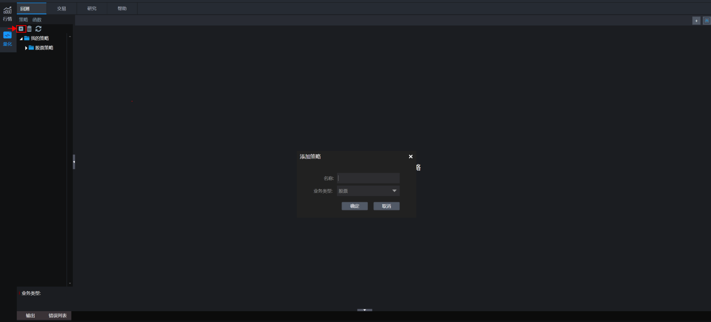
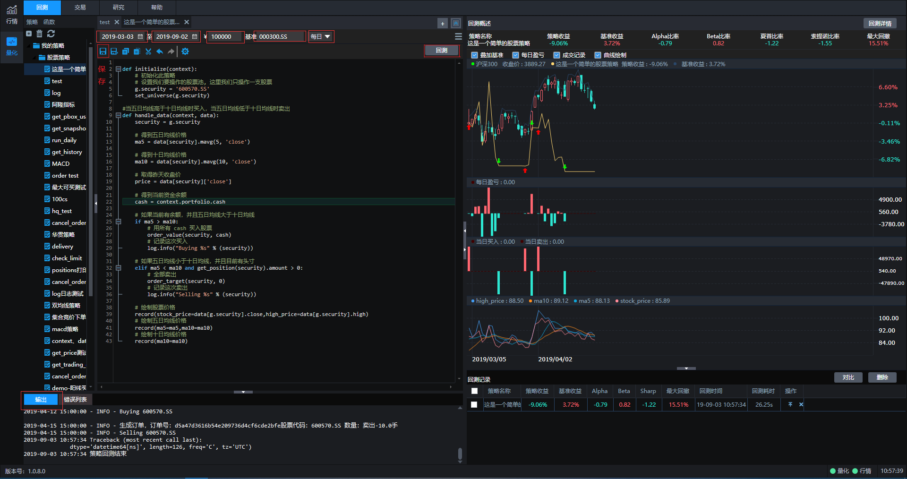
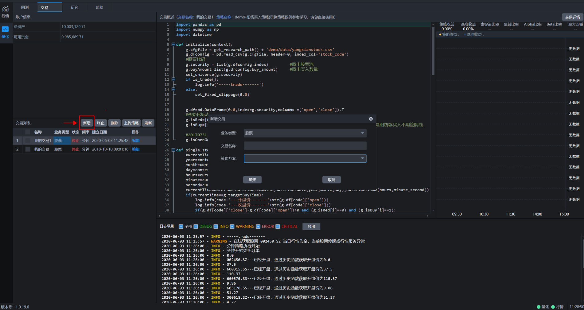
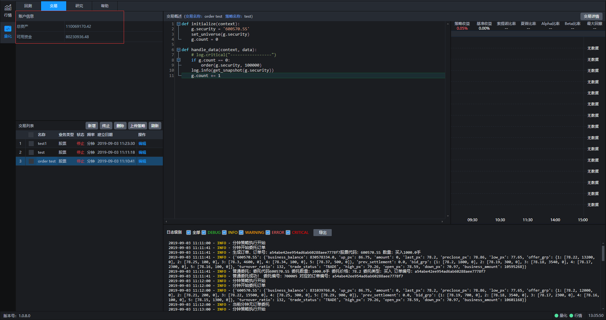
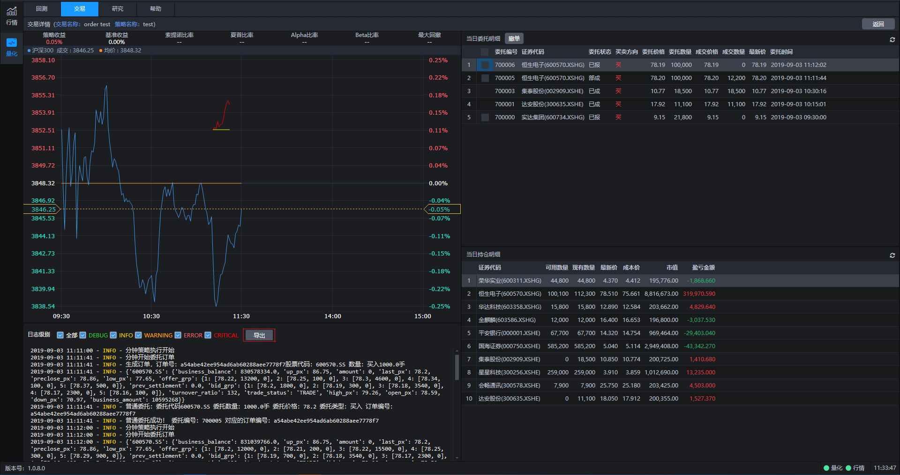

## 使用说明

### 新建策略

开始回测和交易前需要先新建策略，点击下图中左上角标识进行策略添加。可以选择不同的业务类型(比如股票)，然后给策略设定一个名称，添加成功后可以在默认策略模板基础上进行策略编写。

### 新建回测

策略添加完成后就可以开始进行回测操作了。回测之前需要对开始时间、结束时间、回测资金、回测基准、回测频率几个要素进行设定，设定完毕后点击保存。然后再点击回测按键，系统就会开始运行回测，回测的评价指标、收益曲线、日志都会在界面中展现。

### 新建交易

交易界面点击新增按键进行新增交易操作，策略方案中的对象为所有策略列表中的策略，给本次交易设定名称并点击确定后系统就开始运行交易了。

交易开始运行后，可以实时看到总资产和可用资金情况，同时可以在交易列表查询交易状态。

交易开始运行后，可以点击交易详情，查看策略评价指标、交易明细、持仓明细、交易日志。

### 策略运行周期

回测支持日线级别、分钟级别运行，详见[handle\_data](http://180.169.107.9:7766/hub/help/api?weworkcfmcode#handle_data)方法。

交易支持日线级别、分钟级别、tick级别运行，日线级别和分钟级别详见[handle\_data](http://180.169.107.9:7766/hub/help/api?weworkcfmcode#handle_data)方法，tick级别运行详见[run\_interval](http://180.169.107.9:7766/hub/help/api?weworkcfmcode#run_interval)和[tick\_data](http://180.169.107.9:7766/hub/help/api?weworkcfmcode#tick_data)方法。

频率：日线级别

当选择日线频率时，回测和交易都是每天运行一次，回测运行时间为每个交易日的15:00，交易运行时间为尾盘固定时间(允许券商可配)，默认为14:50分。

频率：分钟级别

当选择分钟频率时，回测和交易都是每分钟运行一次，运行时间为每根分钟K线结束。

频率：tick级别

当选择tick频率时，交易最小频率可以达到3秒运行一次。

### 策略运行时间

盘前运行:

9:30分钟之前为盘前运行时间，交易环境支持运行在[run\_daily](http://180.169.107.9:7766/hub/help/api?weworkcfmcode#run_daily)中指定交易时间(如time='09:15')运行的函数；回测环境和交易环境支持运行[before\_trading\_start](http://180.169.107.9:7766/hub/help/api?weworkcfmcode#before_trading_start)函数

盘中运行:

9:31(回测)/9:30(交易)~15:00分钟为盘中运行时间，分钟级别回测环境和交易环境支持运行在[run\_daily](http://180.169.107.9:7766/hub/help/api?weworkcfmcode#run_daily)中指定交易时间(如time='14:30')运行的函数；回测环境和交易环境支持运行[handle\_data](http://180.169.107.9:7766/hub/help/api?weworkcfmcode#handle_data)函数；交易环境支持运行[run\_interval](http://180.169.107.9:7766/hub/help/api?weworkcfmcode#run_interval)函数和[tick\_data](http://180.169.107.9:7766/hub/help/api?weworkcfmcode#tick_data)函数

盘后运行:

15:30分钟为盘后运行时间，回测环境和交易环境支持运行[after\_trading\_end](http://180.169.107.9:7766/hub/help/api?weworkcfmcode#after_trading_end)函数(该函数为定时运行)；15:00之后交易环境支持运行在[run\_daily](http://180.169.107.9:7766/hub/help/api?weworkcfmcode#run_daily)中指定交易时间(如time='15:10')运行的函数

### 交易策略委托下单时间

使用order系列接口进行股票委托下单，将直接报单到柜台。

### 回测支持业务类型

目前所支持的业务类型:

1.普通股票买卖(单位：股)。

2.可转债买卖(单位：张，T+0)。

3.融资融券担保品买卖(单位：股)。

4.期货投机类型交易(单位：手，T+0)。

5.LOF基金买卖(单位：股)。

6.ETF基金买卖(单位：股)。

### 交易支持业务类型

目前所支持的业务类型:

1.普通股票买卖(单位：股)。

2.可转债买卖(具体单位请咨询券商，T+0)。

3.融资融券交易(单位：股)。

4.ETF申赎、套利(单位：份)。

5.国债逆回购(单位：份)。

6.期货投机类型交易(单位：手，T+0)。

7.LOF基金买卖(单位：股)。

8.ETF基金买卖(单位：股)。

9.期权交易(单位：手)。

10.港股通交易(单位：股)。

### 交易标的对应最小价差

1.股票买卖(最小价差：0.01)。

2.可转债买卖(最小价差：0.001)。

3.LOF买卖(最小价差：0.001)。

4.ETF买卖(最小价差：0.001)。

5.国债逆回购(最小价差：0.005)。

6.股指期货投机类型交易(最小价差：0.2)。

7.国债期货投机类型交易(最小价差：0.005)。
